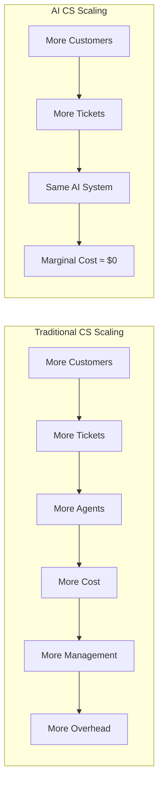
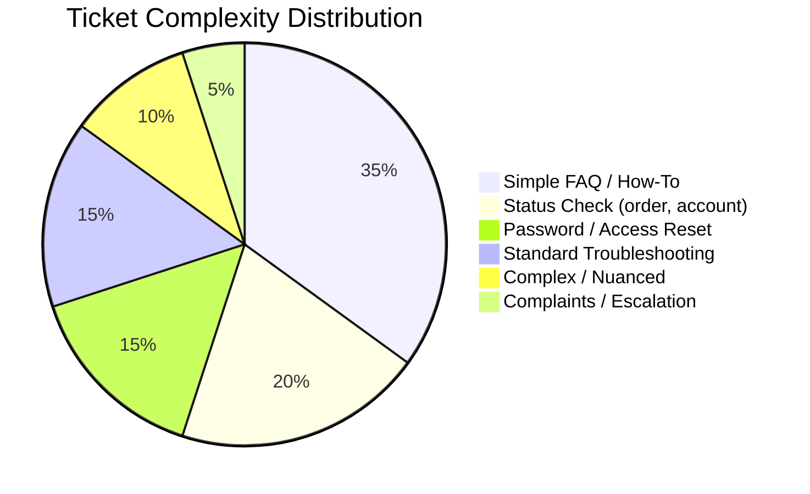

# The Current Customer Service Landscape

Understanding the problem before jumping to the solution.

## The Cost Crisis

Customer service is one of the largest operational costs for most businesses, and it's growing:

| Metric | 2020 | 2024 | Trend |
|---|---|---|---|
| Average cost per ticket | $8 | $12 | ↑ 50% |
| Agent annual turnover | 30% | 45% | ↑ Getting worse |
| Customer expectations (response time) | 24 hours | 1 hour | ↑ 24x faster |
| Ticket volume growth | — | +15% YoY | ↑ Exponential |

:::warning The Math Doesn't Work
If ticket volume grows 15% annually and agent costs rise 10% annually, traditional CS departments face a **compounding cost spiral** with no ceiling in sight.
:::

## The Pain Points

### 1. Linear Scaling Problem



Every new customer = proportional CS cost increase. This model breaks at scale.

### 2. Quality Inconsistency

| Factor | Impact on Quality |
|---|---|
| Agent experience level | Junior agents give different answers than senior |
| Time of day | End-of-shift agents are less thorough |
| Workload | Overloaded agents rush responses |
| Training gaps | New products = knowledge lag |
| Language | Multilingual support = multiple quality tiers |

### 3. The 24/7 Problem

To provide round-the-clock support with humans:

| Coverage Model | Headcount Multiplier | Annual Cost (10-agent base) |
|---|---|---|
| Business hours only (8/5) | 1x | $600K |
| Extended hours (12/6) | 2.2x | $1.3M |
| Full 24/7 coverage | 3.5x | $2.1M |

And that's before accounting for holidays, sick days, and turnover.

### 4. Agent Burnout & Turnover

```
Average CS agent tenure: 1.5 years
Cost to hire + train replacement: $15K–$25K
Annual turnover cost (10-agent team): $45K–$75K

Common reasons for leaving:
├── Repetitive questions (80% of tickets)
├── Emotional labor (angry customers)
├── Low growth trajectory
└── Metrics pressure (handle time, CSAT)
```

## Ticket Distribution Analysis

Most CS teams see a predictable pattern:



**Key insight:** 70% of tickets follow predictable patterns. This is where AI excels.

## Customer Expectations Are Rising

| Metric | Customer Expectation | Industry Average | Gap |
|---|---|---|---|
| First response time | < 1 hour | 12 hours | 12x gap |
| Resolution time | < 4 hours | 24 hours | 6x gap |
| 24/7 availability | Expected | 30% offer it | 70% gap |
| First contact resolution | > 80% | 65% | 15% gap |
| Channel preference | Omnichannel | Siloed | Major gap |

## Why Now?

Several converging factors make AI CS viable today:

| Factor | 2020 | 2024 |
|---|---|---|
| LLM capability | GPT-3 (mediocre) | GPT-4/Claude (excellent) |
| Cost per 1M tokens | $60 | $0.50–$15 |
| RAG maturity | Experimental | Production-ready |
| Vector databases | Niche | Mainstream (Pinecone, Weaviate) |
| Integration APIs | Limited | Extensive (Zendesk, Intercom, etc.) |
| Customer acceptance | Skeptical | Normalized (ChatGPT effect) |

:::tip The Inflection Point
We're at the crossover where AI quality exceeds average human quality for Tier 1 tickets, at 1/10th the cost. This is the moment to evaluate.
:::

## What's Next

Now that we understand the problem, let's do a detailed [cost comparison](./cost-comparison) between human, AI, and hybrid CS models.
