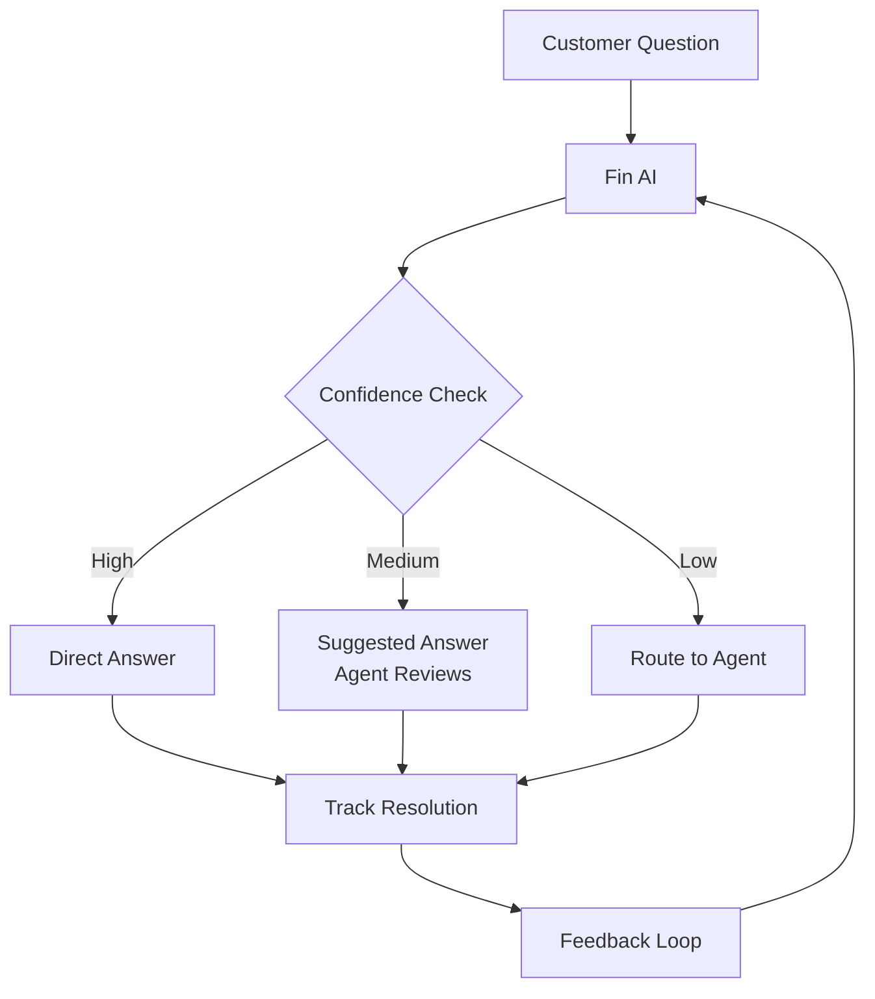
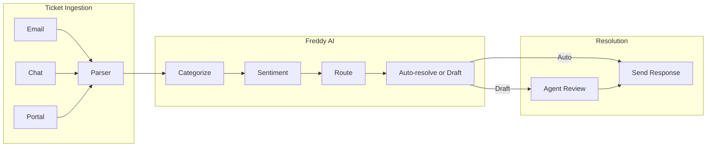
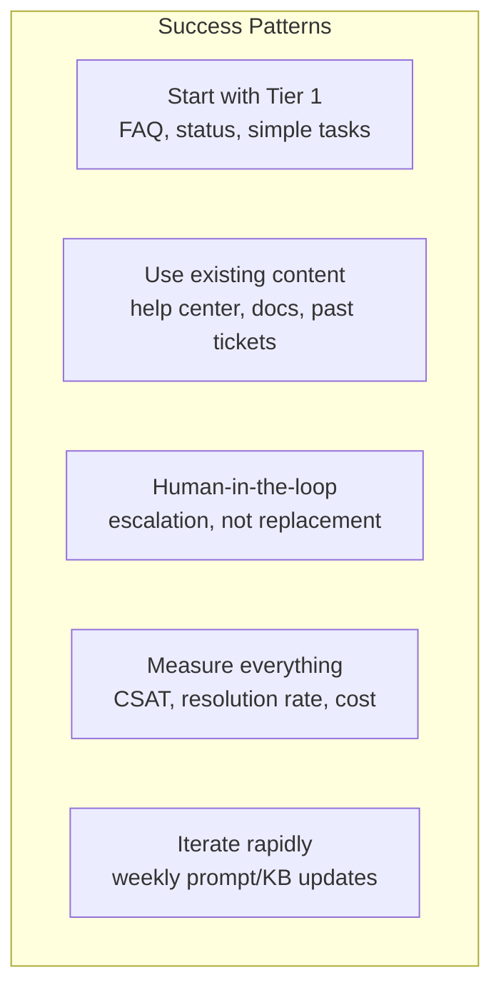

# Case Studies: Real-World AI CS Implementations

Learn from companies that have successfully deployed AI customer service at scale.

## Klarna (2024)

### The Headline
AI assistant handled **2.3 million conversations** in its first month, doing the work of **700 full-time agents**.

### Before
| Metric | Value |
|---|---|
| Agents | 3,000+ |
| Avg resolution time | 11 minutes |
| Languages supported | Limited by staffing |
| Cost per interaction | $8–$12 |

### After
| Metric | Value |
|---|---|
| AI handles | 2/3 of all conversations |
| Avg resolution time | < 2 minutes |
| Languages supported | 23 (vs limited before) |
| Estimated savings | $40M annually |

### What They Did
- Built on OpenAI's models
- Integrated with their internal systems (billing, refunds, account)
- AI handles refunds, payment issues, account questions
- Human agents focus on complex disputes and edge cases

### Key Lesson
> "The AI assistant is available 24/7 and communicates in over 35 languages, a significant improvement over the human-only setup."

:::tip Speed of Impact
Klarna saw ROI within the first month. Their high volume (millions of interactions) meant savings compound immediately.
:::

---

## Intercom Fin (2023–2024)

### The Headline
Fin resolves **up to 50%** of support questions automatically, trained on customers' existing help center content.

### Architecture

### Results Across Customers

| Company | Resolution Rate | CSAT Impact | Cost Reduction |
|---|---|---|---|
| SaaS (mid-market) | 45% | +8% CSAT | 35% |
| E-commerce | 52% | Neutral | 40% |
| Fintech | 38% | +5% CSAT | 28% |

### Key Lesson
- Start with existing help center content (zero additional KB work)
- Resolution rate improves over time as Fin learns from interactions
- Works best when help center is already comprehensive

---

## Zendesk AI (2023–2024)

### The Headline
Zendesk's AI features reduce **first reply time by 80%** and improve **agent productivity by 40%**.

### Three-Tier Approach

| Tier | Function | Adoption |
|---|---|---|
| AI Agents | Autonomous resolution | 15–30% of tickets |
| Copilot | Agent assistance (draft, summarize) | Used by 70%+ of agents |
| Intelligent Triage | Auto-categorize, prioritize, route | 90%+ accuracy |

### Customer Results

**Shopify:**
- 40% reduction in first reply time
- AI handles password resets, order status, billing inquiries
- Agents focus on merchant-specific issues

**Mailchimp:**
- 30% of tickets resolved without human intervention
- CSAT maintained at 4.2/5 (same as human-only)
- Agent satisfaction improved (less repetitive work)

### Key Lesson
> "The value isn't just automation. Copilot makes human agents faster and more consistent."

---

## Freshdesk Freddy AI (2023)

### The Headline
Freshworks' AI assistant achieves **80% accuracy** in ticket categorization and **40% auto-resolution** for qualifying tickets.

### Implementation Pattern

### Key Lesson
- Start with **triage** (categorization, routing) — easier to prove value
- Auto-resolution comes second, once you trust the categorization
- Sentiment analysis enables smart routing (angry → senior agent)

---

## Bank of America Erica (2018–2024)

### The Headline
Virtual financial assistant with **2+ billion interactions** served to **42 million clients**.

### Scale

| Metric | Value |
|---|---|
| Total interactions | 2+ billion |
| Users | 42 million |
| Daily interactions | 50+ million |
| Tasks automated | Balance checks, transfers, bill pay, spending insights |

### Key Lesson
- Voice + text multi-modal support
- Deep integration with banking systems (not just chat)
- Continuous feature expansion over 6 years
- Regulatory compliance built into every interaction

---

## Common Patterns Across All Cases

### What Separates Success from Failure

| Success Factor | Failed Projects Lack |
|---|---|
| Comprehensive knowledge base | Sparse or outdated docs |
| Clear escalation paths | AI or nothing approach |
| Continuous feedback loop | Deploy and forget |
| Executive sponsorship | IT-only initiative |
| Realistic expectations | Expect 100% automation |

## Lessons Learned

1. **Tier 1 automation delivers 80% of the value** — Don't try to automate everything on day one
2. **Quality > quantity** — 40% automation with 4.5 CSAT beats 70% automation with 3.5 CSAT
3. **Knowledge base is the bottleneck** — AI quality is bounded by KB quality
4. **Start with copilot, not autopilot** — Let agents use AI first, then automate
5. **Measure from day 1** — You can't improve what you don't measure

## What's Next

Now let's dive into the technical implementation, starting with [AI model selection](./ai-models) — which LLM to use and when.
