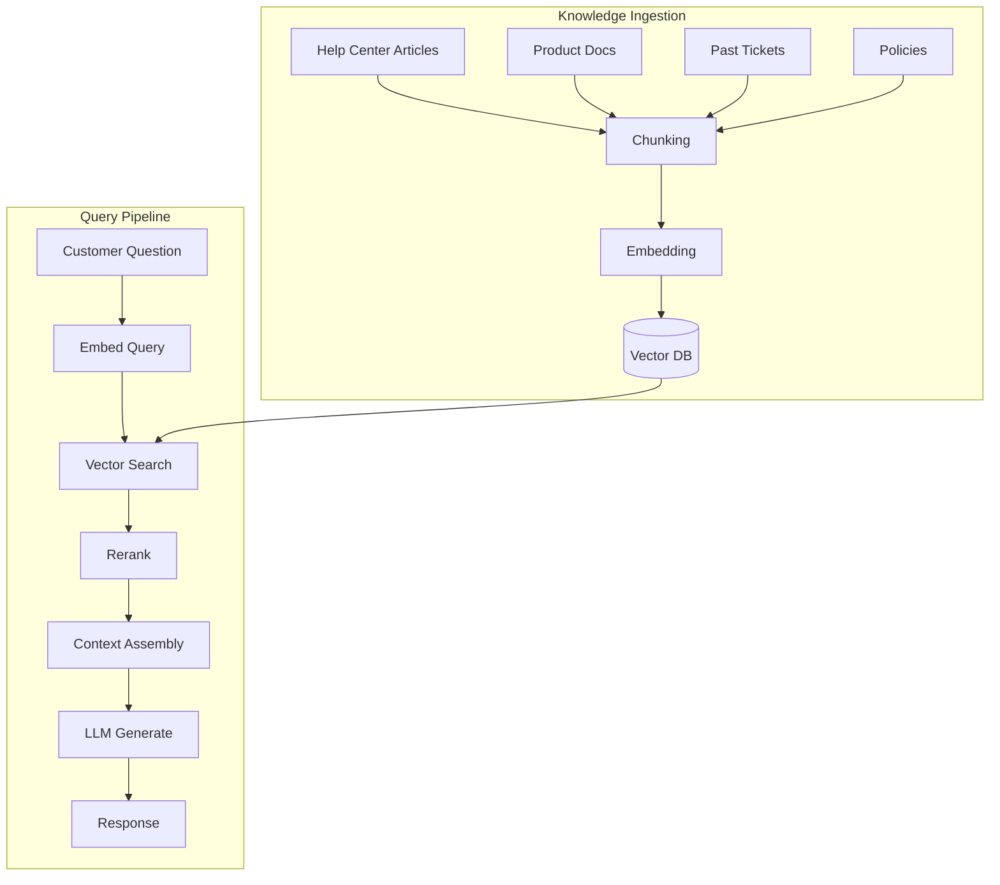
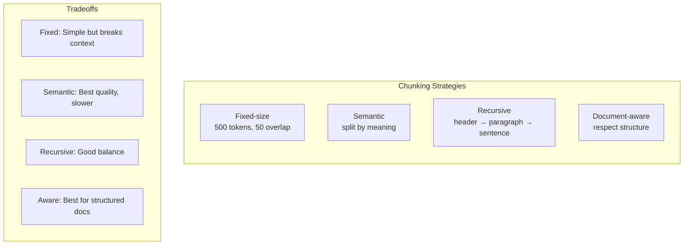
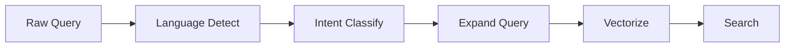
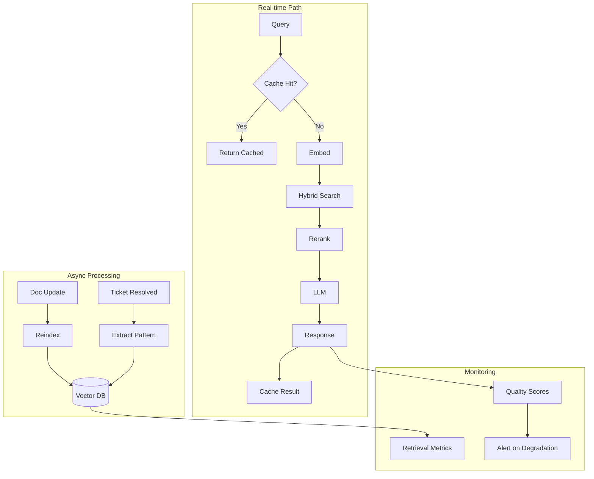

# RAG Architecture for Customer Service

Retrieval-Augmented Generation (RAG) is the core pattern for AI customer service — retrieve relevant knowledge, then generate accurate answers.

## Why RAG for CS?

| Challenge | How RAG Solves It |
|---|---|
| LLMs hallucinate facts | Grounds answers in your actual documentation |
| Knowledge changes frequently | Update KB without retraining |
| Need source attribution | Retrieved chunks = citations |
| Domain-specific terminology | Your docs contain your terms |
| Compliance requirements | Answers traceable to approved sources |

## Architecture Overview



## Knowledge Ingestion Pipeline

### Step 1: Content Sources

| Source | Format | Update Frequency | Priority |
|---|---|---|---|
| Help center | HTML/Markdown | Weekly | High |
| Product documentation | Markdown/RST | On release | High |
| Past ticket resolutions | Database export | Daily | Medium |
| Policy documents | PDF/Word | Quarterly | Medium |
| Community forums | HTML | Real-time | Low |

### Step 2: Chunking Strategies

How you split documents matters enormously for retrieval quality:



**Recommended approach for CS:**

```python
from langchain.text_splitter import RecursiveCharacterTextSplitter

splitter = RecursiveCharacterTextSplitter(
    chunk_size=500,          # ~400 words
    chunk_overlap=50,        # Context continuity
    separators=[
        "\n## ",             # Headers first
        "\n\n",              # Paragraphs
        "\n",                # Lines
        ". ",                # Sentences
        " ",                 # Words
    ],
    length_function=len,
)
```

### Step 3: Metadata Enrichment

Every chunk should carry metadata for filtered search:

| Metadata Field | Example | Purpose |
|---|---|---|
| `source` | "help-center" | Filter by source type |
| `product` | "billing" | Product-specific search |
| `section` | "refunds" | Hierarchical context |
| `last_updated` | "2024-01-15" | Freshness scoring |
| `version` | "v2.3" | Version-specific answers |
| `language` | "en" | Multilingual routing |

### Step 4: Vector Database Selection

| Database | Type | Managed | Best For |
|---|---|---|---|
| Pinecone | Purpose-built | ✅ | Easy setup, good performance |
| Weaviate | Purpose-built | ✅/Self | Hybrid search, GraphQL |
| Qdrant | Purpose-built | ✅/Self | Performance, filtering |
| pgvector | PostgreSQL ext. | ✅ | Already have Postgres |
| Chroma | Embedded | Self | Prototyping, small scale |
| Milvus | Purpose-built | ✅/Self | Enterprise scale |

:::tip Start Simple
For most CS use cases, **Pinecone** (managed) or **pgvector** (if you already use Postgres) is the right choice. Don't over-engineer the vector DB selection.
:::

## Query Pipeline

### Step 1: Query Processing



**Query expansion** improves recall:

```python
def expand_query(query: str, intent: str) -> list[str]:
    """Generate multiple query variations for better retrieval."""
    queries = [query]
    
    if intent == "how_to":
        queries.append(f"steps to {query}")
        queries.append(f"guide for {query}")
    elif intent == "troubleshooting":
        queries.append(f"fix {query}")
        queries.append(f"solve {query}")
        queries.append(f"{query} not working")
    
    return queries
```

### Step 2: Hybrid Search

Combine vector search with keyword search for best results:

```python
def hybrid_search(query: str, top_k: int = 5) -> list[Chunk]:
    # Vector search (semantic similarity)
    vector_results = vector_db.search(
        embedding=embed(query),
        top_k=top_k * 2,
        filter={"language": detected_language}
    )
    
    # Keyword search (exact matches for product names, error codes)
    keyword_results = keyword_index.search(
        query=query,
        top_k=top_k
    )
    
    # Reciprocal Rank Fusion
    combined = reciprocal_rank_fusion(vector_results, keyword_results)
    return combined[:top_k]
```

### Step 3: Reranking

Cross-encoder reranking improves precision:

```python
from sentence_transformers import CrossEncoder

reranker = CrossEncoder('cross-encoder/ms-marco-MiniLM-L-6-v2')

def rerank(query: str, chunks: list[Chunk], top_k: int = 3) -> list[Chunk]:
    pairs = [(query, chunk.text) for chunk in chunks]
    scores = reranker.predict(pairs)
    
    ranked = sorted(zip(chunks, scores), key=lambda x: x[1], reverse=True)
    return [chunk for chunk, score in ranked[:top_k]]
```

### Step 4: Context Assembly

```python
def assemble_context(
    query: str,
    chunks: list[Chunk],
    conversation_history: list[Message],
    customer_context: dict
) -> str:
    return f"""Answer the customer's question using ONLY the provided context.

## Customer Context
- Name: {customer_context['name']}
- Account type: {customer_context['tier']}
- Previous issues: {customer_context.get('recent_issues', 'None')}

## Conversation History
{format_history(conversation_history)}

## Relevant Knowledge Base Articles
{format_chunks(chunks)}

## Customer Question
{query}

## Instructions
- Answer based ONLY on the provided articles
- If the articles don't contain the answer, say so
- Be concise and helpful
- Include relevant links if available
"""
```

## Quality Optimization

### Retrieval Metrics

| Metric | Target | How to Measure |
|---|---|---|
| Recall@5 | > 90% | % of queries where answer is in top 5 chunks |
| Precision@3 | > 70% | % of retrieved chunks that are relevant |
| MRR (Mean Reciprocal Rank) | > 0.8 | Average position of first relevant chunk |
| Latency (p95) | < 200ms | Time from query to retrieved chunks |

### Common Issues & Fixes

| Issue | Symptom | Fix |
|---|---|---|
| Irrelevant chunks retrieved | Low precision | Better chunking, metadata filtering |
| Answer in doc but not found | Low recall | Query expansion, hybrid search |
| Outdated information | Wrong answers | Freshness metadata, regular re-indexing |
| Chunks too small | Lost context | Increase chunk size, overlap |
| Chunks too large | Noisy retrieval | Decrease chunk size, better splitting |

## Production Architecture



## What's Next

With the knowledge retrieval pipeline designed, let's look at [integration patterns](./integration-patterns) — connecting to Zendesk, Intercom, email, and other channels.
