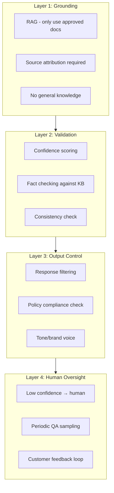
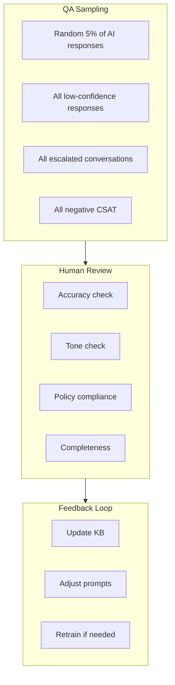

# Quality & Safety Guardrails

Preventing hallucinations, ensuring compliance, and maintaining brand voice in AI customer service.

## The Hallucination Problem

LLMs can generate plausible but incorrect information. In CS, this means:

- Wrong product information
- Incorrect pricing or policies
- Made-up procedures
- False promises (refunds, timelines)

:::danger Hallucination in CS = Broken Trust
One confidently wrong answer can lose a customer permanently. Unlike a chatbot for fun, CS accuracy is non-negotiable.
:::

## Defense Layers



## Implementation

### System Prompt Engineering

The system prompt is your first line of defense:

```python
SYSTEM_PROMPT = """You are a customer service assistant for [Company].

## CRITICAL RULES
1. ONLY use information from the provided knowledge base articles
2. If the knowledge base doesn't contain the answer, say "I don't have that information. Let me connect you with a specialist."
3. NEVER make up information, procedures, or policies
4. NEVER promise specific outcomes (refunds, credits) unless explicitly stated in the knowledge base
5. ALWAYS cite the source article when providing information
6. If unsure, escalate to a human agent

## RESPONSE FORMAT
- Be concise and direct
- Use the customer's name
- Provide step-by-step instructions when applicable
- Include relevant links to help articles
- End with "Is there anything else I can help with?"

## TONE
- Friendly but professional
- Empathetic to frustrations
- Never defensive or argumentative
- Never say "I'm just an AI" unprompted

## PROHIBITED
- Don't discuss competitors
- Don't provide legal advice
- Don't make commitments about future features
- Don't share internal company information
- Don't process refunds > $50 without human approval
"""
```

### Knowledge-Grounded Responses

```python
async def generate_safe_response(
    query: str,
    retrieved_chunks: list[Chunk],
    conversation_history: list[Message],
    customer_context: dict
) -> Response:
    # If no relevant chunks found, escalate
    if not retrieved_chunks or max(c.score for c in retrieved_chunks) < 0.5:
        return Response(
            content=None,
            action="escalate",
            reason="no_relevant_knowledge"
        )
    
    # Build context with source attribution
    context = format_chunks_with_sources(retrieved_chunks)
    
    response = await llm.generate(
        system=SYSTEM_PROMPT,
        user=f"""Answer based ONLY on these articles:

{context}

Customer question: {query}

Remember: If these articles don't contain the answer, say so and escalate."""
    )
    
    # Validate response
    validation = await validate_response(response, retrieved_chunks)
    
    if not validation.is_grounded:
        return Response(
            content=None,
            action="escalate",
            reason="hallucination_detected"
        )
    
    return Response(
        content=response,
        action="send",
        sources=validation.cited_sources,
        confidence=validation.confidence
    )
```

### Response Validation

```python
class ResponseValidator:
    async def validate(self, response: str, source_chunks: list[Chunk]) -> ValidationResult:
        checks = [
            self.check_groundedness(response, source_chunks),
            self.check_no_made_up_facts(response, source_chunks),
            self.check_policy_compliance(response),
            self.check_no_promises(response),
            self.check_source_attribution(response, source_chunks),
        ]
        
        results = await asyncio.gather(*checks)
        
        return ValidationResult(
            is_valid=all(r.passed for r in results),
            is_grounded=results[0].passed,
            confidence=self.calculate_confidence(results),
            issues=[r for r in results if not r.passed],
            cited_sources=self.extract_citations(response)
        )
    
    async def check_groundedness(self, response: str, chunks: list[Chunk]) -> Check:
        """Verify response content exists in source chunks."""
        # Use LLM to check if response claims are supported by chunks
        result = await llm.generate(
            prompt=f"""Does this response make claims NOT supported by the sources?

Response: {response}

Sources: {format_chunks(chunks)}

Answer YES if response contains unsupported claims, NO if all claims are supported.
Also list any unsupported claims."""
        )
        
        return Check(
            name="groundedness",
            passed="NO" in result.upper(),
            details=result
        )
    
    async def check_no_promises(self, response: str) -> Check:
        """Check for unauthorized commitments."""
        promise_patterns = [
            r"\b(will|shall|guarantee)\s+(refund|credit|compensate)\b",
            r"\b(I'?ll?|we'?ll?)\s+(give|provide|send)\s+you\b",
            r"\bwithin\s+\d+\s+(hours?|days?)\s+you'?ll?\b",
        ]
        
        has_promises = any(
            re.search(pattern, response, re.IGNORECASE) 
            for pattern in promise_patterns
        )
        
        return Check(
            name="no_promises",
            passed=not has_promises,
            details="Response contains unauthorized commitments" if has_promises else None
        )
```

## PII Protection

### Detection & Masking

```python
import re

class PIIDetector:
    PATTERNS = {
        "email": r'\b[A-Za-z0-9._%+-]+@[A-Za-z0-9.-]+\.[A-Z|a-z]{2,}\b',
        "phone": r'\b\d{3}[-.]?\d{3}[-.]?\d{4}\b',
        "ssn": r'\b\d{3}-\d{2}-\d{4}\b',
        "credit_card": r'\b\d{4}[-\s]?\d{4}[-\s]?\d{4}[-\s]?\d{4}\b',
        "ip_address": r'\b\d{1,3}\.\d{1,3}\.\d{1,3}\.\d{1,3}\b',
    }
    
    def detect(self, text: str) -> list[dict]:
        findings = []
        for pii_type, pattern in self.PATTERNS.items():
            for match in re.finditer(pattern, text):
                findings.append({
                    "type": pii_type,
                    "value": match.group(),
                    "start": match.start(),
                    "end": match.end()
                })
        return findings
    
    def mask(self, text: str) -> str:
        """Replace PII with placeholders."""
        for pii_type, pattern in self.PATTERNS.items():
            text = re.sub(pattern, f"[{pii_type.upper()}]", text)
        return text
```

### PII Handling Policy

| PII Type | Log | AI Processing | Response |
|---|---|---|---|
| Email | Masked | Allowed (masked) | Never echo back |
| Phone | Masked | Allowed (masked) | Never echo back |
| SSN | Never log | Never process | Escalate to human |
| Credit card | Never log | Never process | Escalate to human |
| Address | Masked | Allowed (masked) | Confirm, don't repeat |

## Compliance Guardrails

### Industry-Specific Rules

```python
COMPLIANCE_RULES = {
    "healthcare": {
        "prohibited_topics": ["diagnosis", "treatment", "medication"],
        "required_disclaimer": "I'm not a medical professional. Please consult your doctor.",
        "escalation_keywords": ["symptoms", "pain", "medication", "diagnosis"],
    },
    "financial": {
        "prohibited_topics": ["investment advice", "tax advice", "legal advice"],
        "required_disclaimer": "This is general information, not financial advice.",
        "escalation_keywords": ["invest", "tax", "legal", "lawsuit"],
    },
    "general": {
        "prohibited_topics": ["legal advice", "guaranteed outcomes"],
        "required_disclaimer": None,
        "escalation_keywords": ["lawyer", "sue", "legal action"],
    }
}

def apply_compliance_rules(response: str, industry: str, query: str) -> str:
    rules = COMPLIANCE_RULES.get(industry, COMPLIANCE_RULES["general"])
    
    # Check if query touches prohibited topics
    for topic in rules["prohibited_topics"]:
        if topic.lower() in query.lower():
            return None  # Escalate
    
    # Add disclaimer if required
    if rules["required_disclaimer"]:
        response = f"{response}\n\n{rules['required_disclaimer']}"
    
    return response
```

## Quality Monitoring

### Sampling & Review



### Quality Metrics Dashboard

| Metric | Target | Measurement |
|---|---|---|
| Accuracy rate | > 95% | Human review of sample |
| Groundedness | > 98% | Automated + human review |
| Policy compliance | 100% | Automated check |
| Tone compliance | > 95% | Human review |
| PII leak rate | 0% | Automated scan |
| Customer satisfaction | > 4.0/5 | CSAT survey |

## What's Next

To power all these guardrails, you need a well-engineered [knowledge base](./knowledge-base) — the foundation of accurate AI responses.
