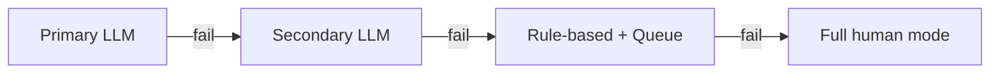

# Frequently Asked Questions

Common questions and misconceptions about AI-driven customer service.

## General Questions

### Will AI completely replace human agents?

No. The goal is **augmentation, not replacement**. AI handles repetitive Tier 1 tickets (40–60% of volume), freeing humans for complex, high-value interactions. Most successful implementations maintain 50–70% of their human agent workforce, with agents handling more interesting, impactful work.

### How long does implementation take?

| Phase | Timeline | Deliverable |
|---|---|---|
| Pilot (one channel) | 4–8 weeks | Live on chat or email |
| Expand (multi-channel) | 2–3 months | Chat + email + portal |
| Mature (full deployment) | 6–12 months | Omnichannel with copilot |

### What's the minimum ticket volume to make this worthwhile?

There's no hard minimum, but economics improve dramatically with volume:

| Monthly Tickets | Recommended Approach |
|---|---|
| < 1,000 | SaaS (Zendesk AI, Intercom Fin) |
| 1,000–10,000 | SaaS or hybrid |
| 10,000–100,000 | Hybrid or custom |
| > 100,000 | Custom (maximum ROI) |

### Will customers know they're talking to AI?

**They should.** Transparency builds trust. Disclose AI involvement clearly but naturally:

> "Hi! I'm the [Company] AI assistant. I'll help with your question, and if I can't, I'll connect you with a human agent."

Don't pretend to be human. Customers respect honesty, and many prefer the speed of AI for simple questions.

## Technical Questions

### Which LLM should I use?

See the [AI Models](./ai-models) chapter for detailed guidance. Quick answer:

- **Starting out**: GPT-4o-mini or Claude Haiku (cheap, fast, good enough)
- **Quality priority**: GPT-4o or Claude Sonnet
- **Privacy requirements**: Self-hosted Llama 3.1
- **Ultra-high volume**: Gemini Flash

### Do I need to fine-tune a model?

**Usually no.** RAG (Retrieval-Augmented Generation) gets you 80% of the value without fine-tuning. Fine-tune only when you need:
- Very specific brand voice
- Complex multi-step workflows
- Domain-specific jargon handling

### How do I prevent hallucinations?

Multiple layers of defense:

1. **RAG grounding** — Only answer from retrieved knowledge base
2. **Confidence scoring** — Route low-confidence to humans
3. **Response validation** — Check responses against source chunks
4. **No-promises rule** — Never commit to outcomes not in KB
5. **Human QA sampling** — Regular review of AI responses

See [Quality & Safety](./quality-safety) for implementation details.

### What happens when the LLM provider goes down?

Design for failure:

Always have a fallback path. Queue customers for human agents rather than showing errors.

## Business Questions

### How do I measure ROI?

See the [ROI Framework](./roi-framework) for detailed calculation. Key metrics:

- **Cost per ticket**: Traditional ($8–$15) vs AI ($0.50–$3)
- **Resolution rate**: % of tickets handled without human
- **Payback period**: Typically 1–6 months depending on volume

### What if customers hate it?

Build in escape hatches:
- Always available "talk to human" option
- Easy escalation (no hoops to jump through)
- Monitor CSAT closely
- Opt-out mechanism for customers who prefer human-only

Track CSAT by channel (AI vs human). If AI CSAT drops below human CSAT by more than 0.5 points, investigate and adjust.

### How do I handle the team's fear of job loss?

**Transparent communication is critical:**

1. **Position as copilot, not replacement** — AI handles boring stuff, humans do impactful work
2. **Retraining investment** — Upskill agents for complex problem-solving
3. **New roles created** — AI trainers, QA reviewers, escalation specialists
4. **Involve the team** — Let agents help design the system
5. **Show the data** — Most implementations maintain or grow CS teams

### What about languages we don't support?

AI dramatically expands language coverage. Modern LLMs support 50+ languages. This is one of the biggest wins: you can offer 24/7 multilingual support without hiring multilingual agents.

## Implementation Questions

### Should I build or buy?

| Approach | Best For | Pros | Cons |
|---|---|---|---|
| **SaaS** (Zendesk AI, Intercom Fin) | < 10K tickets/month | Fast setup, low effort | Limited customization |
| **Build on APIs** | > 100K tickets/month | Full control, lowest per-ticket cost | Requires engineering |
| **Hybrid** | 10K–100K tickets/month | Balance of control and ease | Integration complexity |

### What knowledge base do I need?

Start with what you have:
1. Help center / FAQ (highest value)
2. Product documentation
3. Policy documents
4. Past ticket resolutions (Phase 2)

See [Knowledge Base Engineering](./knowledge-base) for detailed guidance.

### How do I start?

**Recommended pilot approach:**

1. **Week 1–2**: Audit current tickets, identify Tier 1 candidates
2. **Week 3–4**: Prepare knowledge base, set up AI pipeline
3. **Week 5–6**: Pilot on one channel (chat recommended)
4. **Week 7–8**: Measure, iterate, expand

Start small, measure rigorously, expand based on data.

## Troubleshooting

### AI resolution rate is lower than expected

| Possible Cause | Fix |
|---|---|
| Knowledge base gaps | Audit unanswered questions, add content |
| Poor chunking | Adjust chunk size and overlap |
| Wrong model | Try a more capable model |
| Low confidence threshold | Calibrate threshold (but don't lower too much) |
| Complex ticket mix | Review if Tier 1 % matches assumptions |

### CSAT is lower for AI than human

| Possible Cause | Fix |
|---|---|
| AI not resolving fully | Improve KB coverage |
| Customers want human | Make escalation easier |
| Tone issues | Adjust system prompt |
| Slow responses | Optimize pipeline latency |
| Wrong answers | Review accuracy, fix hallucinations |

### Escalation rate is too high

| Possible Cause | Fix |
|---|---|
| Confidence threshold too high | Calibrate (carefully) |
| KB doesn't cover common questions | Add missing content |
| AI giving up too easily | Adjust escalation triggers |
| Customer preference for human | Check if AI disclosure is appropriate |

## What's Next

Ready to start? Go back to the [Introduction](/) and begin with the economic analysis, or jump straight to the [Architecture](./architecture) if you're technical.
