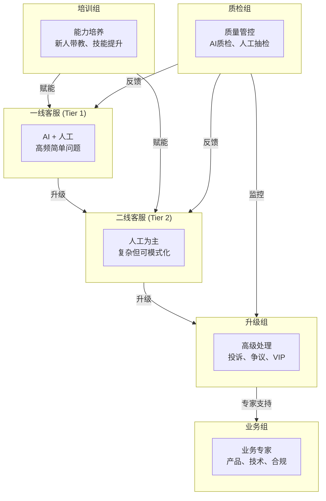
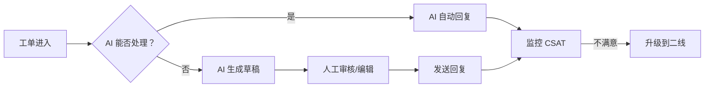
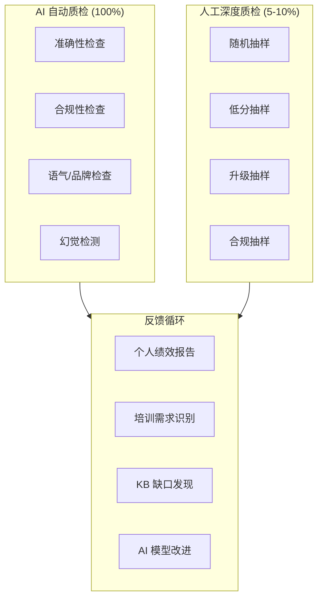

# Customer Service Organization & Training

How to structure your CS team for AI-augmented operations, with training plans for each group.

## The 6-Group CS Organization

A mature AI-augmented CS organization has six specialized groups, each with distinct responsibilities and training needs:

## Group Details

### 一线客服 (Tier 1 / First-Line Support)

**Role:** Handle high-frequency, simple issues. AI handles 60-80%, human handles the rest.

| Aspect | Details |
|---|---|
| **Ticket types** | FAQ, order status, password reset, basic how-to |
| **AI involvement** | AI auto-resolves 60-80%, human reviews/edits AI drafts |
| **Staffing ratio** | 1 agent per 3-5x traditional ticket volume |
| **Skills required** | Product basics, system navigation, empathy |
| **KPIs** | First response time < 1 min, CSAT > 4.0, resolution rate > 70% |

**Daily workflow:**

### 二线客服 (Tier 2 / Second-Line Support)

**Role:** Handle complex but patterned issues. AI assists with research and drafting.

| Aspect | Details |
|---|---|
| **Ticket types** | Complex troubleshooting, multi-step processes, billing disputes |
| **AI involvement** | AI retrieves context, suggests solutions, drafts responses |
| **Staffing ratio** | 1 agent per 2-3 traditional ticket volume |
| **Skills required** | Deep product knowledge, problem-solving, cross-system navigation |
| **KPIs** | Resolution time < 4 hours, escalation accuracy > 85%, CSAT > 4.2 |

**AI copilot tools for Tier 2:**
- Auto-pull customer history and past interactions
- Suggest solutions based on similar resolved tickets
- Draft response for agent review
- Flag related knowledge base articles

### 升级组 (Escalation Team)

**Role:** Handle complaints, disputes, VIP customers, and sensitive situations.

| Aspect | Details |
|---|---|
| **Ticket types** | Customer complaints, refund disputes, VIP requests, legal threats |
| **AI involvement** | AI provides full context summary, sentiment analysis, suggested actions |
| **Staffing ratio** | 1 specialist per 10-15 Tier 2 agents |
| **Skills required** | De-escalation, negotiation, policy authority, emotional intelligence |
| **KPIs** | Resolution time < 24 hours, retention rate > 90%, escalation-to-resolution > 95% |

**Escalation criteria:**
| Trigger | Auto-route to |
|---|---|
| Customer explicitly requests supervisor | Escalation team |
| CSAT < 2.0 on Tier 1/2 interaction | Escalation team |
| Refund amount > $500 | Escalation team |
| Legal keywords detected | Escalation team |
| VIP/Enterprise customer | Escalation team (skip Tier 1/2) |

### 业务组 (Business Team)

**Role:** Subject matter experts who support Tier 1/2/escalation with deep domain knowledge.

| Aspect | Details |
|---|---|
| **Functions** | Product expertise, technical support, compliance, billing |
| **AI involvement** | AI routes domain-specific questions to correct business expert |
| **Staffing ratio** | 1 expert per 20-30 frontline agents |
| **Skills required** | Deep domain mastery, policy authoring, cross-team communication |
| **KPIs** | Knowledge article creation rate, Tier 1/2 resolution improvement |

**Business team responsibilities:**
- Author and maintain knowledge base articles
- Create training materials for frontline teams
- Handle complex product/technical issues beyond Tier 2
- Ensure compliance with industry regulations
- Feedback loop: identify patterns for AI automation

### 培训组 (Training Team)

**Role:** Develop and deliver training programs for all CS groups.

| Aspect | Details |
|---|---|
| **Functions** | New hire onboarding, ongoing skill development, AI tool training |
| **AI involvement** | AI identifies skill gaps from QA data, suggests personalized training |
| **Staffing ratio** | 1 trainer per 30-50 agents |
| **Skills required** | Instructional design, product expertise, coaching |
| **KPIs** | Time-to-proficiency, training satisfaction, post-training performance improvement |

**Training program by group:**

| Group | Onboarding | Ongoing Training | AI-Specific Training |
|---|---|---|---|
| 一线客服 | 2 weeks | Weekly 1hr | AI tool usage, draft review, escalation judgment |
| 二线客服 | 3 weeks | Bi-weekly 1.5hr | AI copilot, complex case analysis |
| 升级组 | 4 weeks | Monthly 2hr | AI context interpretation, de-escalation |
| 业务组 | 4 weeks | Monthly 2hr | KB authoring, AI feedback loop |
| 培训组 | 2 weeks | Monthly 1hr | AI-generated training content review |
| 质检组 | 3 weeks | Bi-weekly 1hr | AI QA calibration, bias detection |

### 质检组 (Quality Assurance Team)

**Role:** Monitor quality across all CS interactions, both AI and human.

| Aspect | Details |
|---|---|
| **Functions** | AI response QA, human interaction audit, calibration, compliance |
| **AI involvement** | AI does automated QA on 100% of interactions, humans do deep-dive on samples |
| **Staffing ratio** | 1 QA specialist per 20-30 agents |
| **Skills required** | Analytical thinking, product expertise, coaching feedback |
| **KPIs** | QA coverage > 10%, calibration agreement > 90%, quality score improvement |

**QA framework:**

## AI Integration by Tier

How AI augments each group differently:

| Group | AI Role | Automation Level | Human Override |
|---|---|---|---|
| 一线客服 | Auto-responder + Draft generator | 60-80% autonomous | Review, edit, escalate |
| 二线客服 | Copilot + Research assistant | 20-40% autonomous | Full judgment, complex decisions |
| 升级组 | Context summarizer + Suggester | 0-10% autonomous | Full authority, empathy required |
| 业务组 | Knowledge retriever + Pattern finder | Read-only | Expert decisions |
| 培训组 | Gap analyzer + Content generator | Content assist | Training delivery, coaching |
| 质检组 | Automated scorer + Anomaly detector | Score 100%, flag issues | Deep-dive, calibration |

## Organizational Assessment Checklist

Use this checklist to evaluate your CS organization's readiness for AI augmentation:

### Structure Assessment

| Criterion | Current State | Target State | Gap |
|---|---|---|---|
| Clear tier definitions | ☐ | ☐ | |
| Defined escalation paths | ☐ | ☐ | |
| Specialized business experts | ☐ | ☐ | |
| Dedicated training function | ☐ | ☐ | |
| QA team exists | ☐ | ☐ | |

### People Assessment

| Criterion | Current State | Target State | Gap |
|---|---|---|---|
| Tier 1 can review AI drafts | ☐ | ☐ | |
| Tier 2 can use AI copilot | ☐ | ☐ | |
| Escalation team understands AI limits | ☐ | ☐ | |
| Business team maintains KB | ☐ | ☐ | |
| Training team can train on AI tools | ☐ | ☐ | |
| QA team can calibrate AI scores | ☐ | ☐ | |

### Process Assessment

| Criterion | Current State | Target State | Gap |
|---|---|---|---|
| Escalation criteria defined | ☐ | ☐ | |
| AI auto-resolution rules set | ☐ | ☐ | |
| QA sampling methodology exists | ☐ | ☐ | |
| Training curriculum documented | ☐ | ☐ | |
| KB update workflow defined | ☐ | ☐ | |
| Feedback loop operational | ☐ | ☐ | |

### Technology Assessment

| Criterion | Current State | Target State | Gap |
|---|---|---|---|
| Ticketing system supports AI | ☐ | ☐ | |
| AI drafts visible to agents | ☐ | ☐ | |
| QA dashboard operational | ☐ | ☐ | |
| Training LMS integrated | ☐ | ☐ | |
| Reporting/analytics available | ☐ | ☐ | |

## Staffing Model

Traditional vs AI-augmented staffing for 10,000 tickets/month:

| Role | Traditional | AI-Augmented | Change |
|---|---|---|---|
| 一线客服 | 8-10 agents | 3-4 agents | -60% |
| 二线客服 | 4-5 agents | 3-4 agents | -20% |
| 升级组 | 1-2 agents | 1-2 agents | Same |
| 业务组 | 1-2 agents | 1-2 agents | Same |
| 培训组 | 0.5 FTE | 0.5 FTE | Same |
| 质检组 | 0.5 FTE | 0.5 FTE + AI | AI augments |
| **Total** | **15-20 people** | **9-13 people** | **-35-40%** |

:::tip Key Insight
AI reduces Tier 1 headcount by 60%, but the other groups stay roughly the same size. The savings come from automation of simple tasks, not elimination of specialized roles.
:::

## What's Next

With your org structure defined, review the [Risk Assessment](./risk-assessment) for governance considerations, or go back to the [Introduction](/) to review the full guide.
