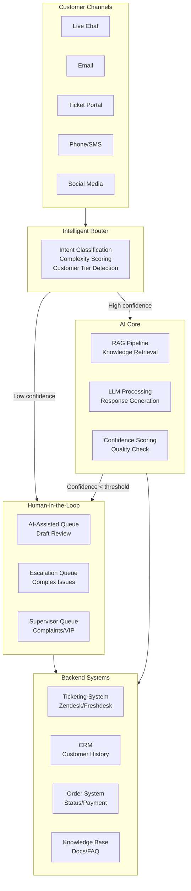
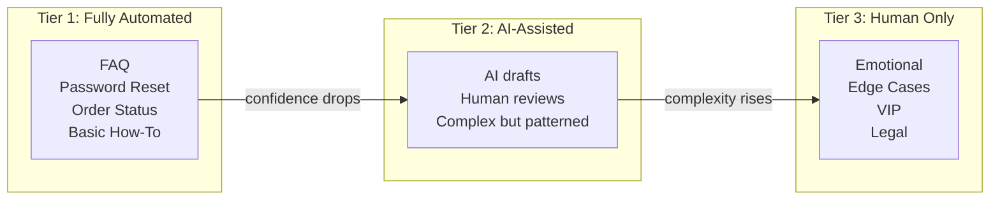
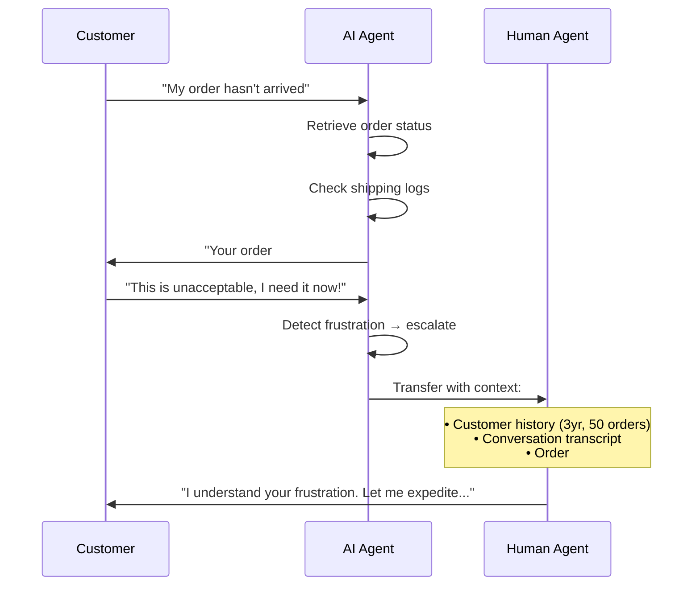
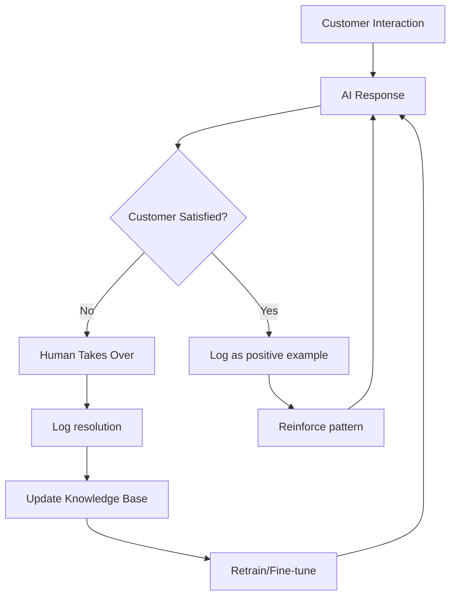
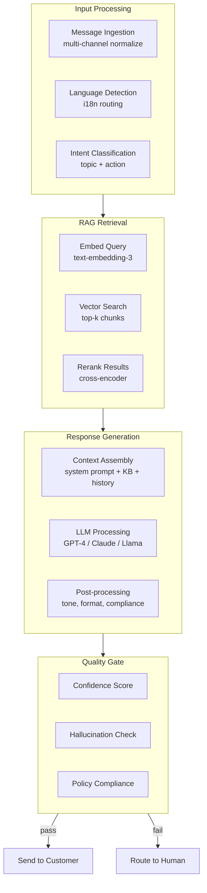
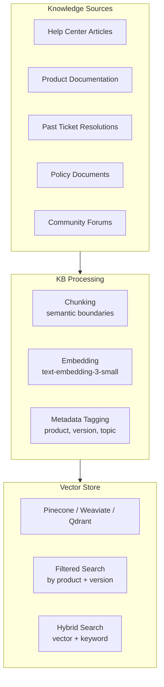
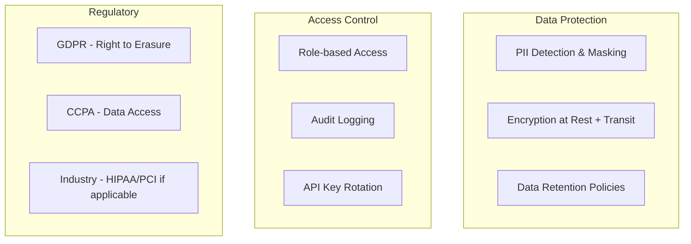

# Architecture Overview

This page describes the full system architecture for AI-driven customer service, covering both the business decision framework and the technical implementation stack.

## System Architecture

## Design Principles

### 1. Tiered Automation

Not all tickets are equal. The system classifies every interaction:

### 2. Confidence-Based Routing

Every AI response gets a confidence score. Below threshold → human review:

| Confidence | Action | Typical Use |
|---|---|---|
| 0.90–1.00 | Send directly | Clear FAQ match, standard procedure |
| 0.70–0.89 | Send + flag for review | Good match but nuanced situation |
| 0.50–0.69 | Queue for human with AI draft | Ambiguous, needs human judgment |
| < 0.50 | Route to human, no draft | No reliable match, human handles |

### 3. Context Preservation

When escalating from AI to human, full context transfers:

### 4. Continuous Learning Loop

## Component Architecture

### AI Processing Pipeline

### Knowledge Base Architecture

## Integration Points

| System | Integration Method | Data Flow |
|---|---|---|
| Ticketing (Zendesk, Freshdesk) | Webhooks + REST API | Bidirectional |
| Live Chat (Intercom, Crisp) | WebSocket + REST | Real-time |
| Email | IMAP/SMTP or API (SendGrid) | Async |
| CRM (Salesforce, HubSpot) | REST API | Read customer context |
| Order System | REST API / GraphQL | Read order/payment status |
| Knowledge Base | Vector DB + REST | Read for RAG |

## Failure Modes & Mitigations

| Failure | Detection | Recovery |
|---|---|---|
| AI hallucinates answer | Confidence score low | Route to human |
| AI gives wrong information | Customer feedback / QA | Flag for review, update KB |
| Knowledge base outdated | Resolution rate drops | Automated freshness checks |
| LLM API down | Health check timeout | Fallback to rule-based + queue to human |
| High latency | Response time > SLA | Scale replicas, cache common queries |
| Customer frustrated | Sentiment analysis | Immediate escalation to human |

## Security & Compliance

## What's Next

With the architecture understood, let's examine the [current customer service landscape](./current-landscape) to understand why AI-driven CS is becoming a necessity, not an option.
