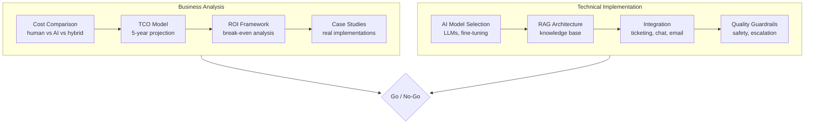
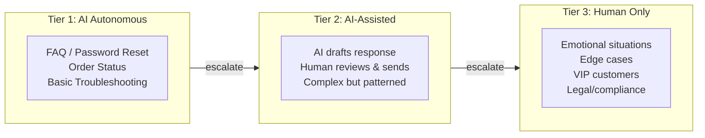

# AI-Driven Customer Service: Analysis & Implementation Guide

A comprehensive framework for evaluating, planning, and implementing AI-powered customer service — from economic feasibility through technical architecture.

## What This Guide Covers

This documentation answers two fundamental questions:

1. **Is it economically viable?** — Detailed cost models, ROI frameworks, and real-world case studies
2. **How do you build it?** — Architecture patterns, integration guides, and implementation roadmaps

## Who This Is For

| Audience | What You'll Find |
|---|---|
| **Business Leaders** | Cost analysis, ROI models, risk assessment, vendor comparison |
| **Product Managers** | Feature scoping, integration patterns, success metrics |
| **Engineering Teams** | Architecture, RAG patterns, API design, deployment guides |
| **Operations** | Monitoring, quality assurance, escalation design |

## Economic Snapshot

The core economics of AI customer service:

| Metric | Traditional CS | AI-Augmented | Full AI (Tier 1) |
|---|---|---|---|
| Cost per ticket | $5–$15 | $0.50–$3 | $0.10–$0.50 |
| First response time | 4–24 hours | < 1 minute | < 10 seconds |
| 24/7 coverage cost | 3x headcount | Baseline | Baseline |
| Scalability | Linear | Exponential | Exponential |

:::info Not a Replacement — A Transformation
AI doesn't just replace agents. It changes the entire support model: faster responses, consistent quality, infinite scalability, and humans freed for complex, high-value interactions.
:::

## The Hybrid Reality

Most successful implementations follow a tiered model:

Typical ticket distribution in a mature deployment:
- **Tier 1 (AI handles):** 40–60% of tickets
- **Tier 2 (AI assists):** 20–30% of tickets
- **Tier 3 (Human only):** 10–30% of tickets

## Tutorial Roadmap

### Business Analysis
1. **[Architecture Overview](./architecture)** — System design and component interactions
2. **[Current CS Landscape](./current-landscape)** — Pain points, costs, and why change is needed
3. **[Cost Comparison](./cost-comparison)** — Head-to-head: human vs AI vs hybrid models
4. **[TCO Model](./tco-model)** — 5-year total cost of ownership with infrastructure, training, maintenance
5. **[ROI Framework](./roi-framework)** — Break-even analysis, payback period, sensitivity analysis
6. **[Case Studies](./case-studies)** — Real implementations: Zendesk AI, Intercom Fin, Klarna, and more

### Technical Architecture
7. **[AI Models & Selection](./ai-models)** — LLMs, fine-tuning vs RAG, model comparison matrix
8. **[RAG Architecture](./rag-architecture)** — Knowledge base design, retrieval patterns, chunking strategies
9. **[Integration Patterns](./integration-patterns)** — Ticketing systems, live chat, email, omnichannel
10. **[Human Handoff Design](./human-handoff)** — Escalation triggers, context transfer, queue management
11. **[Quality & Safety](./quality-safety)** — Guardrails, hallucination prevention, compliance

### Implementation
12. **[Knowledge Base Engineering](./knowledge-base)** — Building and maintaining the AI's brain
13. **[Monitoring & Evaluation](./monitoring-eval)** — CSAT, resolution rate, quality metrics

### Risk & Governance
14. **[Risk Assessment](./risk-assessment)** — What can go wrong, mitigations, governance framework
15. **[FAQ](./faq)** — Common questions and misconceptions

## Prerequisites

| For Business Analysis | For Implementation |
|---|---|
| Current CS cost data | Python/TypeScript proficiency |
| Ticket volume metrics | API integration experience |
| Customer satisfaction baseline | Vector database familiarity |
| | LLM API access (OpenAI, Anthropic, etc.) |

## Design Philosophy

1. **Economics first** — Don't build what doesn't pay for itself
2. **Hybrid by default** — AI handles volume, humans handle complexity
3. **Measure everything** — CSAT, resolution rate, cost per ticket, escalation rate
4. **Iterate fast** — Start with Tier 1, expand as confidence grows

Let's start with the [architecture overview](./architecture).
