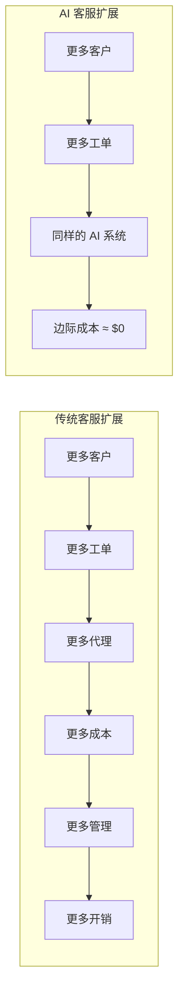
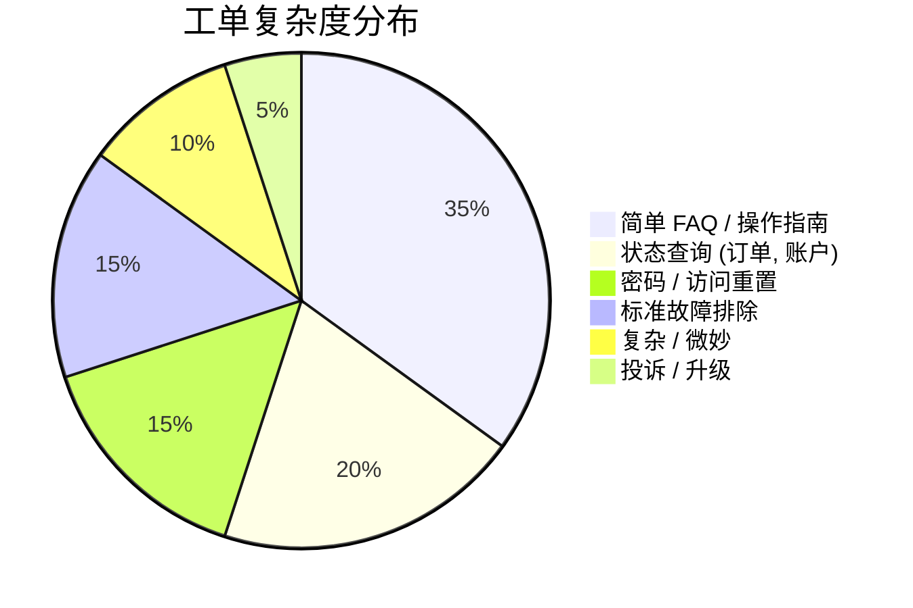

# 当前客服现状

在跳入解决方案之前，先了解问题所在。

## 成本危机

客户服务是大多数企业最大的运营成本之一，而且还在不断增长：

| 指标 | 2020 | 2024 | 趋势 |
|---|---|---|---|
| 每张工单平均成本 | $8 | $12 | ↑ 50% |
| 代理年度流失率 | 30% | 45% | ↑ 正在恶化 |
| 客户期望 (响应时间) | 24 小时 | 1 小时 | ↑ 快了 24 倍 |
| 工单量增长 | — | +15% YoY (同比增长) | ↑ 指数级 |

:::warning 账算不过来
如果工单量每年增长 15%，而代理成本每年上升 10%，传统的客服部门将面临一个看不到天花板的**复合成本螺旋**。
:::

## 痛点

### 1. 线性扩展问题



每一个新客户 = 成比例的客服成本增加。这种模式在规模化时会崩溃。

### 2. 质量不一致

| 因素 | 对质量的影响 |
|---|---|
| 代理经验水平 | 初级代理给出的答案与高级代理不同 |
| 一天中的时间 | 班次结束时的代理不够细致 |
| 工作量 | 超负荷的代理会匆忙回复 |
| 培训差距 | 新产品 = 知识滞后 |
| 语言 | 多语言支持 = 多个质量层级 |

### 3. 24/7 全天候问题

要通过人工提供全天候支持：

| 覆盖模型 | 人力乘数 | 年度成本 (以 10 名代理为基准) |
|---|---|---|
| 仅限工作时间 (8/5) | 1x | $600K |
| 延长工作时间 (12/6) | 2.2x | $1.3M |
| 全天候 24/7 覆盖 | 3.5x | $2.1M |

这还没算上节假日、病假和人员流失。

### 4. 代理倦怠与流失

```
客服代理平均任期：1.5 年
招聘 + 培训替代者的成本：$15K–$25K
年度流失成本 (10 人团队)：$45K–$75K

常见的离职原因：
├── 重复性问题 (80% 的工单)
├── 情绪劳动 (愤怒的客户)
├── 职业成长空间小
└── 指标压力 (处理时间, CSAT (客户满意度))
```

## 工单分布分析

大多数客服团队都会看到一个可预测的模式：



**核心洞察：** 70% 的工单遵循可预测的模式。这正是 AI (人工智能) 擅长的地方。

## 客户期望正在上升

| 指标 | 客户期望 | 行业平均水平 | 差距 |
|---|---|---|---|
| 首次响应时间 | < 1 小时 | 12 小时 | 12 倍差距 |
| 解决时间 | < 4 小时 | 24 小时 | 6 倍差距 |
| 24/7 可用性 | 期望 | 30% 提供 | 70% 差距 |
| 首次联系解决率 | > 80% | 65% | 15% 差距 |
| 渠道偏好 | 全渠道 | 孤立渠道 | 重大差距 |

## 为什么是现在？

几个趋同的因素使得 AI 客服在今天变得可行：

| 因素 | 2020 | 2024 |
|---|---|---|
| LLM (大语言模型) 能力 | GPT-3 (平庸) | GPT-4/Claude (卓越) |
| 每 100 万 token 成本 | $60 | $0.50–$15 |
| RAG (检索增强生成) 成熟度 | 实验性 | 生产就绪 |
| 向量数据库 | 小众 | 主流 (Pinecone, Weaviate) |
| 集成 API | 有限 | 广泛 (Zendesk, Intercom 等) |
| 客户接受度 | 怀疑 | 常态化 (ChatGPT 效应) |

:::tip 拐点
我们正处于一个交叉点：对于 Tier 1 工单，AI 的质量超过了人类的平均质量，而成本仅为 1/10。现在正是评估的时机。
:::

## 下一步

既然我们已经了解了问题，让我们对人工、AI 和混合客服模型进行详细的 [成本对比](./cost-comparison)。
