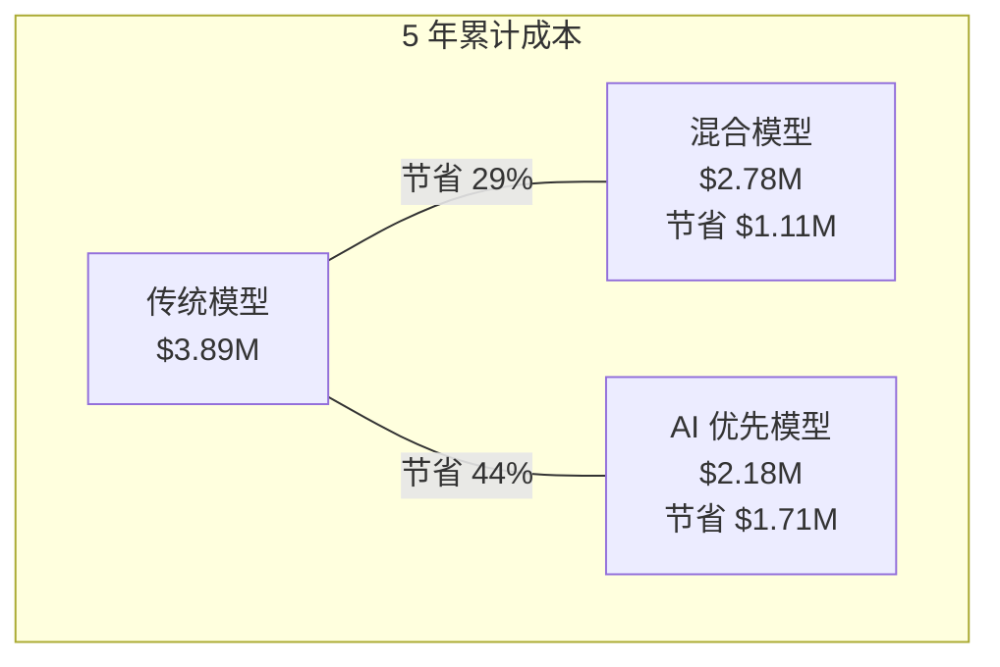

# 总体拥有成本 (TCO, Total Cost of Ownership)：5 年模型

一个用于评估 AI 客服投资的全面财务模型，包括所有直接和间接成本。

## 模型假设

| 参数 | 数值 | 备注 |
|---|---|---|
| 初始工单量 | 50,000/年 | 10,000/月 |
| 年度工单增长 | 15% | 行业平均水平 |
| 当前每张工单成本 | $10 | 传统模型 |
| 客服年薪 | $45,000 | 全额负担（含福利） |
| 每位客服每年处理工单数 | 8,000 | 约 32 张/天 |
| 折现率 | 8% | 用于净现值 (NPV, Net Present Value) 计算 |

## 逐年成本明细

### 传统模型（基准）

| 成本类别 | 第 1 年 | 第 2 年 | 第 3 年 | 第 4 年 | 第 5 年 |
|---|---|---|---|---|---|
| 客服人力（工资 + 福利） | $450K | $495K | $545K | $600K | $660K |
| 管理开销 (15%) | $68K | $74K | $82K | $90K | $99K |
| 工单软件 | $25K | $27K | $29K | $32K | $35K |
| 培训与入职 | $30K | $33K | $36K | $40K | $44K |
| 离职成本 | $45K | $50K | $55K | $60K | $66K |
| 场地与设备 | $20K | $22K | $24K | $26K | $29K |
| **年度总计** | **$638K** | **$701K** | **$771K** | **$848K** | **$933K** |
| **累计** | **$638K** | **$1.34M** | **$2.11M** | **$2.96M** | **$3.89M** |

### 混合模型（AI 处理 1 级 + 人工处理 2/3 级）

| 成本类别 | 第 1 年 | 第 2 年 | 第 3 年 | 第 4 年 | 第 5 年 |
|---|---|---|---|---|---|
| **启动成本（摊销）** | | | | | |
| 知识库构建 | $35K | — | — | — | — |
| 集成开发 | $50K | — | — | — | — |
| 变革管理 | $15K | — | — | — | — |
| **持续运营成本** | | | | | |
| AI API 成本 | $15K | $17K | $20K | $23K | $26K |
| 向量数据库 (Vector Database) | $12K | $14K | $16K | $18K | $21K |
| 基础设施（计算） | $18K | $20K | $22K | $25K | $28K |
| 人工客服（减少 40%） | $270K | $297K | $327K | $360K | $396K |
| 管理开销 | $41K | $45K | $49K | $54K | $59K |
| 工单软件 | $25K | $27K | $29K | $32K | $35K |
| 知识库维护 | $25K | $27K | $30K | $33K | $36K |
| 模型微调 (Fine-tuning) | $10K | $12K | $14K | $16K | $18K |
| 质量保证 (QA) 与监督 | $20K | $22K | $24K | $26K | $29K |
| **年度总计** | **$536K** | **$481K** | **$531K** | **$587K** | **$648K** |
| **累计** | **$536K** | **$1.02M** | **$1.55M** | **$2.13M** | **$2.78M** |

### AI 优先模型（AI 处理 1/2 级 + 人工处理 3 级）

| 成本类别 | 第 1 年 | 第 2 年 | 第 3 年 | 第 4 年 | 第 5 年 |
|---|---|---|---|---|---|
| **启动成本（摊销）** | | | | | |
| 知识库构建 | $50K | — | — | — | — |
| 集成开发 | $75K | — | — | — | — |
| 微调数据集 | $25K | — | — | — | — |
| 变革管理 | $20K | — | — | — | — |
| **持续运营成本** | | | | | |
| AI API 成本 | $25K | $29K | $33K | $38K | $44K |
| 向量数据库 | $18K | $21K | $24K | $27K | $31K |
| 基础设施 | $24K | $27K | $31K | $35K | $40K |
| 人工客服（减少 70%） | $135K | $149K | $164K | $180K | $198K |
| 管理开销 | $20K | $22K | $25K | $27K | $30K |
| 工单软件 | $20K | $22K | $24K | $26K | $29K |
| 知识库维护 | $35K | $38K | $42K | $46K | $51K |
| 模型微调 | $15K | $17K | $20K | $23K | $26K |
| 质量保证 (QA) 与监督 | $30K | $33K | $36K | $40K | $44K |
| **年度总计** | **$492K** | **$358K** | **$399K** | **$442K** | **$493K** |
| **累计** | **$492K** | **$850K** | **$1.25M** | **$1.69M** | **$2.18M** |

## 5 年总结

| 模型 | 5 年总计 | 对比传统模型 | 节省 |
|---|---|---|---|
| 传统模型 | $3.89M | — | — |
| 混合模型 | $2.78M | -$1.11M | 29% |
| AI 优先模型 | $2.18M | -$1.71M | 44% |

## 净现值 (NPV, Net Present Value) 分析

按 8% 折现率计算：

| 模型 | NPV (5 年) | NPV 节省（对比传统模型） |
|---|---|---|
| 传统模型 | $3.08M | — |
| 混合模型 | $2.15M | $930K |
| AI 优先模型 | $1.68M | $1.40M |

## 敏感性分析

### 工单量如何影响经济效益

| 每月工单量 | 传统模型每工单成本 | 混合模型每工单成本 | AI 优先模型每工单成本 |
|---|---|---|---|
| 5,000 | $12.00 | $4.50 | $2.00 |
| 10,000 | $10.00 | $3.50 | $1.20 |
| 50,000 | $8.50 | $2.20 | $0.60 |
| 100,000 | $8.00 | $1.80 | $0.40 |
| 500,000 | $7.50 | $1.20 | $0.25 |

:::tip 规模是关键变量
AI 客服 (CS, Customer Service) 的经济效益随规模显著提升。每月处理 10 万以上工单的公司，在 AI 优先模型下，每张工单的成本可降至 0.50 美元以下 —— 比传统模型便宜一个**数量级**。
:::

### 工单复杂度如何影响经济效益

| 1 级工单占比 ↓ | 传统模型影响 | 混合模型节省 | AI 优先模型节省 |
|---|---|---|---|
| 40% | 基准 | 20% | 30% |
| 50% | 基准 | 25% | 37% |
| 60% | 基准 | 30% | 44% |
| 70% | 基准 | 35% | 52% |
| 80% | 基准 | 40% | 60% |

### 什么会破坏该模型

| 风险因素 | 影响 | 缓解措施 |
|---|---|---|
| 高复杂度工单（3 级工单 > 50%） | AI 节省降至 15–20% | 优先关注 1 级自动化 |
| 产品变更频繁 | 知识库 (KB, Knowledge Base) 维护成本翻倍 | 自动化知识库刷新流水线 |
| 监管要求 | 合规成本每年增加 $50K–$100K | 内置合规层 |
| 低工单量（每月 < 5K 张） | 固定成本占主导 | 从 SaaS AI（如 Zendesk AI, Intercom）开始 |

## 自建 vs 购买分析

| 方案 | 第一年成本 | 年度持续成本 | 控制力 | 定制化 |
|---|---|---|---|---|
| **SaaS (Zendesk AI, Intercom Fin)** | $20K–$50K | $30K–$80K | 低 | 有限 |
| **基于 LLM API 构建** | $100K–$200K | $50K–$100K | 高 | 完全 |
| **混合方案（SaaS + 定制）** | $60K–$120K | $40K–$80K | 中 | 适中 |

:::note 按规模推荐
- **每月工单量 < 10K**: 使用 SaaS（Zendesk AI, Intercom Fin）
- **每月工单量 10K–100K**: 混合方案（SaaS + 定制 RAG）
- **每月工单量 > 100K**: 基于 LLM API 构建，以获得最大控制力和最低的单工单成本
:::

## 下一步

要使用您自己的数据计算具体的投资回报率 (ROI)，请参阅带有交互式计算器模板的 [投资回报框架](./roi-framework)。
