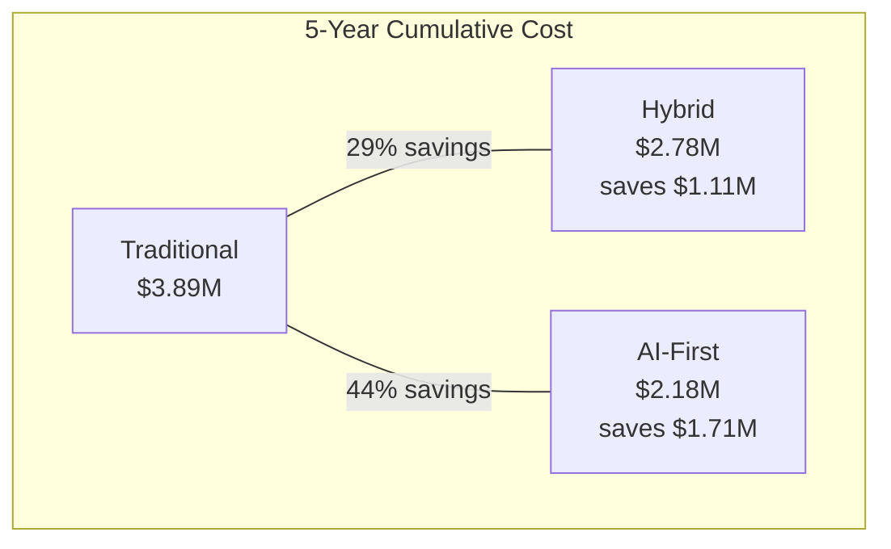

# Total Cost of Ownership: 5-Year Model

A comprehensive financial model for evaluating AI customer service investment, including all direct and indirect costs.

## Model Assumptions

| Parameter | Value | Notes |
|---|---|---|
| Starting ticket volume | 50,000/year | 10,000/month |
| Annual ticket growth | 15% | Industry average |
| Current cost per ticket | $10 | Traditional model |
| Agent annual salary | $45,000 | Fully loaded |
| Tickets per agent per year | 8,000 | ~32/day |
| Discount rate | 8% | For NPV calculation |

## Year-by-Year Cost Breakdown

### Traditional Model (Baseline)

| Cost Category | Year 1 | Year 2 | Year 3 | Year 4 | Year 5 |
|---|---|---|---|---|---|
| Agent labor (salaries + benefits) | $450K | $495K | $545K | $600K | $660K |
| Management overhead (15%) | $68K | $74K | $82K | $90K | $99K |
| Ticketing software | $25K | $27K | $29K | $32K | $35K |
| Training & onboarding | $30K | $33K | $36K | $40K | $44K |
| Turnover costs | $45K | $50K | $55K | $60K | $66K |
| Facility & equipment | $20K | $22K | $24K | $26K | $29K |
| **Annual Total** | **$638K** | **$701K** | **$771K** | **$848K** | **$933K** |
| **Cumulative** | **$638K** | **$1.34M** | **$2.11M** | **$2.96M** | **$3.89M** |

### Hybrid Model (AI Tier 1 + Human Tier 2/3)

| Cost Category | Year 1 | Year 2 | Year 3 | Year 4 | Year 5 |
|---|---|---|---|---|---|
| **Setup (amortized)** | | | | | |
| Knowledge base creation | $35K | — | — | — | — |
| Integration development | $50K | — | — | — | — |
| Change management | $15K | — | — | — | — |
| **Ongoing** | | | | | |
| AI API costs | $15K | $17K | $20K | $23K | $26K |
| Vector database | $12K | $14K | $16K | $18K | $21K |
| Infrastructure (compute) | $18K | $20K | $22K | $25K | $28K |
| Human agents (40% reduction) | $270K | $297K | $327K | $360K | $396K |
| Management overhead | $41K | $45K | $49K | $54K | $59K |
| Ticketing software | $25K | $27K | $29K | $32K | $35K |
| Knowledge base maintenance | $25K | $27K | $30K | $33K | $36K |
| Model fine-tuning | $10K | $12K | $14K | $16K | $18K |
| QA & oversight | $20K | $22K | $24K | $26K | $29K |
| **Annual Total** | **$536K** | **$481K** | **$531K** | **$587K** | **$648K** |
| **Cumulative** | **$536K** | **$1.02M** | **$1.55M** | **$2.13M** | **$2.78M** |

### AI-First Model (AI Tier 1/2 + Human Tier 3)

| Cost Category | Year 1 | Year 2 | Year 3 | Year 4 | Year 5 |
|---|---|---|---|---|---|
| **Setup (amortized)** | | | | | |
| Knowledge base creation | $50K | — | — | — | — |
| Integration development | $75K | — | — | — | — |
| Fine-tuning dataset | $25K | — | — | — | — |
| Change management | $20K | — | — | — | — |
| **Ongoing** | | | | | |
| AI API costs | $25K | $29K | $33K | $38K | $44K |
| Vector database | $18K | $21K | $24K | $27K | $31K |
| Infrastructure | $24K | $27K | $31K | $35K | $40K |
| Human agents (70% reduction) | $135K | $149K | $164K | $180K | $198K |
| Management overhead | $20K | $22K | $25K | $27K | $30K |
| Ticketing software | $20K | $22K | $24K | $26K | $29K |
| Knowledge base maintenance | $35K | $38K | $42K | $46K | $51K |
| Model fine-tuning | $15K | $17K | $20K | $23K | $26K |
| QA & oversight | $30K | $33K | $36K | $40K | $44K |
| **Annual Total** | **$492K** | **$358K** | **$399K** | **$442K** | **$493K** |
| **Cumulative** | **$492K** | **$850K** | **$1.25M** | **$1.69M** | **$2.18M** |

## 5-Year Summary

| Model | 5-Year Total | vs Traditional | Savings |
|---|---|---|---|
| Traditional | $3.89M | — | — |
| Hybrid | $2.78M | -$1.11M | 29% |
| AI-First | $2.18M | -$1.71M | 44% |

## Net Present Value (NPV) Analysis

At 8% discount rate:

| Model | NPV (5-Year) | NPV Savings vs Traditional |
|---|---|---|
| Traditional | $3.08M | — |
| Hybrid | $2.15M | $930K |
| AI-First | $1.68M | $1.40M |

## Sensitivity Analysis

### How Ticket Volume Affects Economics

| Monthly Tickets | Traditional Cost/Ticket | Hybrid Cost/Ticket | AI-First Cost/Ticket |
|---|---|---|---|
| 5,000 | $12.00 | $4.50 | $2.00 |
| 10,000 | $10.00 | $3.50 | $1.20 |
| 50,000 | $8.50 | $2.20 | $0.60 |
| 100,000 | $8.00 | $1.80 | $0.40 |
| 500,000 | $7.50 | $1.20 | $0.25 |

:::tip Volume Is the Key Variable
AI CS economics improve dramatically with volume. A company processing 100K+ tickets/month sees cost per ticket drop below $0.50 in the AI-First model — an **order of magnitude** cheaper than traditional.
:::

### How Ticket Complexity Affects Economics

| Tier 1 % | Traditional Impact | Hybrid Savings | AI-First Savings |
|---|---|---|---|
| 40% | Baseline | 20% | 30% |
| 50% | Baseline | 25% | 37% |
| 60% | Baseline | 30% | 44% |
| 70% | Baseline | 35% | 52% |
| 80% | Baseline | 40% | 60% |

### What Breaks the Model

| Risk Factor | Impact | Mitigation |
|---|---|---|
| High-complexity tickets (>50% Tier 3) | AI savings drop to 15–20% | Focus on Tier 1 automation first |
| Frequent product changes | KB maintenance costs spike 2x | Automated KB refresh pipeline |
| Regulatory requirements | Compliance costs add $50K–$100K/year | Built-in compliance layer |
| Low volume (`<5K` tickets/month) | Fixed costs dominate | Start with SaaS AI (Zendesk AI, Intercom) |

## Build vs Buy Analysis

| Approach | Year 1 Cost | Ongoing Annual | Control | Customization |
|---|---|---|---|---|
| **SaaS (Zendesk AI, Intercom Fin)** | $20K–$50K | $30K–$80K | Low | Limited |
| **Build on LLM APIs** | $100K–$200K | $50K–$100K | High | Full |
| **Hybrid (SaaS + Custom)** | $60K–$120K | $40K–$80K | Medium | Moderate |

:::note Recommendation by Scale
- **< 10K tickets/month**: Use SaaS (Zendesk AI, Intercom Fin)
- **10K–100K tickets/month**: Hybrid approach (SaaS + custom RAG)
- **> 100K tickets/month**: Build on LLM APIs for maximum control and lowest per-ticket cost
:::

## What's Next

To calculate your specific ROI with your own numbers, see the [ROI Framework](./roi-framework) with an interactive calculator template.
