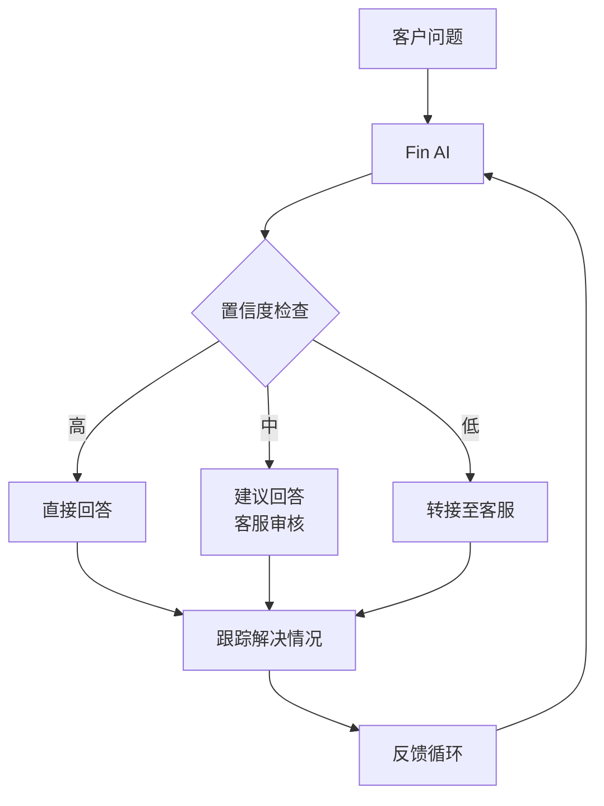
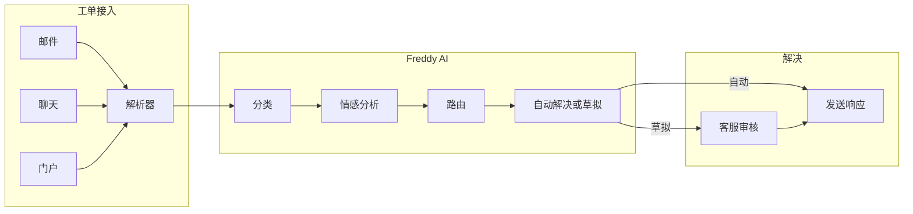
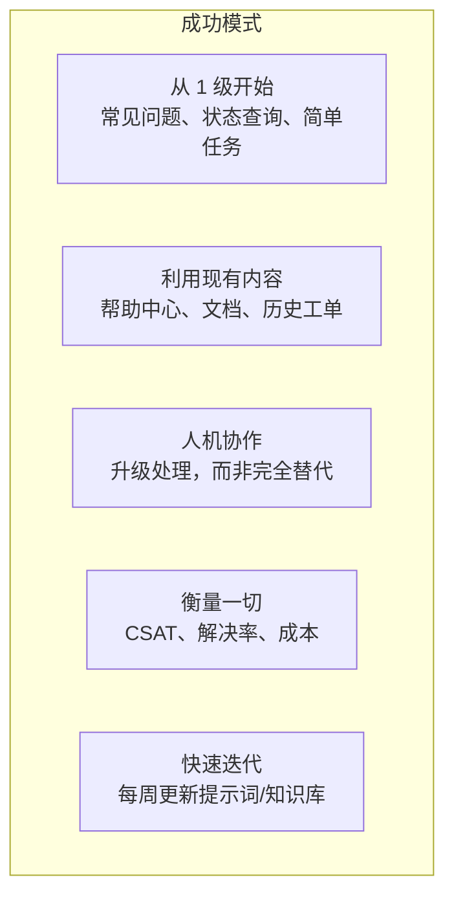

# 案例研究：真实的 AI 客服实施

借鉴已成功大规模部署 AI 客服的公司的经验。

## Klarna (2024)

### 核心摘要
AI 助手在第一个月处理了 **230 万次对话**，相当于 **700 名全职客服**的工作量。

### 实施前
| 指标 | 数值 |
|---|---|
| 客服人数 | 3,000+ |
| 平均解决时间 | 11 分钟 |
| 支持语言 | 受限于人员配置 |
| 每次交互成本 | $8–$12 |

### 实施后
| 指标 | 数值 |
|---|---|
| AI 处理量 | 所有对话的 2/3 |
| 平均解决时间 | < 2 分钟 |
| 支持语言 | 23 种（此前受限） |
| 预计节省 | 每年 $40M |

### 实施举措
- 基于 OpenAI 的模型构建
- 与内部系统（账单、退款、账户）集成
- AI 处理退款、支付问题、账户咨询
- 人工客服专注于复杂的争议和极端情况

### 关键启示
> “AI 助手 24/7 全天候在线，并能以超过 35 种语言进行交流，这比纯人工配置有了显著提升。”

:::tip 见效速度
Klarna 在第一个月就看到了投资回报。他们的高业务量（数百万次交互）意味着节省的成本会立即产生复利效应。
:::

---

## Intercom Fin (2023–2024)

### 核心摘要
Fin 能够自动解决**高达 50%** 的支持问题，其训练基于客户现有的帮助中心内容。

### 架构

### 客户群成果

| 公司 | 解决率 | CSAT 影响 | 成本降低 |
|---|---|---|---|
| SaaS（中型市场） | 45% | +8% CSAT | 35% |
| 电商 | 52% | 持平 | 40% |
| 金融科技 | 38% | +5% CSAT | 28% |

### 关键启示
- 从现有的帮助中心内容开始（无需额外的知识库构建工作）
- 随着 Fin 从交互中学习，解决率会随时间提高
- 当帮助中心内容已经很全面时，效果最佳

---

## Zendesk AI (2023–2024)

### 核心摘要
Zendesk 的 AI 功能将**首次回复时间缩短了 80%**，并将**客服生产力提高了 40%**。

### 三层方案

| 层级 | 功能 | 采用率 |
|---|---|---|
| AI 代理 (AI Agents) | 自主解决 | 15–30% 的工单 |
| 智能副驾 (Copilot) | 客服辅助（草拟、总结） | 70% 以上的客服使用 |
| 智能分流 (Intelligent Triage) | 自动分类、优先级排序、路由 | 90% 以上的准确率 |

### 客户成果

**Shopify:**
- 首次回复时间缩短 40%
- AI 处理密码重置、订单状态、账单查询
- 客服专注于商家特定的问题

**Mailchimp:**
- 30% 的工单在无需人工干预的情况下得到解决
- CSAT 保持在 4.2/5（与纯人工模式持平）
- 客服满意度提高（减少了重复性工作）

### 关键启示
> “价值不仅仅在于自动化。智能副驾 (Copilot) 让人工客服变得更快、更具一致性。”

---

## Freshdesk Freddy AI (2023)

### 核心摘要
Freshworks 的 AI 助手在工单分类方面达到了 **80% 的准确率**，并对符合条件的工单实现了 **40% 的自动解决率**。

### 实施模式

### 关键启示
- 从**分流**（分类、路由）开始 —— 更容易证明价值
- 自动解决紧随其后，前提是您信任分类结果
- 情感分析可实现智能路由（愤怒的客户 -> 资深客服）

---

## Bank of America Erica (2018–2024)

### 核心摘要
虚拟金融助手已为 **4200 万客户**提供了超过 **20 亿次交互**服务。

### 规模

| 指标 | 数值 |
|---|---|
| 总交互次数 | 20 亿+ |
| 用户数 | 4,200 万 |
| 每日交互次数 | 5,000 万+ |
| 自动化任务 | 余额查询、转账、账单支付、支出洞察 |

### 关键启示
- 语音 + 文本多模态支持
- 与银行系统深度集成（不仅仅是聊天）
- 6 年间持续的功能扩展
- 每次交互都内置了监管合规性

---

## 所有案例的共同模式

### 成功与失败的区别

| 成功因素 | 失败项目所缺失的 |
|---|---|
| 全面的知识库 | 稀疏或过时的文档 |
| 清晰的升级路径 | “非 AI 即无”的方法 |
| 持续的反馈循环 | 部署后即不管 |
| 高管支持 | 仅由 IT 部门发起的项目 |
| 现实的预期 | 期望 100% 自动化 |

## 经验教训

1. **1 级自动化提供了 80% 的价值** —— 不要试图在第一天就自动化所有事情
2. **质量 > 数量** —— 4.5 CSAT 的 40% 自动化优于 3.5 CSAT 的 70% 自动化
3. **知识库是瓶颈** —— AI 的质量受限于知识库的质量
4. **从智能副驾 (Copilot) 开始，而非自动驾驶 (Autopilot)** —— 让客服先使用 AI，然后再实现自动化
5. **从第一天开始衡量** —— 您无法改进您未衡量的事项

## 下一步

现在让我们深入探讨技术实施，从 [AI 模型选择](./ai-models) 开始 —— 了解何时使用哪种大语言模型 (LLM)。
