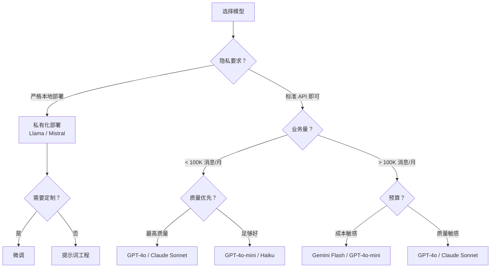
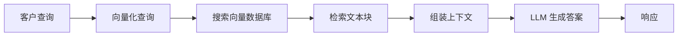
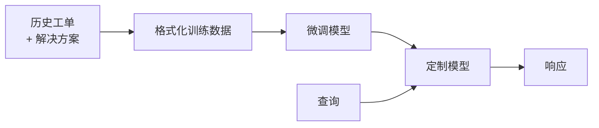

# AI 模型与选择指南

为客服选择合适的 AI 模型 —— 平衡成本、质量、延迟和控制力。

## 模型概览

### 基础模型（基于 API）

| 提供商 | 模型 | 优势 | 成本（每 1M Token） | 最佳用途 |
|---|---|---|---|---|
| OpenAI | GPT-4o | 综合质量最佳，速度快 | $2.50–$10 | 复杂推理，高质量 |
| OpenAI | GPT-4o-mini | 快速，廉价，足够好 | $0.15–$0.60 | 高业务量的 1 级工单 |
| Anthropic | Claude 3.5 Sonnet | 卓越的指令遵循能力 | $3–$15 | 细腻的响应，安全性 |
| Anthropic | Claude 3 Haiku | 最快，最廉价 | $0.25–$1.25 | 实时聊天，高业务量 |
| Google | Gemini 1.5 Pro | 长上下文，多模态 | $1.25–$5 | 多文档分析 |
| Google | Gemini 1.5 Flash | 非常快，非常廉价 | $0.075–$0.30 | 超高业务量 |
| Meta | Llama 3.1 70B | 开源，可私有化部署 | 私有化部署成本 | 完全控制，隐私 |

### 开源模型（私有化部署）

| 模型 | 参数量 | 质量 | 硬件需求 | 使用场景 |
|---|---|---|---|---|
| Llama 3.1 | 8B–405B | 极好 | 1–8× A100 | 成本控制，隐私 |
| Mistral | 7B–8x22B | 良好至极好 | 1–4× A100 | 欧洲数据驻留要求 |
| Qwen 2.5 | 7B–72B | 良好 | 1–4× A100 | 多语言（中文增强） |
| Phi-3 | 3.8B–14B | 良好（相对于其尺寸） | 1× A100 或 CPU | 边缘计算，本地部署 |

## 决策框架

## 模型选择矩阵

### 按使用场景

| 使用场景 | 推荐模型 | 原因 |
|---|---|---|
| 常见问题 (FAQ) 自动响应 | GPT-4o-mini / Haiku | 快速、廉价、擅长检索 |
| 复杂故障排除 | GPT-4o / Claude Sonnet | 需要推理能力和细腻度 |
| 多语言支持 | GPT-4o / Gemini Pro | 最佳的多语言覆盖范围 |
| 实时聊天 | Haiku / Gemini Flash | 最低延迟 |
| 敏感数据（如医疗保健） | 私有化部署 Llama | 数据保留在您的基础设施中 |
| 为客服审核草拟回复 | GPT-4o-mini | 质量良好，成本低 |
| 情感分析 | 微调后的较小模型 | 比通用大语言模型 (LLM) 更便宜 |

### 按优先级

| 优先级 | 首选 | 备选 |
|---|---|---|
| 最低成本 | Gemini Flash ($0.075/M) | GPT-4o-mini ($0.15/M) |
| 最高质量 | GPT-4o | Claude 3.5 Sonnet |
| 最低延迟 | Claude Haiku | Gemini Flash |
| 最佳性价比 | GPT-4o-mini | Claude Haiku |
| 完全控制 | Llama 3.1 70B | Mistral 8x22B |
| 专门针对客服的最佳选择 | GPT-4o（微调后） | Claude Sonnet |

## 微调 (Fine-Tuning) vs RAG

为您的特定客服需求定制模型的两种方法：

### RAG (检索增强生成)

| 维度 | RAG |
|---|---|
| 搭建时间 | 数天至数周 |
| 所需数据 | 知识库文章 |
| 更新频率 | 实时（只需更新知识库） |
| 成本 | 低（无需训练） |
| 质量 | 擅长事实召回 |
| 最佳用途 | 常见问题、文档查找 |

### 微调 (Fine-Tuning)

| 维度 | 微调 (Fine-Tuning) |
|---|---|
| 搭建时间 | 数周至数月 |
| 所需数据 | 1,000 至 100,000 个示例 |
| 更新频率 | 需要重新训练 |
| 成本 | 较高（训练计算成本） |
| 质量 | 擅长语气、风格和极端情况 |
| 最佳用途 | 一致的品牌语调、复杂的工作流 |

### 建议

| 情况 | 方案 |
|---|---|
| 刚开始实施 | 仅使用 RAG |
| 拥有 1 万个以上高质量工单解决方案 | RAG + 语气微调 |
| 高度专业领域 | 微调 + RAG |
| 严格的品牌语调要求 | 微调 |

:::tip 从 RAG 开始
RAG 能以 20% 的努力为您带来 80% 的价值。等您有了数据并明确了需求后，再考虑微调。
:::

## 嵌入模型 (Embedding Models)

对于 RAG，您需要一个嵌入模型来将您的知识库向量化：

| 模型 | 维度 | 成本 | 质量 | 最佳用途 |
|---|---|---|---|---|
| text-embedding-3-small | 1536 | $0.02/M Token | 良好 | 大多数使用场景 |
| text-embedding-3-large | 3072 | $0.13/M Token | 最佳 | 高准确度需求 |
| Cohere Embed v3 | 1024 | $0.10/M Token | 极好 | 多语言 |
| BGE-large (开源) | 1024 | 私有化部署 | 良好 | 本地部署 |
| nomic-embed-text (开源) | 768 | 私有化部署 | 良好 | 本地部署，速度快 |

## 按业务量的成本估算

| 每月消息量 | GPT-4o | GPT-4o-mini | Claude Haiku | 私有化部署 Llama |
|---|---|---|---|---|
| 10K | $250 | $15 | $25 | $200 (GPU) |
| 50K | $1,250 | $75 | $125 | $400 (GPU) |
| 100K | $2,500 | $150 | $250 | $600 (GPU) |
| 500K | $12,500 | $750 | $1,250 | $1,500 (GPU) |
| 1M | $25,000 | $1,500 | $2,500 | $2,500 (GPU) |

*假设每次对话约 500 Token 输入 + 200 Token 输出，平均 3 轮对话*

:::note 交叉点
当每月消息量达到约 50 万条以上时，私有化部署模型会比 API 更便宜，但需要 DevOps 专业知识。对于大多数公司而言，基于 API 的模型是正确的选择。
:::

## 下一步

选定模型后，让我们来设计 [RAG 架构](./rag-architecture) —— 为准确回答提供支持的知识检索系统。
