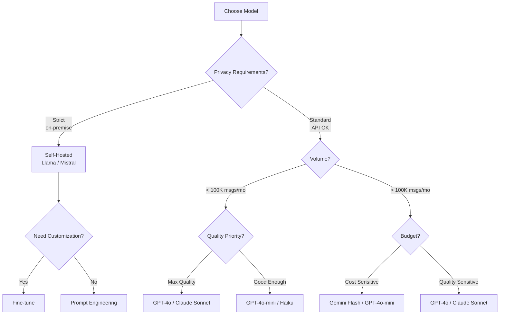
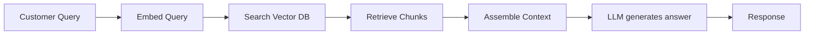
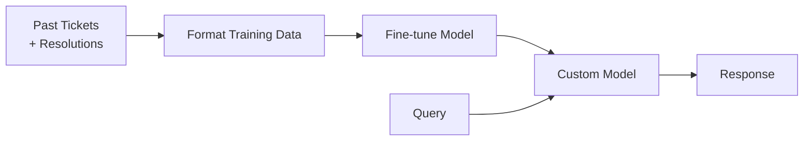

# AI Models & Selection Guide

Choosing the right AI model for customer service — balancing cost, quality, latency, and control.

## The Model Landscape

### Foundation Models (API-based)

| Provider | Model | Strengths | Cost (per 1M tokens) | Best For |
|---|---|---|---|---|
| OpenAI | GPT-4o | Best overall quality, fast | $2.50–$10 | Complex reasoning, high quality |
| OpenAI | GPT-4o-mini | Fast, cheap, good enough | $0.15–$0.60 | High-volume Tier 1 |
| Anthropic | Claude 3.5 Sonnet | Excellent instruction following | $3–$15 | Nuanced responses, safety |
| Anthropic | Claude 3 Haiku | Fastest, cheapest | $0.25–$1.25 | Real-time chat, high volume |
| Google | Gemini 1.5 Pro | Long context, multimodal | $1.25–$5 | Multi-document analysis |
| Google | Gemini 1.5 Flash | Very fast, very cheap | $0.075–$0.30 | Ultra-high volume |
| Meta | Llama 3.1 70B | Open source, self-hostable | Self-host cost | Full control, privacy |

### Open Source (Self-Hosted)

| Model | Parameters | Quality | Hardware | Use Case |
|---|---|---|---|---|
| Llama 3.1 | 8B–405B | Very Good | 1–8× A100 | Cost control, privacy |
| Mistral | 7B–8x22B | Good–Very Good | 1–4× A100 | European data residency |
| Qwen 2.5 | 7B–72B | Good | 1–4× A100 | Multilingual (Chinese+) |
| Phi-3 | 3.8B–14B | Good (for size) | 1× A100 or CPU | Edge, on-premise |

## Decision Framework

## Model Selection Matrix

### By Use Case

| Use Case | Recommended Model | Why |
|---|---|---|
| FAQ auto-response | GPT-4o-mini / Haiku | Fast, cheap, good at retrieval |
| Complex troubleshooting | GPT-4o / Claude Sonnet | Needs reasoning, nuance |
| Multilingual support | GPT-4o / Gemini Pro | Best multilingual coverage |
| Real-time chat | Haiku / Gemini Flash | Lowest latency |
| Sensitive data (healthcare) | Self-hosted Llama | Data stays in your infra |
| Drafting for agent review | GPT-4o-mini | Good quality, low cost |
| Sentiment analysis | Fine-tuned smaller model | Cheaper than general LLM |

### By Priority

| Priority | Primary | Secondary |
|---|---|---|
| Lowest cost | Gemini Flash ($0.075/M) | GPT-4o-mini ($0.15/M) |
| Highest quality | GPT-4o | Claude 3.5 Sonnet |
| Lowest latency | Claude Haiku | Gemini Flash |
| Best value | GPT-4o-mini | Claude Haiku |
| Full control | Llama 3.1 70B | Mistral 8x22B |
| Best for CS specifically | GPT-4o (fine-tuned) | Claude Sonnet |

## Fine-Tuning vs RAG

Two approaches to customizing models for your specific CS needs:

### RAG (Retrieval-Augmented Generation)

| Aspect | RAG |
|---|---|
| Setup time | Days–weeks |
| Data needed | Knowledge base articles |
| Updates | Real-time (just update KB) |
| Cost | Low (no training) |
| Quality | Good for factual recall |
| Best for | FAQ, documentation lookup |

### Fine-Tuning

| Aspect | Fine-Tuning |
|---|---|
| Setup time | Weeks–months |
| Data needed | 1K–100K examples |
| Updates | Requires retraining |
| Cost | Higher (training compute) |
| Quality | Better for tone, style, edge cases |
| Best for | Consistent brand voice, complex workflows |

### Recommendation

| Situation | Approach |
|---|---|
| Starting out | RAG only |
| Have 10K+ quality ticket resolutions | RAG + fine-tune for tone |
| Highly specialized domain | Fine-tune + RAG |
| Strict brand voice requirements | Fine-tune |

:::tip Start with RAG
RAG gets you 80% of the value at 20% of the effort. Fine-tune later when you have data and know what you need.
:::

## Embedding Models

For RAG, you need an embedding model to vectorize your knowledge base:

| Model | Dimensions | Cost | Quality | Best For |
|---|---|---|---|---|
| text-embedding-3-small | 1536 | $0.02/M tokens | Good | Most use cases |
| text-embedding-3-large | 3072 | $0.13/M tokens | Best | High-accuracy needs |
| Cohere Embed v3 | 1024 | $0.10/M tokens | Very Good | Multilingual |
| BGE-large (open) | 1024 | Self-host | Good | On-premise |
| nomic-embed-text (open) | 768 | Self-host | Good | On-premise, fast |

## Cost Estimation by Volume

| Monthly Messages | GPT-4o | GPT-4o-mini | Claude Haiku | Self-hosted Llama |
|---|---|---|---|---|
| 10K | $250 | $15 | $25 | $200 (GPU) |
| 50K | $1,250 | $75 | $125 | $400 (GPU) |
| 100K | $2,500 | $150 | $250 | $600 (GPU) |
| 500K | $12,500 | $750 | $1,250 | $1,500 (GPU) |
| 1M | $25,000 | $1,500 | $2,500 | $2,500 (GPU) |

*Assumes ~500 tokens input + 200 tokens output per conversation, 3 turns average*

:::note The Crossover Point
Self-hosted models become cheaper than API at ~500K+ messages/month, but require DevOps expertise. For most companies, API-based models are the right choice.
:::

## What's Next

With your model selected, let's design the [RAG architecture](./rag-architecture) — the knowledge retrieval system that powers accurate answers.
