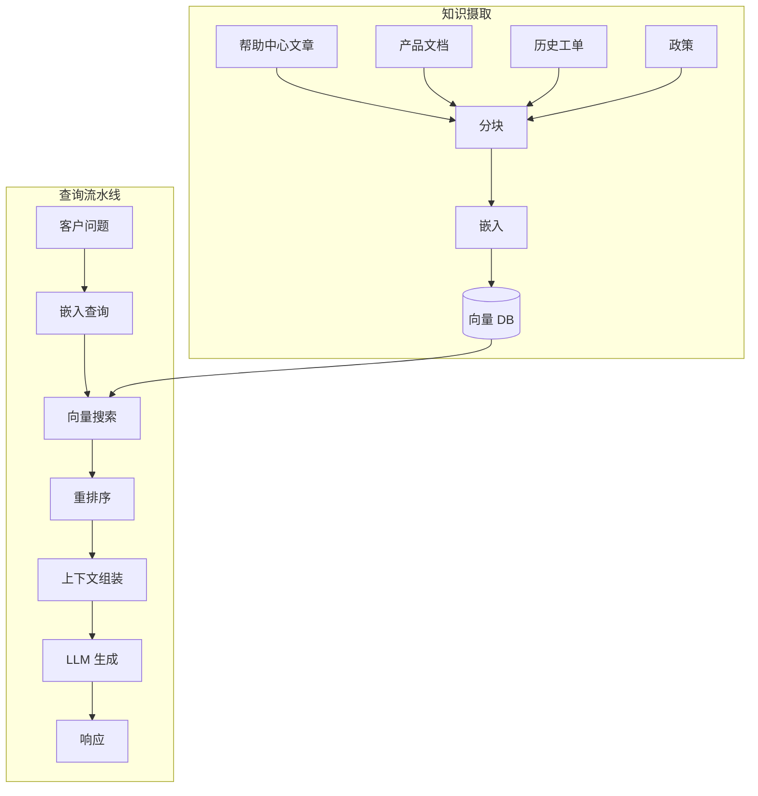
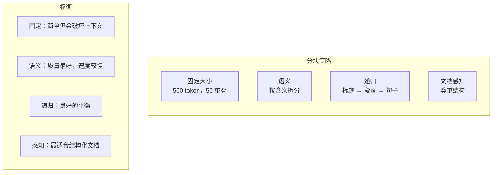
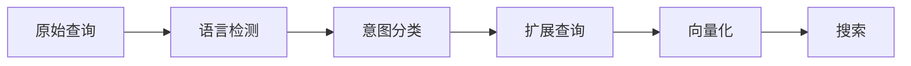
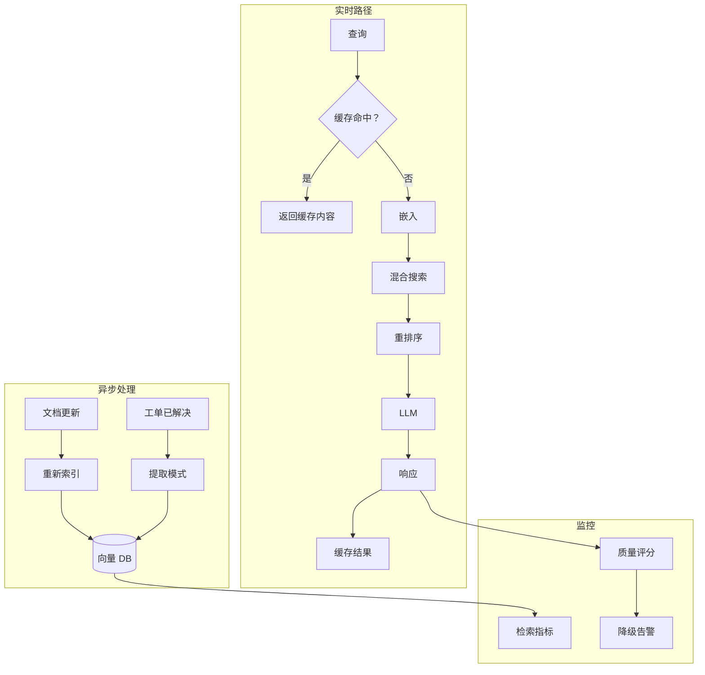

# 客户服务的 RAG 架构

检索增强生成 (Retrieval-Augmented Generation, RAG) 是 AI 客户服务 (Customer Service, CS) 的核心模式 —— 检索相关知识，然后生成准确的答案。

## 为什么在 CS 中使用 RAG？

| 挑战 | RAG 如何解决 |
|---|---|
| LLM (大语言模型) 事实幻觉 | 将答案建立在您的实际文档基础上 |
| 知识更新频繁 | 无需重新训练即可更新 KB (知识库) |
| 需要来源归属 | 检索到的分块 = 引用 |
| 特定领域的术语 | 您的文档包含您的术语 |
| 合规性要求 | 答案可追溯到经过批准的来源 |

## 架构概览



## 知识摄取流水线

### 第 1 步：内容来源

| 来源 | 格式 | 更新频率 | 优先级 |
|---|---|---|---|
| 帮助中心 | HTML/Markdown | 每周 | 高 |
| 产品文档 | Markdown/RST | 发布时 | 高 |
| 历史工单处理结果 | 数据库导出 | 每日 | 中 |
| 政策文件 | PDF/Word | 每季度 | 中 |
| 社区论坛 | HTML | 实时 | 低 |

### 第 2 步：分块策略

如何拆分文档对检索质量至关重要：



**推荐的 CS 处理方法：**

```python
from langchain.text_splitter import RecursiveCharacterTextSplitter

splitter = RecursiveCharacterTextSplitter(
    chunk_size=500,          # ~400 words
    chunk_overlap=50,        # Context continuity
    separators=[
        "\n## ",             # Headers first
        "\n\n",              # Paragraphs
        "\n",                # Lines
        ". ",                # Sentences
        " ",                 # Words
    ],
    length_function=len,
)
```

### 第 3 步：元数据丰富

每个分块都应携带元数据以便进行过滤搜索：

| 元数据字段 | 示例 | 用途 |
|---|---|---|
| `source` | "help-center" | 按来源类型过滤 |
| `product` | "billing" | 特定产品的搜索 |
| `section` | "refunds" | 层级上下文 |
| `last_updated` | "2024-01-15" | 新鲜度评分 |
| `version` | "v2.3" | 特定版本的答案 |
| `language` | "en" | 多语言路由 |

### 第 4 步：向量数据库选择

| 数据库 | 类型 | 托管 | 最适合 |
|---|---|---|---|
| Pinecone | 专用 | ✅ | 设置简单，性能良好 |
| Weaviate | 专用 | ✅/自建 | 混合搜索，GraphQL |
| Qdrant | 专用 | ✅/自建 | 性能，过滤 |
| pgvector | PostgreSQL 扩展 | ✅ | 已有 Postgres |
| Chroma | 嵌入式 | 自建 | 原型设计，小规模 |
| Milvus | 专用 | ✅/自建 | 企业级规模 |

:::tip 从简单开始
对于大多数 CS 用例，**Pinecone** (托管) 或 **pgvector** (如果您已经在使用 Postgres) 是正确的选择。不要在向量 DB (数据库) 的选择上过度设计。
:::

## 查询流水线

### 第 1 步：查询处理



**查询扩展**可以提高召回率：

```python
def expand_query(query: str, intent: str) -> list[str]:
    """Generate multiple query variations for better retrieval."""
    queries = [query]
    
    if intent == "how_to":
        queries.append(f"steps to {query}")
        queries.append(f"guide for {query}")
    elif intent == "troubleshooting":
        queries.append(f"fix {query}")
        queries.append(f"solve {query}")
        queries.append(f"{query} not working")
    
    return queries
```

### 第 2 步：混合搜索

结合向量搜索和关键字搜索以获得最佳结果：

```python
def hybrid_search(query: str, top_k: int = 5) -> list[Chunk]:
    # Vector search (semantic similarity)
    vector_results = vector_db.search(
        embedding=embed(query),
        top_k=top_k * 2,
        filter={"language": detected_language}
    )
    
    # Keyword search (exact matches for product names, error codes)
    keyword_results = keyword_index.search(
        query=query,
        top_k=top_k
    )
    
    # Reciprocal Rank Fusion
    combined = reciprocal_rank_fusion(vector_results, keyword_results)
    return combined[:top_k]
```

### 第 3 步：重排序

交叉编码器 (Cross-encoder) 重排序可提高精度：

```python
from sentence_transformers import CrossEncoder

reranker = CrossEncoder('cross-encoder/ms-marco-MiniLM-L-6-v2')

def rerank(query: str, chunks: list[Chunk], top_k: int = 3) -> list[Chunk]:
    pairs = [(query, chunk.text) for chunk in chunks]
    scores = reranker.predict(pairs)
    
    ranked = sorted(zip(chunks, scores), key=lambda x: x[1], reverse=True)
    return [chunk for chunk, score in ranked[:top_k]]
```

### 第 4 步：上下文组装

```python
def assemble_context(
    query: str,
    chunks: list[Chunk],
    conversation_history: list[Message],
    customer_context: dict
) -> str:
    return f"""Answer the customer's question using ONLY the provided context.

## Customer Context
- Name: {customer_context['name']}
- Account type: {customer_context['tier']}
- Previous issues: {customer_context.get('recent_issues', 'None')}

## Conversation History
{format_history(conversation_history)}

## Relevant Knowledge Base Articles
{format_chunks(chunks)}

## Customer Question
{query}

## Instructions
- Answer based ONLY on the provided articles
- If the articles don't contain the answer, say so
- Be concise and helpful
- Include relevant links if available
"""
```

## 质量优化

### 检索指标

| 指标 | 目标 | 如何衡量 |
|---|---|---|
| Recall@5 (召回率) | > 90% | 答案在排名前 5 的分块中的查询百分比 |
| Precision@3 (精确率) | > 70% | 检索到的分块中相关的百分比 |
| MRR (平均倒数排名) | > 0.8 | 第一个相关分块的平均位置 |
| Latency (p95) (延迟) | < 200ms | 从查询到检索到分块的时间 |

### 常见问题与修复

| 问题 | 症状 | 修复 |
|---|---|---|
| 检索到无关分块 | 低精确率 | 更好的分块，元数据过滤 |
| 文档中有答案但未找到 | 低召回率 | 查询扩展，混合搜索 |
| 信息过时 | 错误的答案 | 新鲜度元数据，定期重新索引 |
| 分块太小 | 丢失上下文 | 增加分块大小、重叠 |
| 分块太大 | 检索噪声多 | 减小分块大小，更好的拆分 |

## 生产架构



## 下一步

设计好知识检索流水线后，让我们看看 [集成模式](./integration-patterns) —— 连接到 Zendesk、Intercom、电子邮件和其他渠道。
