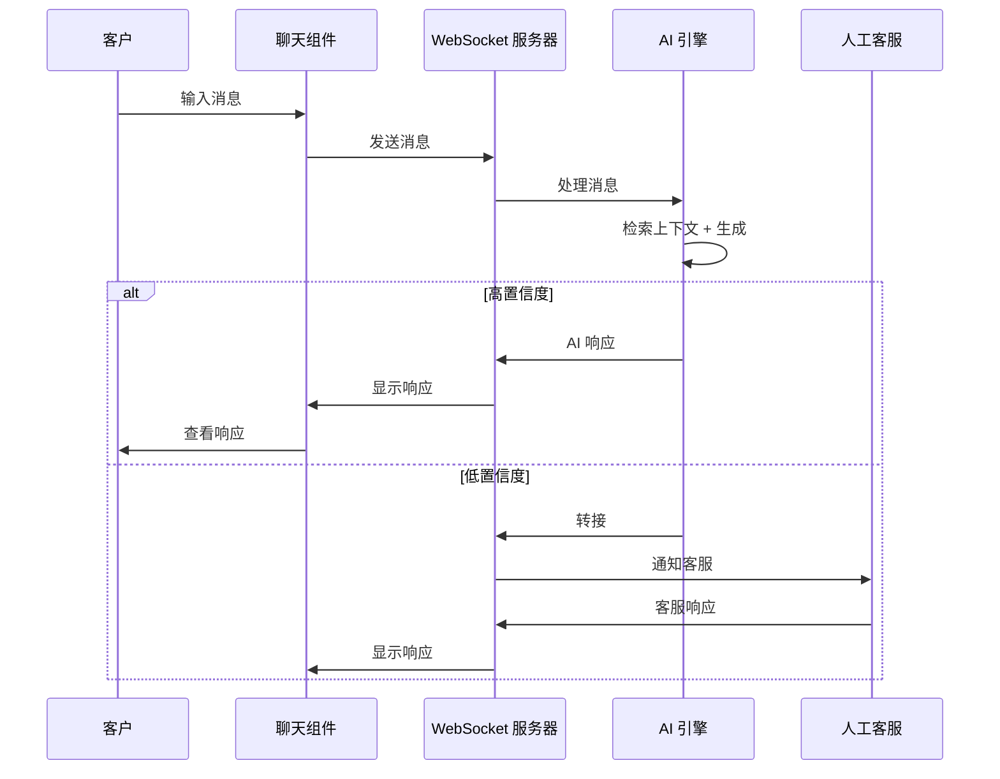
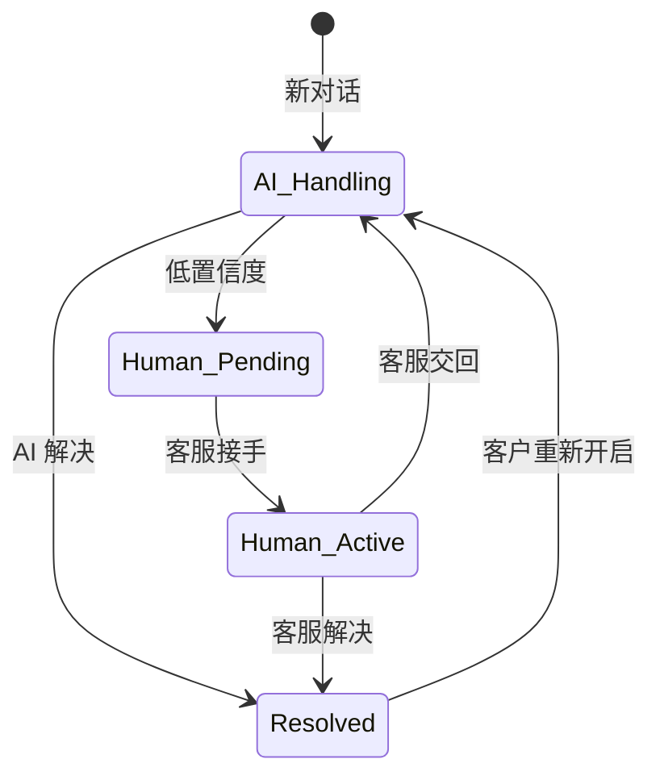

# 集成模式

将您的 AI CS (客户服务) 系统连接到现有的工单、聊天和通信渠道。

## 集成架构

```mermaid
flowchart TB
    subgraph Channels["客户渠道"]
        CH1[在线聊天组件]
        CH2[电子邮件]
        CH3[工单门户]
        CH4[API]
    end

    subgraph Gateway["集成网关"]
        GW[统一消息总线<br/>规范化所有渠道]
    end

    subgraph AI["AI 处理"]
        A1[意图路由]
        A2[RAG 流水线]
        A3[响应生成器]
    end

    subgraph Systems["后端系统"]
        S1[Zendesk / Freshdesk]
        S2[CRM (客户关系管理)]
        S3[订单系统]
        S4[知识库]
    end

    Channels --> GW
    GW --> AI
    AI --> Systems
```

## 工单系统集成

### Zendesk

```python
import zenpy

class ZendeskIntegration:
    def __init__(self, subdomain, email, token):
        self.client = Zenpy(
            subdomain=subdomain,
            email=email,
            token=token
        )
    
    def listen_for_new_tickets(self):
        """Webhook handler for new tickets."""
        # Zendesk triggers webhook on ticket creation
        # Process ticket, generate AI response
        pass
    
    def post_internal_note(self, ticket_id: int, ai_response: str):
        """Post AI-generated response as internal note for agent review."""
        self.client.tickets.update(
            id=ticket_id,
            comment=Comment(
                body=ai_response,
                public=False  # Internal note, not sent to customer
            )
        )
    
    def post_public_reply(self, ticket_id: int, response: str):
        """Post AI response directly to customer (high confidence only)."""
        self.client.tickets.update(
            id=ticket_id,
            comment=Comment(
                body=response,
                public=True
            ),
            status='solved'
        )
    
    def assign_to_human(self, ticket_id: int, group_id: int, reason: str):
        """Escalate to human agent with context."""
        self.client.tickets.update(
            id=ticket_id,
            group_id=group_id,
            comment=Comment(
                body=f"AI Escalation: {reason}",
                public=False
            ),
            tags=['ai-escalated']
        )
```

### Freshdesk

```python
import requests

class FreshdeskIntegration:
    def __init__(self, domain, api_key):
        self.base_url = f"https://{domain}.freshdesk.com/api/v2"
        self.auth = (api_key, "X")
    
    def create_draft_reply(self, ticket_id: int, ai_response: str):
        """Create draft reply for agent to review and send."""
        url = f"{self.base_url}/tickets/{ticket_id}/notes"
        payload = {
            "body": f"<b>AI Suggested Response:</b><br><br>{ai_response}",
            "private": True
        }
        requests.post(url, json=payload, auth=self.auth)
    
    def update_ticket_fields(self, ticket_id: int, fields: dict):
        """Update custom fields (category, priority, etc.)."""
        url = f"{self.base_url}/tickets/{ticket_id}"
        requests.put(url, json=fields, auth=self.auth)
```

## 在线聊天集成

### 基于 WebSocket 的聊天 (Intercom, Crisp, 自定义)



### 实现

```python
from fastapi import FastAPI, WebSocket
from openai import AsyncOpenAI

app = FastAPI()
openai = AsyncOpenAI()

@app.websocket("/ws/chat/{conversation_id}")
async def chat_websocket(websocket: WebSocket, conversation_id: str):
    await websocket.accept()
    
    while True:
        data = await websocket.receive_json()
        customer_message = data["message"]
        
        # Get conversation history
        history = await get_conversation_history(conversation_id)
        
        # Retrieve relevant knowledge
        context = await retrieve_context(customer_message)
        
        # Generate AI response
        ai_response = await generate_response(
            customer_message, 
            history, 
            context
        )
        
        confidence = await score_confidence(ai_response, context)
        
        if confidence > 0.85:
            # High confidence: send directly
            await websocket.send_json({
                "type": "ai_response",
                "message": ai_response,
                "confidence": confidence
            })
            await save_message(conversation_id, "ai", ai_response)
        else:
            # Low confidence: escalate to human
            await websocket.send_json({
                "type": "escalation",
                "message": "Let me connect you with a specialist..."
            })
            await escalate_to_human(conversation_id, customer_message, ai_response)
```

## 电子邮件集成

### 入站电子邮件处理

```python
from email import policy
from email.parser import BytesParser
import imaplib
import smtplib

class EmailProcessor:
    def __init__(self, imap_server, smtp_server, email, password):
        self.imap = imaplib.IMAP4_SSL(imap_server)
        self.imap.login(email, password)
        self.smtp_server = smtp_server
        self.email = email
        self.password = password
    
    def fetch_new_emails(self) -> list[dict]:
        """Fetch unread emails from support inbox."""
        self.imap.select("INBOX")
        _, message_ids = self.imap.search(None, "UNSEEN")
        
        emails = []
        for msg_id in message_ids[0].split():
            _, msg_data = self.imap.fetch(msg_id, "(RFC822)")
            email_message = BytesParser(policy=policy.default).parsebytes(
                msg_data[0][1]
            )
            emails.append({
                "id": msg_id,
                "from": email_message["from"],
                "subject": email_message["subject"],
                "body": self._extract_body(email_message),
                "message_id": email_message["message-id"]
            })
        
        return emails
    
    def send_ai_response(self, to: str, subject: str, body: str, 
                         in_reply_to: str):
        """Send AI-generated email response."""
        msg = MIMEMultipart()
        msg["From"] = self.email
        msg["To"] = to
        msg["Subject"] = f"Re: {subject}"
        msg["In-Reply-To"] = in_reply_to
        msg["References"] = in_reply_to
        
        # Add disclaimer
        full_body = f"""{body}

---
此响应由我们的 AI 助手生成。
如果这没有回答您的问题，请回复此邮件，
人工客服将为您提供帮助。"""
        
        msg.attach(MIMEText(full_body, "plain"))
        
        with smtplib.SMTP_SSL(self.smtp_server) as server:
            server.login(self.email, self.password)
            server.send_message(msg)
```

## 全渠道状态管理

### 统一对话模型

```python
from dataclasses import dataclass
from enum import Enum
from datetime import datetime

class Channel(Enum):
    CHAT = "chat"
    EMAIL = "email"
    TICKET = "ticket"
    API = "api"

class ConversationState(Enum):
    AI_HANDLING = "ai_handling"
    HUMAN_PENDING = "human_pending"
    HUMAN_ACTIVE = "human_active"
    RESOLVED = "resolved"

@dataclass
class Conversation:
    id: str
    customer_id: str
    channel: Channel
    channel_conversation_id: str  # External system ID
    state: ConversationState
    ai_confidence: float
    assigned_agent: str | None
    created_at: datetime
    updated_at: datetime
    metadata: dict

@dataclass
class Message:
    conversation_id: str
    sender: str  # "customer", "ai", "human:agent_id"
    content: str
    timestamp: datetime
    metadata: dict  # confidence score, retrieved chunks, etc.
```

### 状态机



## Webhook 配置

### Zendesk Webhooks

```json
{
  "webhook": {
    "endpoint": "https://your-ai-service.com/webhooks/zendesk",
    "http_method": "POST",
    "request_format": "json",
    "status": "active",
    "subscriptions": [
      "conditional_ticket_events"
    ]
  }
}
```

### Intercom Webhooks

```json
{
  "url": "https://your-ai-service.com/webhooks/intercom",
  "topics": [
    "conversation.user.created",
    "conversation.user.replied",
    "conversation.admin.replied"
  ]
}
```

## 速率限制与熔断 (Rate Limiting & Circuit Breaking)

```python
from circuitbreaker import circuit
from ratelimit import limits, sleep_and_retry

class AIEngine:
    @circuit(failure_threshold=5, recovery_timeout=60)
    @sleep_and_retry
    @limits(calls=100, period=60)
    async def generate_response(self, prompt: str) -> str:
        """Rate-limited, circuit-broken AI call."""
        # 速率限制、熔断保护的 AI 调用。
        response = await openai.chat.completions.create(
            model="gpt-4o-mini",
            messages=[{"role": "user", "content": prompt}],
            timeout=10
        )
        return response.choices[0].message.content
```

## 下一步

现在让我们设计 [人工转接系统](./human-handoff) —— 何时以及如何从 AI 转接到人工客服。
