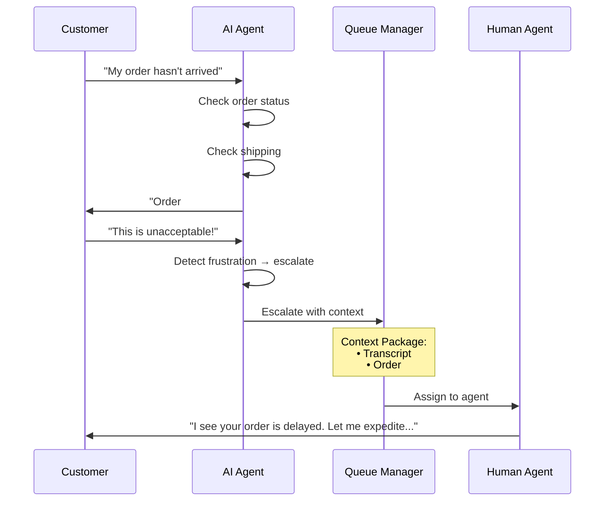
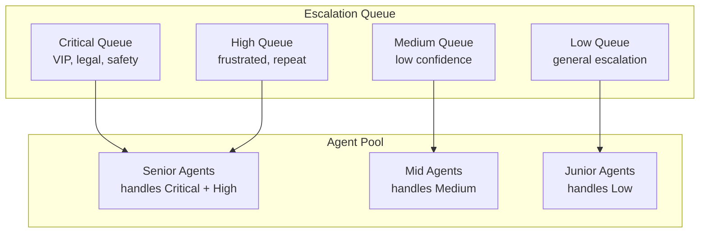
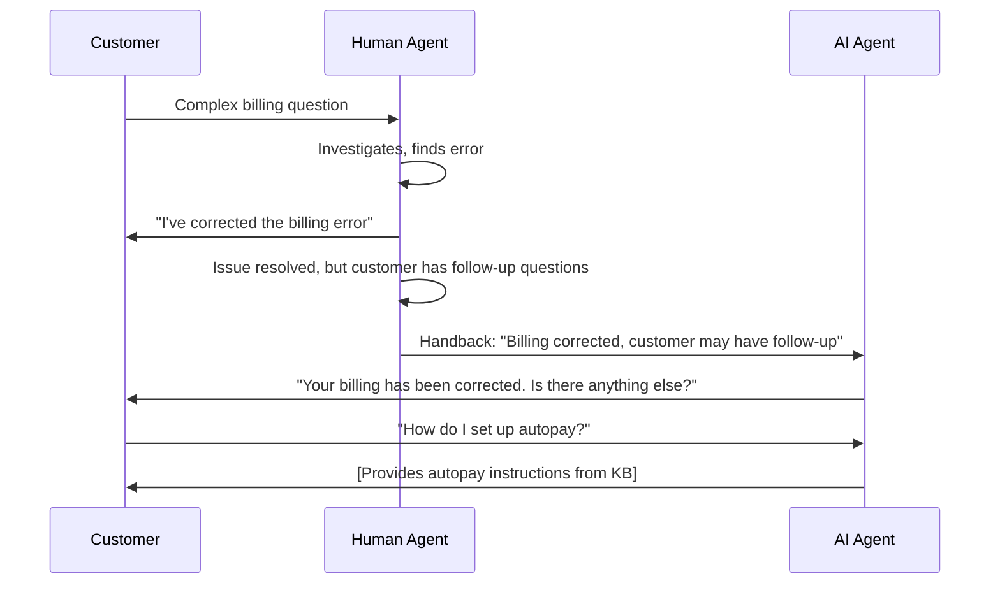

# Human Handoff Design

The most critical part of AI CS: knowing when to stop and let humans take over.

## Handoff Philosophy

:::danger The #1 Failure Mode
AI customer service fails when it **refuses to escalate**. Customers who can't reach a human become furious. Design escalation as a first-class feature, not an afterthought.
:::

## Escalation Triggers

### Automatic Triggers

```mermaid
flowchart TB
    subgraph Triggers["Escalation Triggers"]
        T1[Confidence Score<br/>< 0.7]
        T2[Sentiment Analysis<br/>frustrated / angry]
        T3[Repeat Contact<br/>3+ attempts same issue]
        T4[Explicit Request<br/>"talk to human"]
        T5[VIP Customer<br/>account tier]
        T6[Complex Issue<br/>multi-system]
        T7[Safety Keywords<br/>legal, refund, cancel]
    end

    T1 --> E[Escalate]
    T2 --> E
    T3 --> E
    T4 --> E
    T5 --> E
    T6 --> E
    T7 --> E
```

### Trigger Configuration

| Trigger | Threshold | Priority | Notes |
|---|---|---|---|
| Low confidence | < 0.70 | Medium | AI unsure of answer |
| Frustration detected | Sentiment < -0.5 | High | Customer expressing anger |
| Repeat contact | 3rd contact on same issue | High | AI failing to resolve |
| Explicit request | "talk to human", "agent", "person" | Critical | Always honor immediately |
| VIP customer | Account tier = VIP/Enterprise | High | Skip AI, go to senior agent |
| Safety keywords | "lawyer", "sue", "refund", "cancel" | Critical | Compliance risk |
| Sensitive topics | Billing disputes, account closure | High | Financial/legal implications |

### Explicit Request Detection

```python
HUMAN_REQUEST_PATTERNS = [
    r"\b(talk|speak|connect)\s+(to|with)\s+(a\s+)?(human|person|agent|rep)\b",
    r"\b(real|live|actual)\s+(person|agent|human)\b",
    r"\b(human|agent|representative)\s+(please|now)\b",
    r"\bi\s+want\s+(to\s+)?(talk|speak)\b",
    r"\b(get|give\s+me)\s+(a|me\s+a)?\s*(human|person|agent)\b",
    r"\b(operator|supervisor|manager)\b",
    r"\b(this|the)\s+(bot|ai|chatbot)\s+(isn't|is\s+not|doesn't)\s+work",
]

def should_escalate_to_human(message: str) -> bool:
    """Check if customer explicitly requests human."""
    message_lower = message.lower()
    return any(re.search(pattern, message_lower) for pattern in HUMAN_REQUEST_PATTERNS)
```

## Context Transfer

When escalating, transfer **full context** so the human agent doesn't ask the customer to repeat themselves:



### Context Package Structure

```python
@dataclass
class EscalationContext:
    conversation_id: str
    customer_id: str
    
    # Conversation data
    transcript: list[Message]
    message_count: int
    duration_seconds: int
    
    # AI analysis
    detected_intent: str
    sentiment_score: float
    confidence_scores: list[float]
    ai_attempts: list[str]
    
    # Customer data
    customer_tier: str
    account_age_days: int
    previous_tickets: int
    lifetime_value: float
    
    # Issue data
    issue_category: str
    related_order_ids: list[str]
    related_product_ids: list[str]
    
    # Escalation metadata
    escalation_reason: str
    urgency: str  # "low", "medium", "high", "critical"
    recommended_agent_skills: list[str]
    
    def to_agent_view(self) -> str:
        """Generate human-readable summary for agent."""
        return f"""
## Escalation Summary

**Reason:** {self.escalation_reason}
**Urgency:** {self.urgency}
**Duration:** {self.duration_seconds // 60} minutes, {self.message_count} messages

### Customer Profile
- Tier: {self.customer_tier}
- Account age: {self.account_age_days} days
- Previous tickets: {self.previous_tickets}
- Lifetime value: ${self.lifetime_value:,.2f}

### Issue Summary
- Category: {self.issue_category}
- Sentiment: {self.sentiment_score:.2f} (negative)
- Related orders: {', '.join(self.related_order_ids) or 'None'}

### AI Attempts
{chr(10).join(f'- {attempt}' for attempt in self.ai_attempts)}

### Conversation Transcript
{self.format_transcript()}
"""
```

## Queue Management

### Routing Strategy



### Priority Assignment

```python
def calculate_escalation_priority(context: EscalationContext) -> str:
    score = 0
    
    # Customer tier
    if context.customer_tier in ["vip", "enterprise"]:
        score += 40
    
    # Sentiment
    if context.sentiment_score < -0.7:
        score += 30
    elif context.sentiment_score < -0.4:
        score += 15
    
    # Repeat contacts
    if context.message_count > 5:
        score += 20
    
    # Lifetime value
    if context.lifetime_value > 10000:
        score += 15
    
    # Safety keywords
    if context.escalation_reason == "safety_keywords":
        score += 50
    
    if score >= 70:
        return "critical"
    elif score >= 40:
        return "high"
    elif score >= 20:
        return "medium"
    else:
        return "low"
```

## Agent Interface

### What the Agent Sees

```
┌─────────────────────────────────────────────────────┐
│  ESCALATED: Order not arrived - Customer frustrated │
│  Priority: HIGH          Channel: Chat              │
├─────────────────────────────────────────────────────┤
│  Customer: Jane Doe (VIP)                           │
│  Account: 3 years, $45,000 LTV                      │
│  Previous tickets: 12 (all resolved)                │
├─────────────────────────────────────────────────────┤
│  AI SUMMARY:                                        │
│  • Customer asked about order #12345                │
│  • AI found order shipped Jan 10, delayed at hub    │
│  • Customer expressed frustration                   │
│  • AI confidence dropped to 0.45 → escalated       │
├─────────────────────────────────────────────────────┤
│  CONVERSATION:                                      │
│  Customer: My order hasn't arrived                  │
│  AI: Your order #12345 shipped Jan 10. Tracking     │
│      shows delay at distribution hub.               │
│  Customer: This is unacceptable, I need it now!     │
│  AI: [ESCALATED] Let me connect you with a          │
│      specialist who can help expedite this.         │
├─────────────────────────────────────────────────────┤
│  SUGGESTED ACTIONS:                                 │
│  [Expedite Shipping] [Issue Refund] [Apply Credit]  │
├─────────────────────────────────────────────────────┤
│  [Accept] [Requeue] [Transfer]                      │
└─────────────────────────────────────────────────────┘
```

## Handback to AI

Sometimes a human resolves part of the issue and can hand back to AI:



## Metrics to Track

| Metric | Target | Why It Matters |
|---|---|---|
| Escalation rate | 20–40% | Too high = AI not working, too low = customer frustration |
| Escalation accuracy | > 85% | Escalated tickets should actually need human |
| Context transfer quality | > 90% | Agent shouldn't need to re-ask questions |
| Time to human pick-up | < 2 minutes (chat) | Customer shouldn't wait after escalation |
| Handback rate | 5–15% | Some issues benefit from AI + human combo |
| False escalation rate | < 10% | AI giving up too early |

## What's Next

With handoff designed, let's implement [quality and safety guardrails](./quality-safety) — preventing hallucinations, ensuring compliance, and maintaining brand voice.
