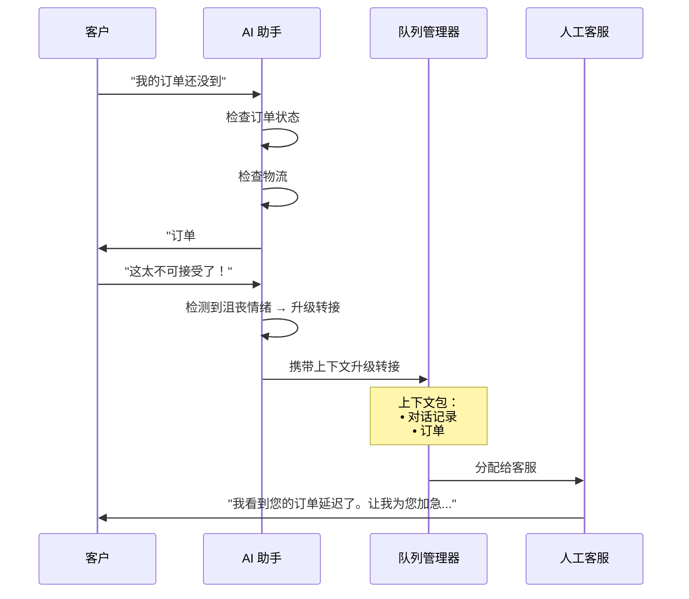
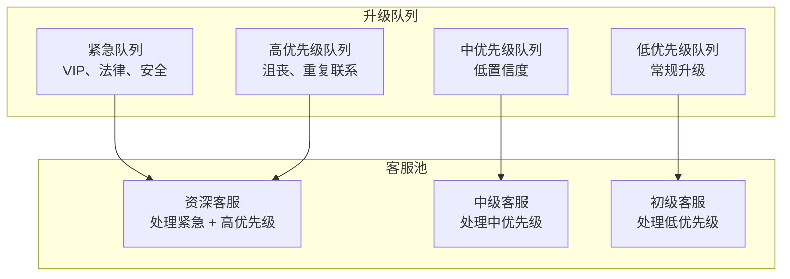
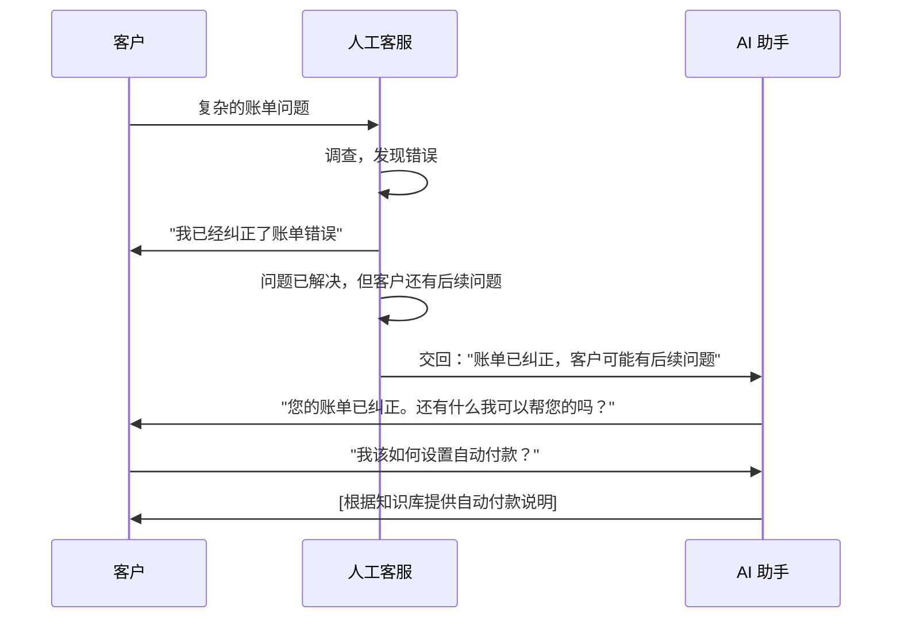

# 人工转接设计

AI CS (客户服务) 最关键的部分：知道何时停止并让人工接手。

## 转接理念

:::danger 第一大失败模式
当 AI 客户服务**拒绝升级转接**时，它就失败了。无法联系到人工客服的客户会变得愤怒。将升级转接设计为一等公民功能，而不是事后才考虑的事情。
:::

## 升级触发器

### 自动触发器

```mermaid
flowchart TB
    subgraph Triggers["升级触发器"]
        T1[置信度评分<br/>< 0.7]
        T2[情感分析<br/>沮丧 / 愤怒]
        T3[重复联系<br/>同一问题尝试 3 次以上]
        T4[明确请求<br/>"找人工"]
        T5[VIP 客户<br/>账户等级]
        T6[复杂问题<br/>涉及多个系统]
        T7[安全关键词<br/>法律、退款、取消]
    end

    T1 --> E[升级转接]
    T2 --> E
    T3 --> E
    T4 --> E
    T5 --> E
    T6 --> E
    T7 --> E
```

### 触发器配置

| 触发器 | 阈值 | 优先级 | 备注 |
|---|---|---|---|
| 低置信度 | < 0.70 | 中 | AI 对答案不确定 |
| 检测到沮丧情绪 | 情感评分 < -0.5 | 高 | 客户表达愤怒 |
| 重复联系 | 同一问题第 3 次联系 | 高 | AI 未能解决问题 |
| 明确请求 | "找人工"、"客服"、"人工" | 紧急 | 始终立即响应 |
| VIP 客户 | 账户等级 = VIP/企业级 | 高 | 跳过 AI，直接转接高级客服 |
| 安全关键词 | "律师"、"起诉"、"退款"、"取消" | 紧急 | 合规风险 |
| 敏感话题 | 账单纠纷、账户关闭 | 高 | 财务/法律影响 |

### 明确请求检测

```python
HUMAN_REQUEST_PATTERNS = [
    r"\b(talk|speak|connect)\s+(to|with)\s+(a\s+)?(human|person|agent|rep)\b",
    r"\b(real|live|actual)\s+(person|agent|human)\b",
    r"\b(human|agent|representative)\s+(please|now)\b",
    r"\bi\s+want\s+(to\s+)?(talk|speak)\b",
    r"\b(get|give\s+me)\s+(a|me\s+a)?\s*(human|person|agent)\b",
    r"\b(operator|supervisor|manager)\b",
    r"\b(this|the)\s+(bot|ai|chatbot)\s+(isn't|is\s+not|doesn't)\s+work",
]

def should_escalate_to_human(message: str) -> bool:
    """Check if customer explicitly requests human."""
    message_lower = message.lower()
    return any(re.search(pattern, message_lower) for pattern in HUMAN_REQUEST_PATTERNS)
```

## 上下文传递

在升级转接时，传递**完整的上下文**，这样人工客服就不用让客户重复他们说过的话：



### 上下文包结构

```python
@dataclass
class EscalationContext:
    conversation_id: str
    customer_id: str
    
    # Conversation data
    transcript: list[Message]
    message_count: int
    duration_seconds: int
    
    # AI analysis
    detected_intent: str
    sentiment_score: float
    confidence_scores: list[float]
    ai_attempts: list[str]
    
    # Customer data
    customer_tier: str
    account_age_days: int
    previous_tickets: int
    lifetime_value: float
    
    # Issue data
    issue_category: str
    related_order_ids: list[str]
    related_product_ids: list[str]
    
    # Escalation metadata
    escalation_reason: str
    urgency: str  # "low", "medium", "high", "critical"
    recommended_agent_skills: list[str]
    
    def to_agent_view(self) -> str:
        """Generate human-readable summary for agent."""
        return f"""
## 升级转接摘要

**原因：** {self.escalation_reason}
**紧急程度：** {self.urgency}
**持续时间：** {self.duration_seconds // 60} 分钟，{self.message_count} 条消息

### 客户画像
- 等级：{self.customer_tier}
- 开户时长：{self.account_age_days} 天
- 历史工单：{self.previous_tickets}
- 终身价值 (LTV)：${self.lifetime_value:,.2f}

### 问题摘要
- 类别：{self.issue_category}
- 情感评分：{self.sentiment_score:.2f} (负面)
- 相关订单：{', '.join(self.related_order_ids) or '无'}

### AI 尝试
{chr(10).join(f'- {attempt}' for attempt in self.ai_attempts)}

### 对话记录
{self.format_transcript()}
"""
```

## 队列管理

### 路由策略



### 优先级分配

```python
def calculate_escalation_priority(context: EscalationContext) -> str:
    score = 0
    
    # Customer tier
    if context.customer_tier in ["vip", "enterprise"]:
        score += 40
    
    # Sentiment
    if context.sentiment_score < -0.7:
        score += 30
    elif context.sentiment_score < -0.4:
        score += 15
    
    # Repeat contacts
    if context.message_count > 5:
        score += 20
    
    # Lifetime value
    if context.lifetime_value > 10000:
        score += 15
    
    # Safety keywords
    if context.escalation_reason == "safety_keywords":
        score += 50
    
    if score >= 70:
        return "critical"
    elif score >= 40:
        return "high"
    elif score >= 20:
        return "medium"
    else:
        return "low"
```

## 客服界面

### 客服看到的内容

```
┌─────────────────────────────────────────────────────┐
│  已升级：订单未送达 - 客户感到沮丧                  │
│  优先级：高              渠道：在线聊天             │
├─────────────────────────────────────────────────────┤
│  客户：Jane Doe (VIP)                               │
│  账户：3 年，LTV $45,000                            │
│  历史工单：12 (全部已解决)                          │
├─────────────────────────────────────────────────────┤
│  AI 摘要：                                          │
│  • 客户询问订单 #12345                              │
│  • AI 发现订单于 1 月 10 日发货，在分拨中心延迟     │
│  • 客户表达了沮丧情绪                               │
│  • AI 置信度降至 0.45 → 已升级转接                  │
├─────────────────────────────────────────────────────┤
│  对话记录：                                         │
│  客户：我的订单还没到                               │
│  AI：您的订单 #12345 已于 1 月 10 日发货。物流      │
│      显示在分拨中心有延迟。                         │
│  客户：这太不可接受了，我现在就要！                 │
│  AI：[已升级] 让我为您转接一位可以帮助加急处理      │
│      的专员。                                       │
├─────────────────────────────────────────────────────┤
│  建议操作：                                         │
│  [加急物流] [办理退款] [发放积分]                   │
├─────────────────────────────────────────────────────┤
│  [接受] [重新排队] [转接]                           │
└─────────────────────────────────────────────────────┘
```

## 交回给 AI

有时人工客服解决了部分问题，可以交回给 AI：



## 跟踪指标

| 指标 | 目标 | 为什么重要 |
|---|---|---|
| 升级转接率 | 20–40% | 太高 = AI 不起作用，太低 = 客户沮丧 |
| 升级准确率 | > 85% | 升级的工单应该确实需要人工处理 |
| 上下文传递质量 | > 90% | 客服不应该需要重新询问问题 |
| 人工接听时间 | < 2 分钟 (聊天) | 客户在升级后不应等待 |
| 交回率 | 5–15% | 某些问题受益于 AI + 人工的组合 |
| 误升级率 | < 10% | AI 过早放弃 |

## 下一步

设计好转接后，让我们实施 [质量与安全护栏](./quality-safety) —— 防止幻觉，确保合规，并维护品牌声调。
