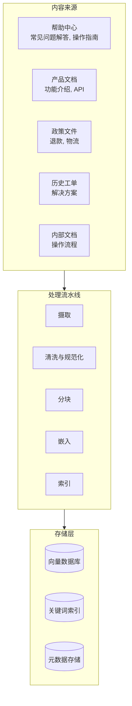
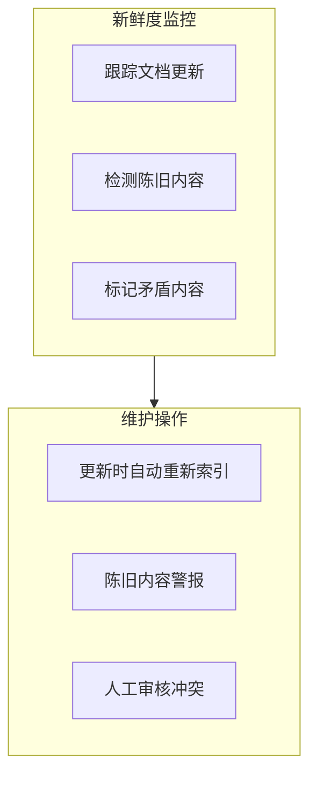
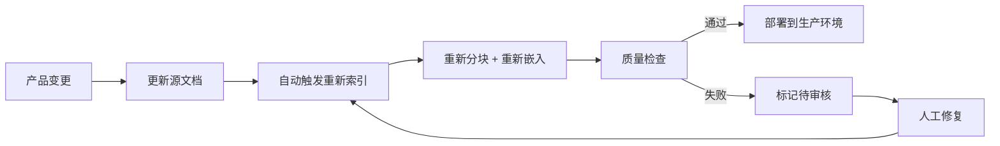

# 知识库工程 (Knowledge Base Engineering)

知识库是 AI 客服系统的“大脑”。它的质量直接决定了回复的质量。

## 知识库质量等式

```
AI 回复质量 ≤ 知识库质量
```

再多的提示词工程 (Prompt Engineering) 或模型复杂性都无法弥补低质量的知识库。

## 知识库架构 (KB Architecture)



## 内容来源优先级

| 来源 | 价值 | 投入成本 | 优先级 |
|---|---|---|---|
| 帮助中心 / 常见问题解答 (FAQ) | 极高 | 低 | 从这里开始 |
| 产品文档 | 高 | 中 | 第一阶段 |
| 政策文件 | 高 | 低 | 第一阶段 |
| 历史工单解决方案 | 高 | 高 | 第二阶段 |
| 社区论坛 | 中 | 中 | 第三阶段 |
| 内部操作流程 | 中 | 高 | 第三阶段 |

## 内容准备

### 从帮助中心摄取

```python
import requests
from bs4 import BeautifulSoup

class HelpCenterIngestor:
    def ingest(self, base_url: str) -> list[Document]:
        articles = []
        
        # Fetch article list
        article_links = self._get_article_links(base_url)
        
        for link in article_links:
            html = requests.get(link).text
            soup = BeautifulSoup(html, 'html.parser')
            
            # Extract structured content
            article = Document(
                title=soup.find('h1').text,
                content=self._extract_content(soup),
                url=link,
                metadata={
                    "source": "help_center",
                    "category": self._extract_category(soup),
                    "last_updated": self._extract_date(soup),
                }
            )
            articles.append(article)
        
        return articles
    
    def _extract_content(self, soup) -> str:
        """Extract clean text, preserving structure."""
        content = soup.find('article') or soup.find('main')
        
        # Preserve headings for chunking
        for heading in content.find_all(['h2', 'h3']):
            heading.replace_with(f"\n## {heading.text}\n")
        
        # Preserve lists
        for li in content.find_all('li'):
            li.replace_with(f"\n- {li.text}")
        
        return content.get_text(separator='\n', strip=True)
```

### 从历史工单提取

```python
class TicketExtractor:
    def extract_resolutions(self, min_csat: float = 4.0) -> list[Document]:
        """Extract successful ticket resolutions as training data."""
        
        tickets = self.db.query("""
            SELECT 
                t.id,
                t.subject,
                t.description,
                t.resolution,
                t.category,
                t.csat_score,
                t.created_at
            FROM tickets t
            WHERE t.status = 'resolved'
              AND t.csat_score >= %s
              AND t.resolution IS NOT NULL
              AND LENGTH(t.resolution) > 50
            ORDER BY t.csat_score DESC
        """, (min_csat,))
        
        documents = []
        for ticket in tickets:
            # Create Q&A pair
            doc = Document(
                title=ticket['subject'],
                content=f"""## Question
{ticket['description']}

## Resolution
{ticket['resolution']}""",
                metadata={
                    "source": "ticket_resolution",
                    "ticket_id": ticket['id'],
                    "category": ticket['category'],
                    "csat_score": ticket['csat_score'],
                    "date": ticket['created_at'].isoformat(),
                }
            )
            documents.append(doc)
        
        return documents
```

## 分块 (Chunking) 最佳实践

### 针对客服场景的语义分块

```python
from langchain.text_splitter import RecursiveCharacterTextSplitter

def create_cs_chunker() -> RecursiveCharacterTextSplitter:
    """Chunker optimized for CS knowledge base."""
    return RecursiveCharacterTextSplitter(
        chunk_size=400,         # ~300 words, good for single Q&A
        chunk_overlap=50,       # Context continuity
        separators=[
            "\n## ",            # Section headers (highest priority)
            "\n### ",           # Sub-headers
            "\n\n",             # Paragraphs
            "\n",               # Lines
            ". ",               # Sentences
            " ",                # Words (last resort)
        ],
        length_function=len,
        keep_separator=True,
    )
```

### 分块质量检查清单

| 标准 | 优质分块 | 劣质分块 |
|---|---|---|
| 完整性 | 包含一个问题的完整答案 | 在指令中间断开 |
| 独立性 | 无需上下文即可理解 | 需要其他分块的上下文 |
| 大小 | 200–600 个 Token (标记) | > 1000 个 Token 或 < 50 个 Token |
| 元数据 | 包含来源、类别、日期 | 无元数据 |
| 结构 | 主题明确，思想完整 | 随机片段 |

## 元数据策略 (Metadata Strategy)

每个分块都应丰富元数据，以便进行过滤检索：

```python
def enrich_metadata(chunk: Chunk, source_doc: Document) -> Chunk:
    chunk.metadata = {
        # Source tracking
        "source": source_doc.metadata["source"],
        "source_url": source_doc.metadata.get("url"),
        "source_title": source_doc.title,
        
        # Categorization
        "product": extract_product(source_doc),
        "category": source_doc.metadata.get("category"),
        "topic": extract_topic(chunk.text),
        
        # Freshness
        "last_updated": source_doc.metadata.get("last_updated"),
        "version": source_doc.metadata.get("version"),
        
        # Quality signals
        "confidence": source_doc.metadata.get("csat_score"),
        "usage_count": 0,  # Track how often this chunk is retrieved
        
        # Language
        "language": detect_language(chunk.text),
    }
    return chunk
```

## 知识库维护

### 新鲜度监控



### 陈旧度检测

```python
class KBFreshnessMonitor:
    STALE_THRESHOLD_DAYS = 90
    
    def check_freshness(self) -> list[Alert]:
        alerts = []
        
        chunks = self.vector_db.get_all_chunks()
        
        for chunk in chunks:
            last_updated = chunk.metadata.get("last_updated")
            if not last_updated:
                alerts.append(Alert(
                    type="no_date",
                    chunk_id=chunk.id,
                    message=f"Chunk has no last_updated date"
                ))
                continue
            
            age_days = (datetime.now() - last_updated).days
            
            if age_days > self.STALE_THRESHOLD_DAYS:
                alerts.append(Alert(
                    type="stale",
                    chunk_id=chunk.id,
                    message=f"Chunk is {age_days} days old",
                    source_url=chunk.metadata.get("source_url")
                ))
        
        return alerts
```

### 矛盾检测

```python
async def detect_contradictions(chunks: list[Chunk]) -> list[Contradiction]:
    """Find chunks that give conflicting information."""
    
    # Group by topic
    topic_groups = group_by_topic(chunks)
    
    contradictions = []
    for topic, topic_chunks in topic_groups.items():
        if len(topic_chunks) < 2:
            continue
        
        # Use LLM to check for contradictions
        result = await llm.generate(
            prompt=f"""Do any of these passages contain contradictory information?

Passages:
{format_passages(topic_chunks)}

If there are contradictions, list them. If all passages are consistent, say "No contradictions found."
"""
        )
        
        if "no contradictions" not in result.lower():
            contradictions.append(Contradiction(
                topic=topic,
                chunks=topic_chunks,
                description=result
            ))
    
    return contradictions
```

## 知识库质量指标

| 指标 | 目标 | 如何衡量 |
|---|---|---|
| 覆盖率 | > 90% 的工单类别 | 将分块映射到工单类别 |
| 新鲜度 | 平均时长 < 90 天 | 跟踪 last_updated 日期 |
| 准确性 | > 98% | 人工审核 + 客户反馈 |
| 完整性 | 完整回答，而非片段 | 审核分块边界 |
| 无矛盾 | 0 冲突 | 自动检测 |

## 知识库更新工作流



## 下一步

知识库构建完成后，让我们设置 [监控与评估](./monitoring-eval) 来跟踪性能并持续改进。
