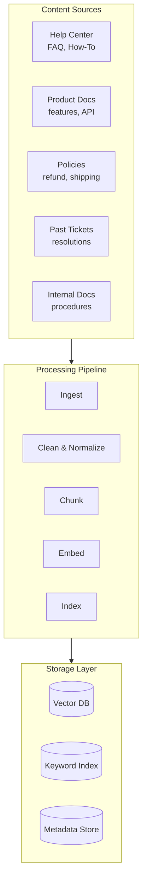
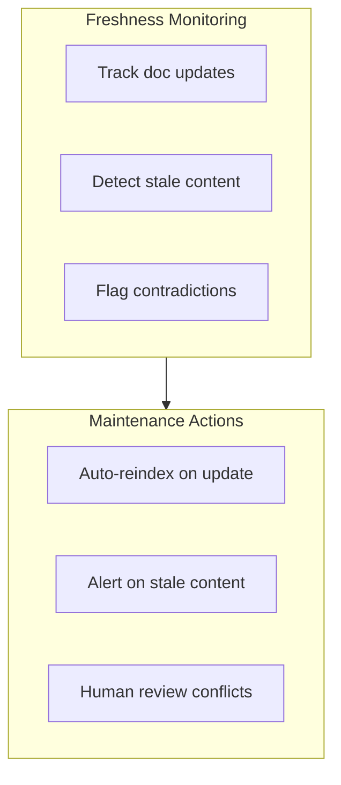
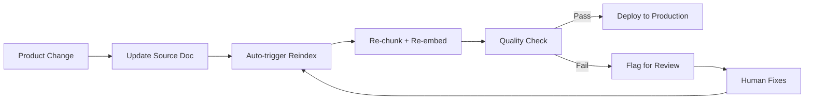

# Knowledge Base Engineering

The knowledge base is the brain of your AI CS system. Its quality directly determines response quality.

## The KB Quality Equation

```
AI Response Quality ≤ Knowledge Base Quality
```

No amount of prompt engineering or model sophistication can compensate for a poor knowledge base.

## KB Architecture



## Content Source Priority

| Source | Value | Effort | Priority |
|---|---|---|---|
| Help center / FAQ | Very High | Low | Start here |
| Product documentation | High | Medium | Phase 1 |
| Policy documents | High | Low | Phase 1 |
| Past ticket resolutions | High | High | Phase 2 |
| Community forums | Medium | Medium | Phase 3 |
| Internal procedures | Medium | High | Phase 3 |

## Content Preparation

### From Help Center

```python
import requests
from bs4 import BeautifulSoup

class HelpCenterIngestor:
    def ingest(self, base_url: str) -> list[Document]:
        articles = []
        
        # Fetch article list
        article_links = self._get_article_links(base_url)
        
        for link in article_links:
            html = requests.get(link).text
            soup = BeautifulSoup(html, 'html.parser')
            
            # Extract structured content
            article = Document(
                title=soup.find('h1').text,
                content=self._extract_content(soup),
                url=link,
                metadata={
                    "source": "help_center",
                    "category": self._extract_category(soup),
                    "last_updated": self._extract_date(soup),
                }
            )
            articles.append(article)
        
        return articles
    
    def _extract_content(self, soup) -> str:
        """Extract clean text, preserving structure."""
        content = soup.find('article') or soup.find('main')
        
        # Preserve headings for chunking
        for heading in content.find_all(['h2', 'h3']):
            heading.replace_with(f"\n## {heading.text}\n")
        
        # Preserve lists
        for li in content.find_all('li'):
            li.replace_with(f"\n- {li.text}")
        
        return content.get_text(separator='\n', strip=True)
```

### From Past Tickets

```python
class TicketExtractor:
    def extract_resolutions(self, min_csat: float = 4.0) -> list[Document]:
        """Extract successful ticket resolutions as training data."""
        
        tickets = self.db.query("""
            SELECT 
                t.id,
                t.subject,
                t.description,
                t.resolution,
                t.category,
                t.csat_score,
                t.created_at
            FROM tickets t
            WHERE t.status = 'resolved'
              AND t.csat_score >= %s
              AND t.resolution IS NOT NULL
              AND LENGTH(t.resolution) > 50
            ORDER BY t.csat_score DESC
        """, (min_csat,))
        
        documents = []
        for ticket in tickets:
            # Create Q&A pair
            doc = Document(
                title=ticket['subject'],
                content=f"""## Question
{ticket['description']}

## Resolution
{ticket['resolution']}""",
                metadata={
                    "source": "ticket_resolution",
                    "ticket_id": ticket['id'],
                    "category": ticket['category'],
                    "csat_score": ticket['csat_score'],
                    "date": ticket['created_at'].isoformat(),
                }
            )
            documents.append(doc)
        
        return documents
```

## Chunking Best Practices

### Semantic Chunking for CS

```python
from langchain.text_splitter import RecursiveCharacterTextSplitter

def create_cs_chunker() -> RecursiveCharacterTextSplitter:
    """Chunker optimized for CS knowledge base."""
    return RecursiveCharacterTextSplitter(
        chunk_size=400,         # ~300 words, good for single Q&A
        chunk_overlap=50,       # Context continuity
        separators=[
            "\n## ",            # Section headers (highest priority)
            "\n### ",           # Sub-headers
            "\n\n",             # Paragraphs
            "\n",               # Lines
            ". ",               # Sentences
            " ",                # Words (last resort)
        ],
        length_function=len,
        keep_separator=True,
    )
```

### Chunk Quality Checklist

| Criterion | Good Chunk | Bad Chunk |
|---|---|---|
| Completeness | Contains full answer to one question | Splits mid-instruction |
| Self-contained | Understandable without neighbors | Requires context from other chunks |
| Size | 200–600 tokens | > 1000 tokens or < 50 tokens |
| Metadata | Has source, category, date | No metadata |
| Structure | Clear topic, complete thought | Random fragment |

## Metadata Strategy

Every chunk should be enriched with metadata for filtered retrieval:

```python
def enrich_metadata(chunk: Chunk, source_doc: Document) -> Chunk:
    chunk.metadata = {
        # Source tracking
        "source": source_doc.metadata["source"],
        "source_url": source_doc.metadata.get("url"),
        "source_title": source_doc.title,
        
        # Categorization
        "product": extract_product(source_doc),
        "category": source_doc.metadata.get("category"),
        "topic": extract_topic(chunk.text),
        
        # Freshness
        "last_updated": source_doc.metadata.get("last_updated"),
        "version": source_doc.metadata.get("version"),
        
        # Quality signals
        "confidence": source_doc.metadata.get("csat_score"),
        "usage_count": 0,  # Track how often this chunk is retrieved
        
        # Language
        "language": detect_language(chunk.text),
    }
    return chunk
```

## KB Maintenance

### Freshness Monitoring



### Staleness Detection

```python
class KBFreshnessMonitor:
    STALE_THRESHOLD_DAYS = 90
    
    def check_freshness(self) -> list[Alert]:
        alerts = []
        
        chunks = self.vector_db.get_all_chunks()
        
        for chunk in chunks:
            last_updated = chunk.metadata.get("last_updated")
            if not last_updated:
                alerts.append(Alert(
                    type="no_date",
                    chunk_id=chunk.id,
                    message=f"Chunk has no last_updated date"
                ))
                continue
            
            age_days = (datetime.now() - last_updated).days
            
            if age_days > self.STALE_THRESHOLD_DAYS:
                alerts.append(Alert(
                    type="stale",
                    chunk_id=chunk.id,
                    message=f"Chunk is {age_days} days old",
                    source_url=chunk.metadata.get("source_url")
                ))
        
        return alerts
```

### Contradiction Detection

```python
async def detect_contradictions(chunks: list[Chunk]) -> list[Contradiction]:
    """Find chunks that give conflicting information."""
    
    # Group by topic
    topic_groups = group_by_topic(chunks)
    
    contradictions = []
    for topic, topic_chunks in topic_groups.items():
        if len(topic_chunks) < 2:
            continue
        
        # Use LLM to check for contradictions
        result = await llm.generate(
            prompt=f"""Do any of these passages contain contradictory information?

Passages:
{format_passages(topic_chunks)}

If there are contradictions, list them. If all passages are consistent, say "No contradictions found."
"""
        )
        
        if "no contradictions" not in result.lower():
            contradictions.append(Contradiction(
                topic=topic,
                chunks=topic_chunks,
                description=result
            ))
    
    return contradictions
```

## KB Quality Metrics

| Metric | Target | How to Measure |
|---|---|---|
| Coverage | > 90% of ticket categories | Map chunks to ticket categories |
| Freshness | < 90 days average age | Track last_updated dates |
| Accuracy | > 98% | Human review + customer feedback |
| Completeness | Full answers, not fragments | Review chunk boundaries |
| No contradictions | 0 conflicts | Automated detection |

## KB Update Workflow



## What's Next

With your knowledge base built, let's set up [monitoring and evaluation](./monitoring-eval) to track performance and continuously improve.
