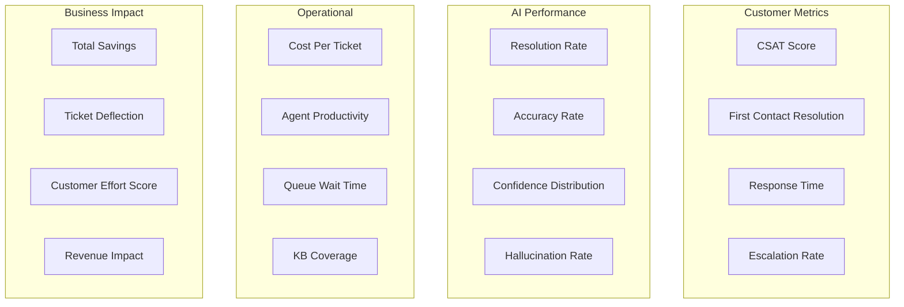
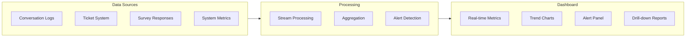
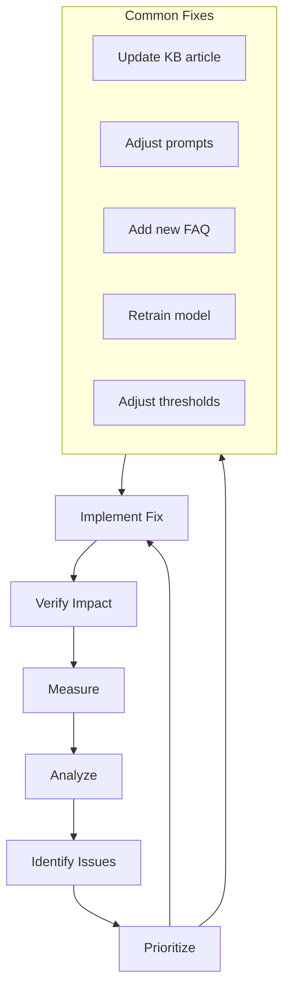

# Monitoring & Evaluation

What gets measured gets improved. A comprehensive metrics framework for AI customer service.

## Metrics Framework



## Key Metrics Dashboard

### Tier 1: North Star Metrics

| Metric | Definition | Target | Measurement |
|---|---|---|---|
| **CSAT** | Customer satisfaction score | > 4.0 / 5.0 | Post-conversation survey |
| **Resolution Rate** | % of tickets AI resolves without human | 40–60% | Automated tracking |
| **Cost Per Ticket** | Total cost / total tickets | < $2 (AI) | Financial tracking |

### Tier 2: Quality Metrics

| Metric | Definition | Target | Measurement |
|---|---|---|---|
| **Accuracy Rate** | % of AI responses factually correct | > 95% | QA sampling |
| **First Contact Resolution** | Resolved in single interaction | > 70% | Automated |
| **Escalation Accuracy** | Escalated tickets actually need human | > 85% | Human review |
| **Hallucination Rate** | % of responses with fabricated info | < 1% | QA sampling |

### Tier 3: Operational Metrics

| Metric | Definition | Target | Measurement |
|---|---|---|---|
| **First Response Time** | Time to first AI reply | < 10 seconds | System logs |
| **Resolution Time** | Time to resolution | < 5 minutes (Tier 1) | System logs |
| **Escalation Rate** | % escalated to human | 20–40% | Automated |
| **Queue Wait Time** | Human queue wait after escalation | < 2 minutes | Queue system |

## Implementation

### Metrics Collection

```python
from dataclasses import dataclass
from datetime import datetime
import prometheus_client as prom

@dataclass
class ConversationMetrics:
    conversation_id: str
    started_at: datetime
    resolved_at: datetime | None
    channel: str
    ai_resolved: bool
    escalated: bool
    escalation_reason: str | None
    message_count: int
    ai_confidence_scores: list[float]
    csat_score: float | None
    customer_id: str
    ticket_category: str

class MetricsCollector:
    def __init__(self):
        # Prometheus metrics
        self.resolution_counter = prom.Counter(
            'cs_ai_resolutions_total',
            'Total AI resolutions',
            ['channel', 'category', 'status']
        )
        self.response_time = prom.Histogram(
            'cs_ai_response_time_seconds',
            'AI response time',
            ['channel']
        )
        self.confidence_dist = prom.Histogram(
            'cs_ai_confidence',
            'AI confidence distribution',
            buckets=[0.1, 0.3, 0.5, 0.7, 0.85, 0.95, 1.0]
        )
        self.csat_gauge = prom.Gauge(
            'cs_ai_csat_average',
            'Average CSAT score'
        )
        self.escalation_counter = prom.Counter(
            'cs_ai_escalations_total',
            'Total escalations',
            ['reason']
        )
    
    def record_conversation(self, metrics: ConversationMetrics):
        """Record completed conversation metrics."""
        status = "resolved" if metrics.ai_resolved else "escalated"
        self.resolution_counter.labels(
            channel=metrics.channel,
            category=metrics.ticket_category,
            status=status
        ).inc()
        
        if metrics.escalated:
            self.escalation_counter.labels(
                reason=metrics.escalation_reason
            ).inc()
        
        for score in metrics.ai_confidence_scores:
            self.confidence_dist.observe(score)
    
    def record_response_time(self, channel: str, duration_seconds: float):
        self.response_time.labels(channel=channel).observe(duration_seconds)
```

### Real-Time Dashboard



## Alerting

### Alert Rules

| Alert | Condition | Severity | Action |
|---|---|---|---|
| CSAT drop | CSAT < 3.5 over 100 conversations | Critical | Pause AI, investigate |
| Accuracy drop | Accuracy < 90% on QA sample | High | Review recent responses |
| Hallucination spike | > 2% hallucination rate | Critical | Pause AI, fix KB |
| High escalation | > 60% escalation rate | Medium | Review AI coverage |
| Slow response | p95 response > 30 seconds | Medium | Check infrastructure |
| API errors | > 5% error rate | High | Check LLM provider |

### Alert Implementation

```python
class AlertManager:
    def __init__(self, notification_channel):
        self.notifier = notification_channel
        self.thresholds = {
            "csat_min": 3.5,
            "accuracy_min": 0.90,
            "hallucination_max": 0.02,
            "escalation_max": 0.60,
            "response_time_p95_max": 30,
            "error_rate_max": 0.05,
        }
    
    async def check_and_alert(self, metrics: dict):
        alerts = []
        
        if metrics["csat_avg"] < self.thresholds["csat_min"]:
            alerts.append(Alert(
                severity="critical",
                title="CSAT below threshold",
                message=f"Average CSAT: {metrics['csat_avg']:.2f} (threshold: {self.thresholds['csat_min']})",
                action="Consider pausing AI and investigating recent conversations"
            ))
        
        if metrics["hallucination_rate"] > self.thresholds["hallucination_max"]:
            alerts.append(Alert(
                severity="critical",
                title="Hallucination rate spike",
                message=f"Hallucination rate: {metrics['hallucination_rate']:.2%}",
                action="Pause AI immediately. Review and fix knowledge base."
            ))
        
        for alert in alerts:
            await self.notifier.send(alert)
```

## Reporting

### Weekly Report Template

```
AI Customer Service Weekly Report
==================================
Week: [DATE RANGE]

EXECUTIVE SUMMARY
- Total conversations: [X]
- AI resolution rate: [X]%
- Average CSAT: [X]/5.0
- Cost savings: $[X]

METRICS
                        This Week    Last Week    Change
Conversations           [X]          [X]          [X]%
AI Resolution Rate      [X]%         [X]%         [X]pp
CSAT (AI handled)       [X]          [X]          [X]
CSAT (Human handled)    [X]          [X]          [X]
Avg Response Time       [X]s         [X]s         [X]%
Escalation Rate         [X]%         [X]%         [X]pp
Cost Per Ticket         $[X]         $[X]         [X]%

TOP ISSUES
1. [Issue]: [Count] occurrences
2. [Issue]: [Count] occurrences
3. [Issue]: [Count] occurrences

KNOWLEDGE BASE
- Articles added: [X]
- Articles updated: [X]
- Coverage gaps identified: [X]

RECOMMENDATIONS
1. [Recommendation]
2. [Recommendation]
3. [Recommendation]
```

### Monthly Deep Dive

| Analysis | Purpose |
|---|---|
| Category breakdown | Which categories AI handles best/worst |
| Confidence calibration | Are confidence scores accurate predictors? |
| Escalation analysis | Why are tickets being escalated? |
| KB gap analysis | What questions can't AI answer? |
| Customer cohort analysis | Does AI work better for certain segments? |
| Cost trend | Is cost per ticket improving? |

## Continuous Improvement Loop



## What's Next

Before going live, review the [Risk Assessment](./risk-assessment) to understand what can go wrong and how to mitigate it.
