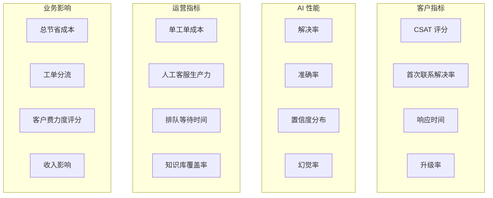
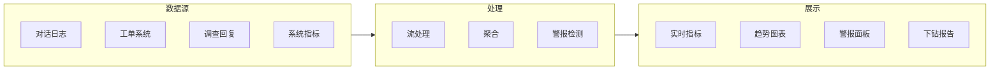
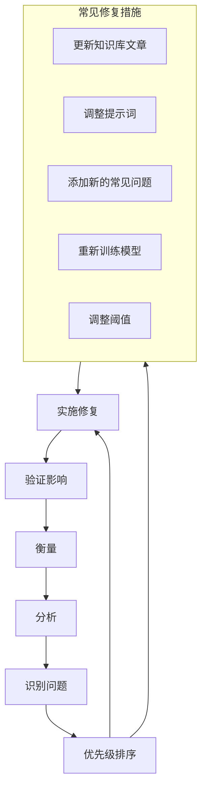

# 监控与评估 (Monitoring & Evaluation)

凡是能衡量的，都能改进。这是一个针对 AI 客服的全面指标框架。

## 指标框架 (Metrics Framework)



## 关键指标仪表盘

### 第一层：北极星指标 (North Star Metrics)

| 指标 | 定义 | 目标 | 衡量方式 |
|---|---|---|---|
| **CSAT** | 客户满意度 (Customer Satisfaction) 评分 | > 4.0 / 5.0 | 对话后调查 |
| **解决率** | AI 无需人工干预即可解决的工单百分比 | 40–60% | 自动跟踪 |
| **单工单成本** | 总成本 / 总工单数 | < $2 (AI) | 财务跟踪 |

### 第二层：质量指标

| 指标 | 定义 | 目标 | 衡量方式 |
|---|---|---|---|
| **准确率** | AI 回复事实正确的百分比 | > 95% | QA (质量保证) 抽样 |
| **首次联系解决率** | 在单次交互中解决的比例 | > 70% | 自动衡量 |
| **升级准确性** | 升级到人工的工单确实需要人工处理的比例 | > 85% | 人工审核 |
| **幻觉率** | 包含虚假信息的回复百分比 | < 1% | QA 抽样 |

### 第三层：运营指标

| 指标 | 定义 | 目标 | 衡量方式 |
|---|---|---|---|
| **首次响应时间** | AI 第一次回复的时间 | < 10 秒 | 系统日志 |
| **解决时间** | 解决问题所需的时间 | < 5 分钟 (第一层) | 系统日志 |
| **升级率** | 升级到人工客服的百分比 | 20–40% | 自动衡量 |
| **排队等待时间** | 升级后在人工队列中的等待时间 | < 2 分钟 | 队列系统 |

## 实现

### 指标收集

```python
from dataclasses import dataclass
from datetime import datetime
import prometheus_client as prom

@dataclass
class ConversationMetrics:
    conversation_id: str
    started_at: datetime
    resolved_at: datetime | None
    channel: str
    ai_resolved: bool
    escalated: bool
    escalation_reason: str | None
    message_count: int
    ai_confidence_scores: list[float]
    csat_score: float | None
    customer_id: str
    ticket_category: str

class MetricsCollector:
    def __init__(self):
        # Prometheus metrics
        self.resolution_counter = prom.Counter(
            'cs_ai_resolutions_total',
            'Total AI resolutions',
            ['channel', 'category', 'status']
        )
        self.response_time = prom.Histogram(
            'cs_ai_response_time_seconds',
            'AI response time',
            ['channel']
        )
        self.confidence_dist = prom.Histogram(
            'cs_ai_confidence',
            'AI confidence distribution',
            buckets=[0.1, 0.3, 0.5, 0.7, 0.85, 0.95, 1.0]
        )
        self.csat_gauge = prom.Gauge(
            'cs_ai_csat_average',
            'Average CSAT score'
        )
        self.escalation_counter = prom.Counter(
            'cs_ai_escalations_total',
            'Total escalations',
            ['reason']
        )
    
    def record_conversation(self, metrics: ConversationMetrics):
        """Record completed conversation metrics."""
        status = "resolved" if metrics.ai_resolved else "escalated"
        self.resolution_counter.labels(
            channel=metrics.channel,
            category=metrics.ticket_category,
            status=status
        ).inc()
        
        if metrics.escalated:
            self.escalation_counter.labels(
                reason=metrics.escalation_reason
            ).inc()
        
        for score in metrics.ai_confidence_scores:
            self.confidence_dist.observe(score)
    
    def record_response_time(self, channel: str, duration_seconds: float):
        self.response_time.labels(channel=channel).observe(duration_seconds)
```

### 实时仪表盘



## 警报 (Alerting)

### 警报规则

| 警报 | 条件 | 严重程度 | 操作 |
|---|---|---|---|
| CSAT 下降 | 100 次对话中 CSAT < 3.5 | 紧急 | 暂停 AI，进行调查 |
| 准确率下降 | QA 样本中准确率 < 90% | 高 | 审核最近的回复 |
| 幻觉激增 | 幻觉率 > 2% | 紧急 | 暂停 AI，修复知识库 |
| 高升级率 | 升级率 > 60% | 中 | 审核 AI 覆盖范围 |
| 响应缓慢 | p95 响应时间 > 30 秒 | 中 | 检查基础设施 |
| API 错误 | 错误率 > 5% | 高 | 检查 LLM (大语言模型) 提供商 |

### 警报实现

```python
class AlertManager:
    def __init__(self, notification_channel):
        self.notifier = notification_channel
        self.thresholds = {
            "csat_min": 3.5,
            "accuracy_min": 0.90,
            "hallucination_max": 0.02,
            "escalation_max": 0.60,
            "response_time_p95_max": 30,
            "error_rate_max": 0.05,
        }
    
    async def check_and_alert(self, metrics: dict):
        alerts = []
        
        if metrics["csat_avg"] < self.thresholds["csat_min"]:
            alerts.append(Alert(
                severity="critical",
                title="CSAT below threshold",
                message=f"Average CSAT: {metrics['csat_avg']:.2f} (threshold: {self.thresholds['csat_min']})",
                action="Consider pausing AI and investigating recent conversations"
            ))
        
        if metrics["hallucination_rate"] > self.thresholds["hallucination_max"]:
            alerts.append(Alert(
                severity="critical",
                title="Hallucination rate spike",
                message=f"Hallucination rate: {metrics['hallucination_rate']:.2%}",
                action="Pause AI immediately. Review and fix knowledge base."
            ))
        
        for alert in alerts:
            await self.notifier.send(alert)
```

## 报告

### 每周报告模板

```
AI 客服每周报告
==================================
周：[日期范围]

执行摘要
- 总对话数：[X]
- AI 解决率：[X]%
- 平均 CSAT：[X]/5.0
- 成本节省：$[X]

指标
                        本周         上周         变化
对话数                  [X]          [X]          [X]%
AI 解决率               [X]%         [X]%         [X]pp
CSAT (AI 处理)          [X]          [X]          [X]
CSAT (人工处理)         [X]          [X]          [X]
平均响应时间            [X]s         [X]s         [X]%
升级率                  [X]%         [X]%         [X]pp
单工单成本              $[X]         $[X]         [X]%

主要问题
1. [问题]：出现 [Count] 次
2. [问题]：出现 [Count] 次
3. [问题]：出现 [Count] 次

知识库
- 新增文章：[X]
- 更新文章：[X]
- 识别出的覆盖缺口：[X]

建议
1. [建议]
2. [建议]
3. [建议]
```

### 每月深度分析

| 分析项目 | 目的 |
|---|---|
| 类别细分 | 哪些类别的 AI 处理效果最好/最差 |
| 置信度校准 | 置信度评分是否是准确的预测指标？ |
| 升级分析 | 为什么工单会被升级？ |
| 知识库缺口分析 | 哪些问题 AI 无法回答？ |
| 客户群分析 | AI 对某些细分客户的效果是否更好？ |
| 成本趋势 | 单工单成本是否在改善？ |

## 持续改进闭环



## 下一步

在上线之前，请查看 [风险评估](./risk-assessment) 以了解可能出现的问题以及如何缓解。
