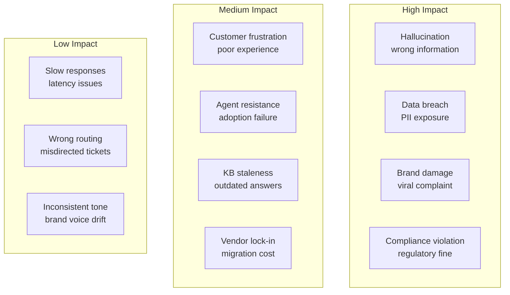
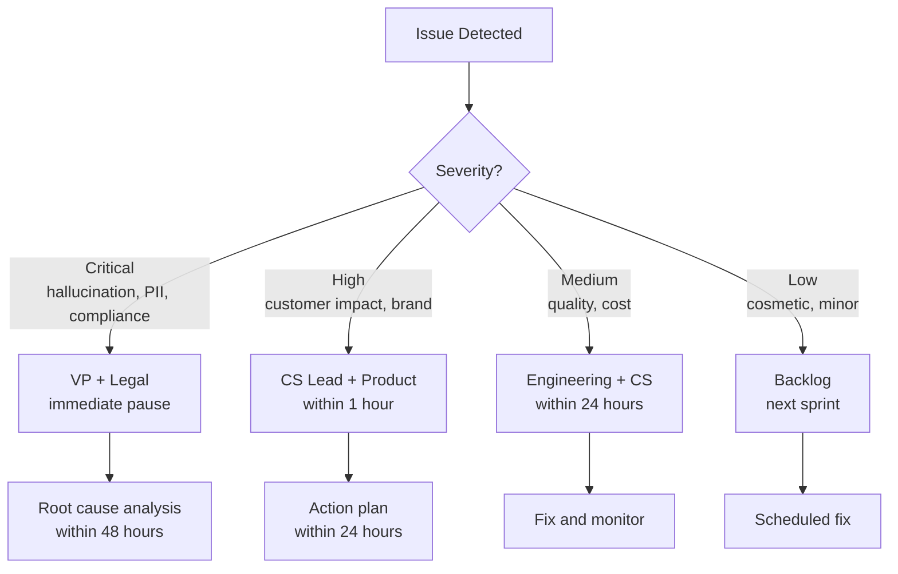

# Risk Assessment & Governance

What can go wrong, how to prevent it, and how to respond when things go sideways.

## Risk Matrix



## Detailed Risk Analysis

### Critical Risks

| Risk | Probability | Impact | Mitigation | Contingency |
|---|---|---|---|---|
| **Hallucination causes financial harm** | Medium | Critical | Grounding, validation, no promises | Customer remediation fund, legal review |
| **PII leak in AI response** | Low | Critical | PII detection, masking, audit logs | Incident response, notification process |
| **Compliance violation (GDPR, etc.)** | Low | Critical | Legal review, data handling policies | DPO involvement, regulatory notification |
| **AI gives dangerous advice** | Very Low | Critical | Safety keywords, escalation triggers | Immediate pause, public statement |

### High Risks

| Risk | Probability | Impact | Mitigation | Contingency |
|---|---|---|---|---|
| **Customer backlash against AI** | Medium | High | Clear disclosure, easy human access | Pause AI, human-only option |
| **Agent job displacement fear** | High | High | Position as copilot, retrain for complex | Transparent communication, retraining |
| **Knowledge base becomes outdated** | High | Medium | Automated freshness checks, update pipeline | Manual review sprint |
| **LLM provider outage** | Medium | High | Multi-provider fallback, queue to human | Degraded mode, rule-based responses |

### Medium Risks

| Risk | Probability | Impact | Mitigation | Contingency |
|---|---|---|---|---|
| **Lower than expected resolution rate** | Medium | Medium | Pilot program, realistic targets | Adjust scope, invest in KB |
| **Higher than expected costs** | Low | Medium | Cost monitoring, budget alerts | Model optimization, caching |
| **Integration complexity** | Medium | Medium | Start with one channel, iterate | SaaS solutions as bridge |
| **Agent adoption resistance** | High | Medium | Training, involvement in design | Champions program, incentives |

## Governance Framework

### Decision Authority Matrix

| Decision | Who Decides | Approval Required |
|---|---|---|
| Deploy AI to new channel | Product + CS Lead | VP Customer Experience |
| Change confidence threshold | Engineering | CS Lead |
| Update system prompt | Engineering | CS Lead review |
| Add new KB source | Content Team | KB Manager |
| Pause AI operations | Anyone (emergency) | Notify leadership within 1 hour |
| Customer compensation (AI error) | CS Lead | Finance if > $500 |
| Model/provider change | Engineering | VP Engineering |

### Escalation Path



## Incident Response Playbook

### Playbook 1: Hallucination Incident

```
TRIGGER: AI provides factually incorrect information that reaches customer

SEVERITY: Critical

IMMEDIATE ACTIONS (within 15 minutes):
1. Pause AI for affected category/channel
2. Review conversation transcript
3. Identify if customer took action based on wrong info
4. If financial impact: escalate to VP + Legal

SHORT-TERM (within 2 hours):
5. Correct the knowledge base article
6. Review similar articles for same issue
7. Proactive outreach to affected customer
8. Document incident

LONG-TERM (within 1 week):
9. Root cause analysis
10. Add validation rule to prevent recurrence
11. Update monitoring/alerting
12. Share learnings with team
```

### Playbook 2: Data Exposure Incident

```
TRIGGER: AI exposes PII or sensitive data in response

SEVERITY: Critical

IMMEDIATE ACTIONS (within 5 minutes):
1. Pause all AI operations
2. Isolate affected conversation
3. Notify Security team
4. Notify Legal/Compliance

SHORT-TERM (within 1 hour):
5. Assess scope of exposure
6. Identify affected customers
7. Begin notification process if required (GDPR: 72 hours)
8. Fix the vulnerability

LONG-TERM (within 1 week):
9. Full security audit
10. Update PII detection rules
11. Review all similar conversation patterns
12. Regulatory notification if required
```

### Playbook 3: Customer Backlash

```
TRIGGER: Viral complaint about AI customer service

SEVERITY: High

IMMEDIATE ACTIONS (within 30 minutes):
1. Monitor social media mentions
2. Contact complainant directly (human agent)
3. Offer resolution + goodwill gesture
4. Prepare public response

SHORT-TERM (within 4 hours):
5. Review the specific conversation
6. Identify systemic issue if any
7. Adjust AI behavior if needed
8. Post public response acknowledging issue

LONG-TERM (within 1 week):
9. Review AI disclosure language
10. Consider opt-out mechanism
11. Survey customers on AI preference
12. Adjust strategy based on feedback
```

## Compliance Checklist

### GDPR Compliance

| Requirement | Implementation |
|---|---|
| Right to access | Customer can request all AI conversation data |
| Right to erasure | Delete conversation data on request |
| Right to human review | Always available escalation path |
| Data minimization | Only process necessary customer data |
| Transparency | Disclose AI involvement |
| Data processing agreement | DPA with AI/LLM providers |

### Industry-Specific

| Industry | Key Requirements |
|---|---|
| Healthcare (HIPAA) | BAA with providers, no PHI in prompts |
| Financial (PCI/SOC) | No payment data in AI, audit logging |
| Legal | No legal advice, disclaimers |
| Children (COPPA) | Age verification, parental consent |

## Risk Monitoring Dashboard

| Metric | Green | Yellow | Red |
|---|---|---|---|
| Hallucination rate | < 1% | 1–2% | > 2% |
| Escalation accuracy | > 85% | 70–85% | < 70% |
| CSAT (AI) | > 4.0 | 3.5–4.0 | < 3.5 |
| PII incidents | 0 | 1 (contained) | > 1 |
| Compliance violations | 0 | 0 | Any |
| Customer complaints | < 5/week | 5–20/week | > 20/week |

## What's Next

Finally, check the [FAQ](./faq) for answers to common questions and misconceptions about AI customer service.
