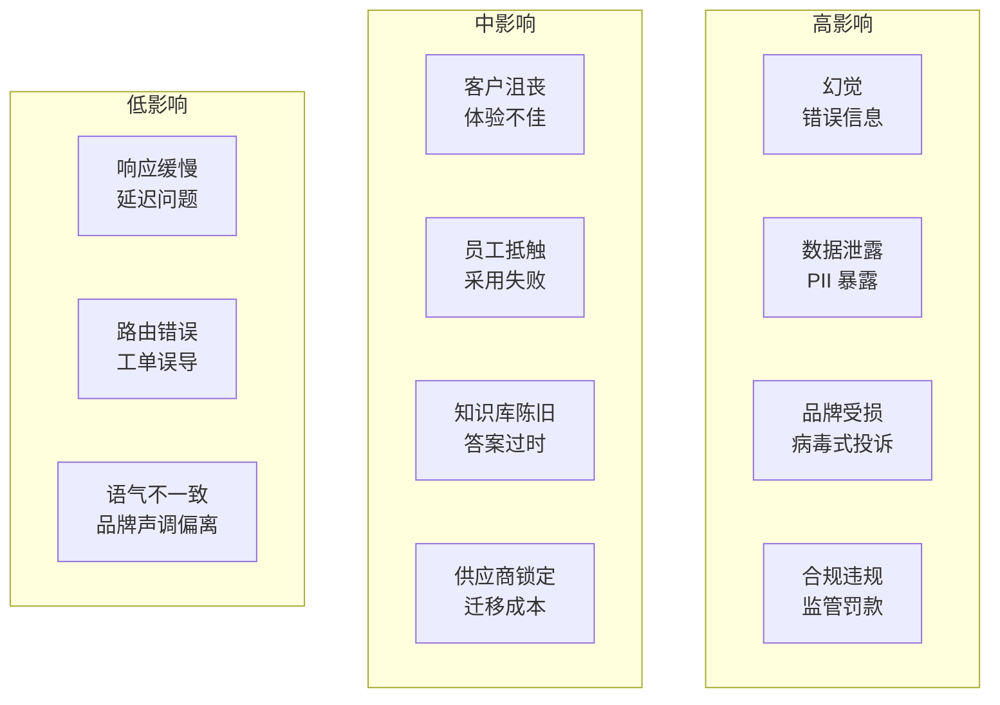
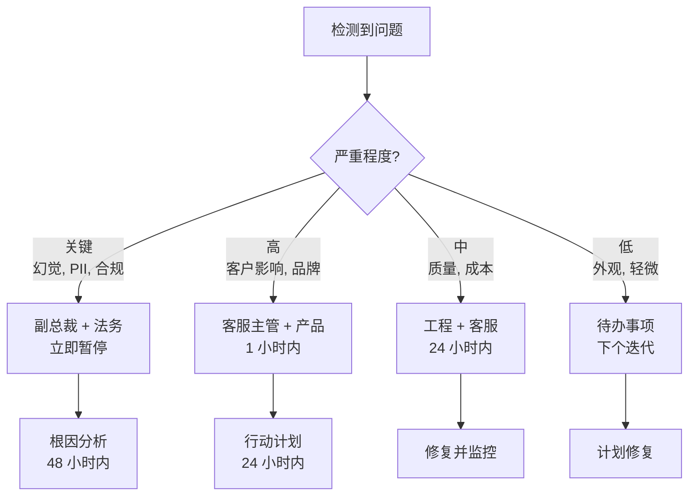

# 风险评估与治理 (Risk Assessment & Governance)

可能出现什么问题、如何预防，以及在出现偏差时如何应对。

## 风险矩阵 (Risk Matrix)



## 详细风险分析

### 关键风险 (Critical Risks)

| 风险 | 可能性 | 影响 | 缓解措施 | 应急预案 |
|---|---|---|---|---|
| **幻觉导致财务损失** | 中 | 关键 | 落地验证 (Grounding)、校验、不作承诺 | 客户补救基金、法律审查 |
| **AI 回复中泄露 PII** | 低 | 关键 | PII (个人身份信息) 检测、脱敏、审计日志 | 事件响应、通知流程 |
| **合规违规 (GDPR 等)** | 低 | 关键 | 法律审查、数据处理政策 | DPO (数据保护官) 介入、监管通知 |
| **AI 给出危险建议** | 极低 | 关键 | 安全关键词、升级触发器 | 立即暂停、发布公开声明 |

### 高风险 (High Risks)

| 风险 | 可能性 | 影响 | 缓解措施 | 应急预案 |
|---|---|---|---|---|
| **客户对 AI 的抵触** | 中 | 高 | 明确告知、便捷的人工接入 | 暂停 AI、仅限人工选项 |
| **员工对失业的恐惧** | 高 | 高 | 定位为副驾驶 (Copilot)、针对复杂任务重新培训 | 透明沟通、重新培训 |
| **知识库过时** | 高 | 中 | 自动新鲜度检查、更新流水线 | 手动审核冲刺 |
| **LLM 提供商宕机** | 中 | 高 | 多供应商备份、排队至人工 | 降级模式、基于规则的回复 |

### 中风险 (Medium Risks)

| 风险 | 可能性 | 影响 | 缓解措施 | 应急预案 |
|---|---|---|---|---|
| **解决率低于预期** | 中 | 中 | 试点计划、设定现实目标 | 调整范围、加大知识库投入 |
| **成本高于预期** | 低 | 中 | 成本监控、预算警报 | 模型优化、缓存 |
| **集成复杂性** | 中 | 中 | 从单一渠道开始，逐步迭代 | 使用 SaaS 解决方案作为过渡 |
| **员工采用抵触** | 高 | 中 | 培训、参与设计 | 倡导者计划、激励措施 |

## 治理框架 (Governance Framework)

### 决策权限矩阵

| 决策 | 决策者 | 需要批准 |
|---|---|---|
| 将 AI 部署到新渠道 | 产品 + 客服主管 | 客户体验副总裁 |
| 更改置信度阈值 | 工程团队 | 客服主管 |
| 更新系统提示词 | 工程团队 | 客服主管审核 |
| 添加新知识库源 | 内容团队 | 知识库经理 |
| 暂停 AI 运营 | 任何人 (紧急情况) | 1 小时内通知领导层 |
| 客户赔偿 (AI 错误) | 客服主管 | 财务 (若 > $500) |
| 模型/提供商变更 | 工程团队 | 工程副总裁 |

### 升级路径



## 事件响应手册 (Incident Response Playbook)

### 手册 1：幻觉事件

```
触发条件：AI 提供了事实错误的信息并传达给了客户

严重程度：关键

立即行动 (15 分钟内)：
1. 暂停受影响类别/渠道的 AI
2. 审核对话记录
3. 确定客户是否根据错误信息采取了行动
4. 若有财务影响：升级至副总裁 + 法务

短期行动 (2 小时内)：
5. 纠正知识库文章
6. 审核类似文章是否存在相同问题
7. 主动联系受影响客户
8. 记录事件

长期行动 (1 周内)：
9. 根因分析
10. 添加验证规则以防止再次发生
11. 更新监控/警报
12. 与团队分享经验教训
```

### 手册 2：数据泄露事件

```
触发条件：AI 在回复中暴露了 PII 或敏感数据

严重程度：关键

立即行动 (5 分钟内)：
1. 暂停所有 AI 运营
2. 隔离受影响的对话
3. 通知安全团队
4. 通知法务/合规团队

短期行动 (1 小时内)：
5. 评估暴露范围
6. 识别受影响客户
7. 若有要求，开始通知流程 (GDPR：72 小时)
8. 修复漏洞

长期行动 (1 周内)：
9. 全面安全审计
10. 更新 PII 检测规则
11. 审核所有类似的对话模式
12. 若有要求，通知监管机构
```

### 手册 3：客户抵触

```
触发条件：关于 AI 客服的病毒式投诉

严重程度：高

立即行动 (30 分钟内)：
1. 监控社交媒体提及
2. 直接联系投诉人 (人工客服)
3. 提供解决方案 + 补偿方案
4. 准备公开回应

短期行动 (4 小时内)：
5. 审核特定对话
6. 识别是否存在系统性问题
7. 根据需要调整 AI 行为
8. 发布公开回应，承认问题

长期行动 (1 周内)：
9. 审核 AI 告知语言
10. 考虑退出机制
11. 调查客户对 AI 的偏好
12. 根据反馈调整策略
```

## 合规检查清单

### GDPR 合规

| 要求 | 实现方式 |
|---|---|
| 访问权 | 客户可以请求所有 AI 对话数据 |
| 删除权 | 根据请求删除对话数据 |
| 人工审核权 | 始终可用的升级路径 |
| 数据最小化 | 仅处理必要的客户数据 |
| 透明度 | 告知 AI 的参与 |
| 数据处理协议 | 与 AI/LLM 提供商签署 DPA |

### 行业特定要求

| 行业 | 关键要求 |
|---|---|
| 医疗 (HIPAA) | 与提供商签署 BAA，提示词中不含 PHI (受保护健康信息) |
| 金融 (PCI/SOC) | AI 中不含支付数据，审计日志 |
| 法律 | 不提供法律建议，免责声明 |
| 儿童 (COPPA) | 年龄验证，家长同意 |

## 风险监控仪表盘

| 指标 | 绿色 | 黄色 | 红色 |
|---|---|---|---|
| 幻觉率 | < 1% | 1–2% | > 2% |
| 升级准确性 | > 85% | 70–85% | < 70% |
| CSAT (AI) | > 4.0 | 3.5–4.0 | < 3.5 |
| PII 事件 | 0 | 1 (已控制) | > 1 |
| 合规违规 | 0 | 0 | 任何 |
| 客户投诉 | < 5 次/周 | 5–20 次/周 | > 20 次/周 |

## 下一步

最后，请查看 [常见问题解答 (FAQ)](./faq)，了解关于 AI 客服的常见问题和误解。
