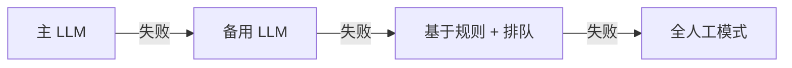

# 常见问题 (Frequently Asked Questions)

关于 AI 驱动的客服系统的常见问题和误解。

## 一般性问题

### AI 会完全取代人工客服吗？

不会。目标是 **增强，而非取代**。AI 处理重复性的第一层 (Tier 1) 工单 (占总量的 40–60%)，从而将人工解放出来，处理复杂且高价值的交互。大多数成功的实施案例都保留了 50–70% 的人工客服团队，让客服人员从事更有趣、更有影响力的工作。

### 实施需要多长时间？

| 阶段 | 时间线 | 交付物 |
|---|---|---|
| 试点 (单一渠道) | 4–8 周 | 在聊天或邮件中上线 |
| 扩展 (多渠道) | 2–3 个月 | 聊天 + 邮件 + 门户网站 |
| 成熟 (全面部署) | 6–12 个月 | 带有副驾驶 (Copilot) 的全渠道支持 |

### 达到多少工单量才值得这样做？

没有硬性的最低要求，但经济效益会随着工单量的增加而显著提高：

| 每月工单量 | 推荐方案 |
|---|---|
| < 1,000 | SaaS (Zendesk AI, Intercom Fin) |
| 1,000–10,000 | SaaS 或混合方案 |
| 10,000–100,000 | 混合或定制方案 |
| > 100,000 | 定制方案 (最大化 ROI) |

### 客户会知道他们在和 AI 说话吗？

**应该知道。** 透明度能建立信任。清晰且自然地告知 AI 的参与：

> "您好！我是 [公司名称] 的 AI 助手。我会协助您解决问题，如果我无法解决，我会为您转接人工客服。"

不要假装是人类。客户尊重诚实，而且对于简单的问题，许多人更喜欢 AI 的响应速度。

## 技术性问题

### 我应该使用哪个 LLM (大语言模型)？

请参阅 [AI 模型](./ai-models) 章节获取详细指导。简短回答：

- **入门阶段**：GPT-4o-mini 或 Claude Haiku (便宜、快速、足够好)
- **质量优先**：GPT-4o 或 Claude Sonnet
- **隐私要求**：私有化部署的 Llama 3.1
- **超大规模工单量**：Gemini Flash

### 我需要微调 (Fine-tune) 模型吗？

**通常不需要。** RAG (检索增强生成，Retrieval-Augmented Generation) 无需微调即可为您带来 80% 的价值。仅在以下情况需要微调：
- 非常特定的品牌声调
- 复杂的多步骤工作流
- 处理特定领域的专业术语

### 如何防止幻觉 (Hallucinations)？

多层防御：

1. **RAG 落地验证 (Grounding)** — 仅根据检索到的知识库内容进行回答
2. **置信度评分** — 将低置信度的工单路由至人工
3. **回复验证** — 根据源分块检查回复内容
4. **不作承诺规则** — 绝不承诺知识库中未提及的结果
5. **人工 QA 抽样** — 定期审核 AI 回复

请参阅 [质量与安全](./quality-safety) 获取实现细节。

### 当 LLM 提供商宕机时会发生什么？

针对故障进行设计：

始终要有备选路径。宁愿让客户在人工队列中等待，也不要显示错误。

## 业务问题

### 如何衡量 ROI (投资回报率)？

请参阅 [ROI 框架](./roi-framework) 获取详细计算方法。关键指标：

- **单工单成本**：传统方式 ($8–$15) vs AI 方式 ($0.50–$3)
- **解决率**：无需人工干预即可处理的工单百分比
- **投资回收期**：通常为 1–6 个月，取决于工单量

### 如果客户讨厌它怎么办？

内置“逃生舱”：
- 始终提供“联系人工”选项
- 便捷的升级路径 (无需重重关卡)
- 密切监控 CSAT (客户满意度)
- 为偏好纯人工服务的客户提供退出机制

按渠道 (AI vs 人工) 跟踪 CSAT。如果 AI 的 CSAT 比人工低 0.5 分以上，请进行调查并调整。

### 如何处理团队对失业的恐惧？

**透明的沟通至关重要：**

1. **定位为副驾驶而非替代品** — AI 处理枯燥的任务，人类从事有影响力的工作
2. **重新培训投入** — 提升客服人员解决复杂问题的技能
3. **创造新角色** — AI 训练师、QA 审核员、升级专家
4. **让团队参与** — 让客服人员协助设计系统
5. **展示数据** — 大多数实施案例都维持或扩大了客服团队规模

### 我们不支持的语言怎么办？

AI 极大地扩展了语言覆盖范围。现代 LLM 支持 50 多种语言。这是最大的优势之一：您无需雇佣多语言客服人员即可提供 24/7 的多语言支持。

## 实施问题

### 我应该自建还是购买？

| 方案 | 适用对象 | 优点 | 缺点 |
|---|---|---|---|
| **SaaS** (Zendesk AI, Intercom Fin) | 每月工单量 < 10K | 设置快，投入低 | 定制化有限 |
| **基于 API 构建** | 每月工单量 > 100K | 全面控制，单工单成本最低 | 需要工程投入 |
| **混合方案** | 每月工单量 10K–100K | 兼顾控制力与便捷性 | 集成复杂性 |

### 我需要什么样的知识库？

从现有的内容开始：
1. 帮助中心 / 常见问题解答 (价值最高)
2. 产品文档
3. 政策文件
4. 历史工单解决方案 (第二阶段)

请参阅 [知识库工程](./knowledge-base) 获取详细指导。

### 如何开始？

**推荐的试点方法：**

1. **第 1–2 周**：审计当前工单，识别适合 AI 处理的第一层工单
2. **第 3–4 周**：准备知识库，搭建 AI 流水线
3. **第 5–6 周**：在单一渠道 (推荐聊天) 进行试点
4. **第 7–8 周**：衡量、迭代、扩展

从小处着手，严格衡量，根据数据进行扩展。

## 故障排除

### AI 解决率低于预期

| 可能原因 | 修复措施 |
|---|---|
| 知识库缺口 | 审计未回答的问题，添加内容 |
| 分块效果差 | 调整分块大小和重叠度 |
| 模型选择错误 | 尝试能力更强的模型 |
| 置信度阈值过低 | 校准阈值 (但不要降得太低) |
| 工单组合复杂 | 审核第一层工单的比例是否符合假设 |

### AI 的 CSAT 低于人工

| 可能原因 | 修复措施 |
|---|---|
| AI 未能完全解决问题 | 提高知识库覆盖率 |
| 客户想要人工服务 | 简化升级流程 |
| 语气问题 | 调整系统提示词 |
| 响应缓慢 | 优化流水线延迟 |
| 答案错误 | 审核准确性，修复幻觉 |

### 升级率过高

| 可能原因 | 修复措施 |
|---|---|
| 置信度阈值过高 | (谨慎地) 进行校准 |
| 知识库未覆盖常见问题 | 添加缺失的内容 |
| AI 太容易放弃 | 调整升级触发器 |
| 客户偏好人工 | 检查 AI 告知语言是否合适 |

## 下一步

准备好开始了吗？返回 [简介](/) 从经济分析开始，或者如果您是技术人员，直接跳转到 [架构](./architecture)。
