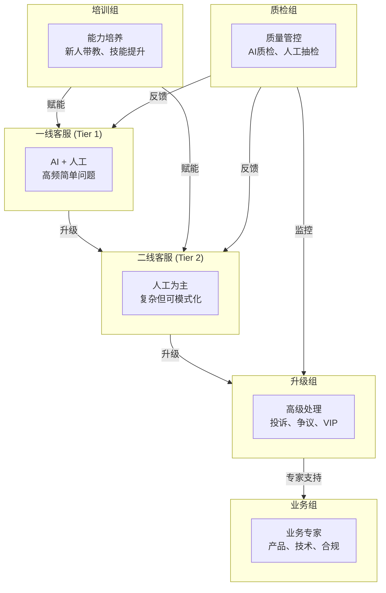
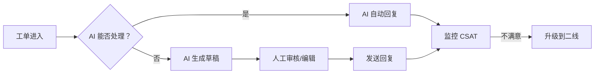
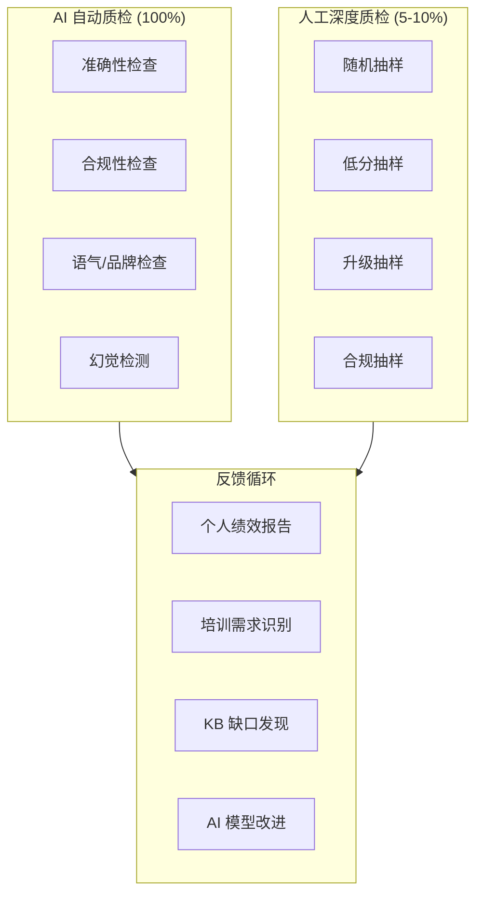

# 客服组织与培训

如何为 AI (人工智能) 增强型运营构建您的客服 (CS) 团队，并为每个小组制定培训计划。

## 六组式客服组织

一个成熟的 AI 增强型客服组织拥有六个专业小组，每个小组都有不同的职责和培训需求：

## 小组详情

### 一线客服 (Tier 1 / 一线支持)

**角色：** 处理高频、简单的问题。AI 处理 60-80%，人工处理其余部分。

| 维度 | 详情 |
|---|---|
| **工单类型** | FAQ (常见问题)、订单状态、密码重置、基础操作指南 |
| **AI 参与度** | AI 自动解决 60-80%，人工审核/编辑 AI 草稿 |
| **人员配比** | 每名客服处理 3-5 倍于传统模式的工单量 |
| **技能要求** | 产品基础知识、系统导航、同理心 |
| **KPI (关键绩效指标)** | 首次响应时间 < 1 分钟，CSAT (客户满意度) > 4.0，解决率 > 70% |

**日常工作流：**

### 二线客服 (Tier 2 / 二线支持)

**角色：** 处理复杂但有模式可循的问题。AI 辅助进行调研和草稿撰写。

| 维度 | 详情 |
|---|---|
| **工单类型** | 复杂的故障排除、多步骤流程、账单争议 |
| **AI 参与度** | AI 检索上下文、建议解决方案、撰写回复草稿 |
| **人员配比** | 每名客服处理 2-3 倍于传统模式的工单量 |
| **技能要求** | 深入的产品知识、问题解决能力、跨系统导航 |
| **KPI** | 解决时间 < 4 小时，升级准确率 > 85%，CSAT > 4.2 |

**适用于二线客服的 AI Copilot (智能副驾驶) 工具：**
- 自动拉取客户历史记录和过往互动
- 根据类似的已解决工单建议解决方案
- 撰写回复供客服审核
- 标记相关的 KB (知识库) 文章

### 升级组 (Escalation Team / 升级处理组)

**角色：** 处理投诉、争议、VIP (重要客户) 以及敏感情况。

| 维度 | 详情 |
|---|---|
| **工单类型** | 客户投诉、退款争议、VIP 请求、法律威胁 |
| **AI 参与度** | AI 提供完整的上下文摘要、情绪分析、建议的操作 |
| **人员配比** | 每 10-15 名二线客服配备 1 名专员 |
| **技能要求** | 降级处理、谈判、政策权限、情商 |
| **KPI** | 解决时间 < 24 小时，留存率 > 90%，升级解决率 > 95% |

**升级标准：**
| 触发条件 | 自动路由至 |
|---|---|
| 客户明确要求主管介入 | 升级组 |
| 一线/二线互动中 CSAT < 2.0 | 升级组 |
| 退款金额 > $500 | 升级组 |
| 检测到法律关键词 | 升级组 |
| VIP/企业客户 | 升级组 (跳过一线/二线) |

### 业务组 (Business Team / 业务专家组)

**角色：** 领域专家，以深厚的专业知识支持一线/二线/升级组。

| 维度 | 详情 |
|---|---|
| **职能** | 产品专业知识、技术支持、合规、账单 |
| **AI 参与度** | AI 将特定领域的问题路由给正确的业务专家 |
| **人员配比** | 每 20-30 名一线客服配备 1 名专家 |
| **技能要求** | 深厚的领域掌控力、政策制定、跨团队沟通 |
| **KPI** | 知识文章创建率、一线/二线解决率提升 |

**业务组职责：**
- 撰写并维护 KB 文章
- 为一线团队创建培训材料
- 处理超出二线能力的复杂产品/技术问题
- 确保符合行业法规
- 反馈循环：识别可用于 AI 自动化的模式

### 培训组 (Training Team)

**角色：** 开发并交付适用于所有客服小组的培训计划。

| 维度 | 详情 |
|---|---|
| **职能** | 新员工入职培训、持续技能提升、AI 工具培训 |
| **AI 参与度** | AI 从 QA (质量保证) 数据中识别技能差距，建议个性化培训 |
| **人员配比** | 每 30-50 名客服配备 1 名培训师 |
| **技能要求** | 教学设计、产品专业知识、辅导 |
| **KPI** | 达到熟练所需时间、培训满意度、培训后绩效提升 |

**各小组培训计划：**

| 小组 | 入职培训 | 持续培训 | AI 专项培训 |
|---|---|---|---|
| 一线客服 | 2 周 | 每周 1 小时 | AI 工具使用、草稿审核、升级判断 |
| 二线客服 | 3 周 | 每两周 1.5 小时 | AI Copilot、复杂案例分析 |
| 升级组 | 4 周 | 每月 2 小时 | AI 上下文解读、降级处理 |
| 业务组 | 4 周 | 每月 2 小时 | KB 撰写、AI 反馈循环 |
| 培训组 | 2 周 | 每月 1 小时 | AI 生成培训内容审核 |
| 质检组 | 3 周 | 每两周 1 小时 | AI QA 校准、偏见检测 |

### 质检组 (QA / 质量保证组)

**角色：** 监控所有客服互动（包括 AI 和人工）的质量。

| 维度 | 详情 |
|---|---|
| **职能** | AI 回复 QA、人工互动审计、校准、合规 |
| **AI 参与度** | AI 对 100% 的互动进行自动 QA，人工对样本进行深度分析 |
| **人员配比** | 每 20-30 名客服配备 1 名 QA 专员 |
| **技能要求** | 分析性思维、产品专业知识、辅导反馈 |
| **KPI** | QA 覆盖率 > 10%，校准一致性 > 90%，质量得分提升 |

**QA 框架：**

## 各层级的 AI 集成

AI 如何以不同方式增强各小组：

| 小组 | AI 角色 | 自动化程度 | 人工干预 |
|---|---|---|---|
| 一线客服 | 自动回复器 + 草稿生成器 | 60-80% 自主 | 审核、编辑、升级 |
| 二线客服 | Copilot + 调研助手 | 20-40% 自主 | 完全判断、复杂决策 |
| 升级组 | 上下文摘要器 + 建议器 | 0-10% 自主 | 完全权限、需要同理心 |
| 业务组 | 知识检索器 + 模式查找器 | 只读 | 专家决策 |
| 培训组 | 差距分析器 + 内容生成器 | 内容辅助 | 培训交付、辅导 |
| 质检组 | 自动评分器 + 异常检测器 | 100% 评分、标记问题 | 深度分析、校准 |

## 组织评估清单

使用此清单评估您的客服组织对 AI 增强的准备情况：

### 架构评估

| 标准 | 当前状态 | 目标状态 | 差距 |
|---|---|---|---|
| 清晰的层级定义 | ☐ | ☐ | |
| 明确的升级路径 | ☐ | ☐ | |
| 专业的业务专家 | ☐ | ☐ | |
| 专门的培训职能 | ☐ | ☐ | |
| 存在 QA 团队 | ☐ | ☐ | |

### 人员评估

| 标准 | 当前状态 | 目标状态 | 差距 |
|---|---|---|---|
| 一线客服能够审核 AI 草稿 | ☐ | ☐ | |
| 二线客服能够使用 AI Copilot | ☐ | ☐ | |
| 升级组了解 AI 的局限性 | ☐ | ☐ | |
| 业务组维护 KB | ☐ | ☐ | |
| 培训组能够进行 AI 工具培训 | ☐ | ☐ | |
| QA 团队能够校准 AI 评分 | ☐ | ☐ | |

### 流程评估

| 标准 | 当前状态 | 目标状态 | 差距 |
|---|---|---|---|
| 升级标准已定义 | ☐ | ☐ | |
| AI 自动解决规则已设置 | ☐ | ☐ | |
| 存在 QA 抽样方法论 | ☐ | ☐ | |
| 培训课程已文档化 | ☐ | ☐ | |
| KB 更新工作流已定义 | ☐ | ☐ | |
| 反馈循环已运作 | ☐ | ☐ | |

### 技术评估

| 标准 | 当前状态 | 目标状态 | 差距 |
|---|---|---|---|
| 工单系统支持 AI | ☐ | ☐ | |
| 客服可见 AI 草稿 | ☐ | ☐ | |
| QA 仪表板已运作 | ☐ | ☐ | |
| 培训 LMS (学习管理系统) 已集成 | ☐ | ☐ | |
| 报告/分析可用 | ☐ | ☐ | |

## 人员配置模型

传统模式 vs AI 增强模式下每月 10,000 张工单的人员配置：

| 角色 | 传统模式 | AI 增强模式 | 变化 |
|---|---|---|---|
| 一线客服 | 8-10 名客服 | 3-4 名客服 | -60% |
| 二线客服 | 4-5 名客服 | 3-4 名客服 | -20% |
| 升级组 | 1-2 名专员 | 1-2 名专员 | 持平 |
| 业务组 | 1-2 名专家 | 1-2 名专家 | 持平 |
| 培训组 | 0.5 FTE (全职等值) | 0.5 FTE | 持平 |
| 质检组 | 0.5 FTE | 0.5 FTE + AI | AI 增强 |
| **总计** | **15-20 人** | **9-13 人** | **-35-40%** |

:::tip 核心洞察
AI 将一线客服的人数减少了 60%，但其他小组的规模基本保持不变。节省主要源于简单任务的自动化，而非取消专业角色。
:::

## 下一步

在定义好组织架构后，请查看 [风险评估](./risk-assessment) 以了解治理方面的注意事项，或返回 [简介](/) 查看完整指南。
