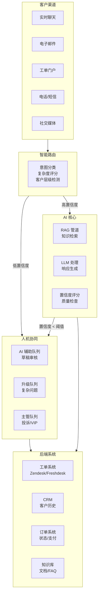
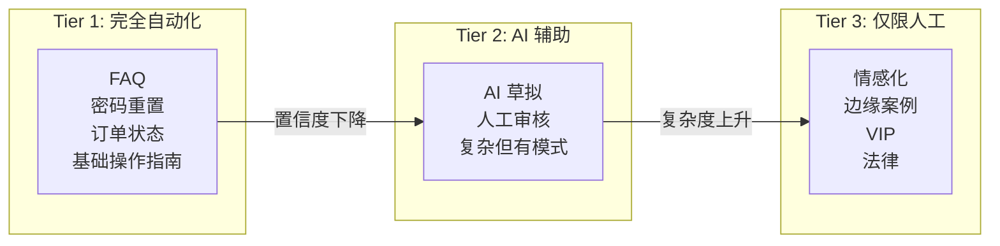
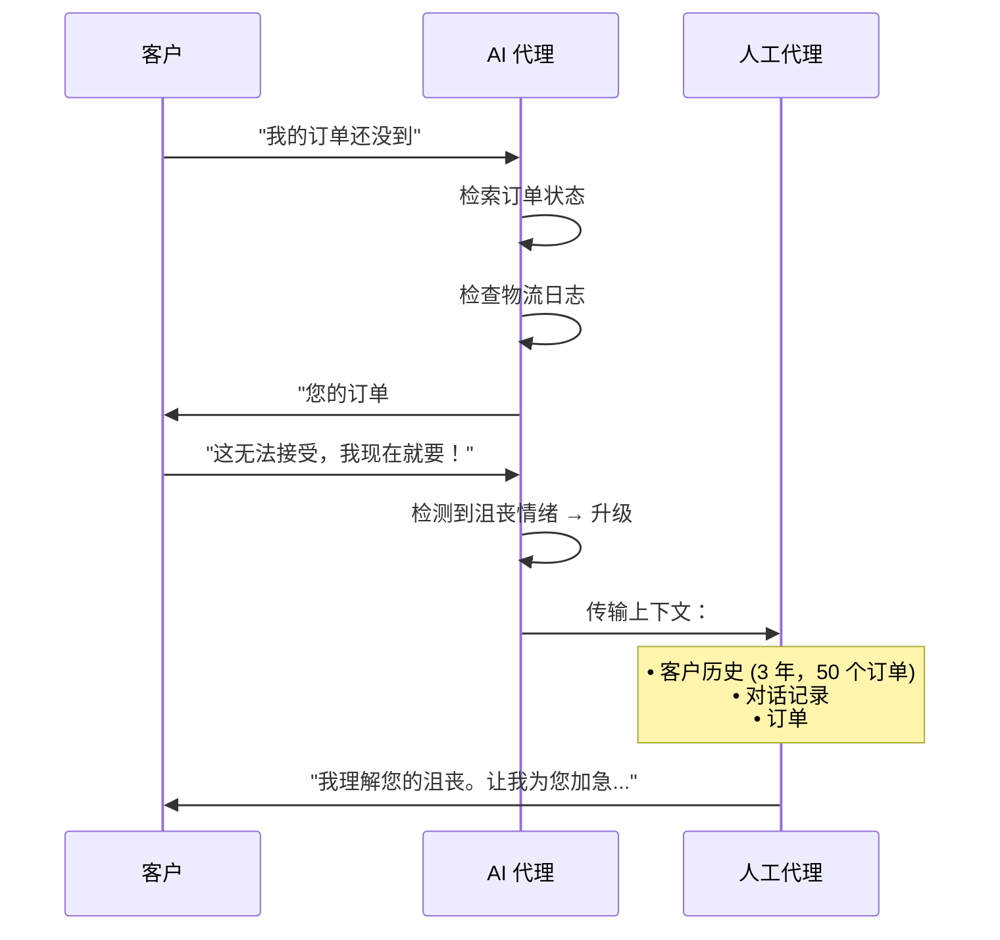
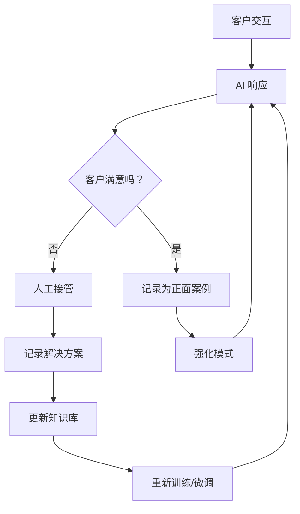
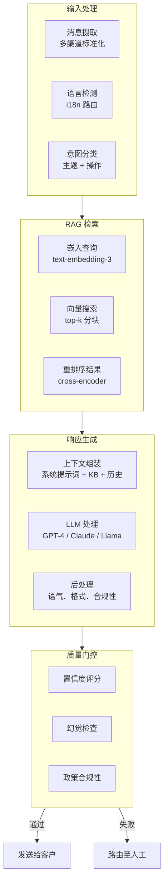
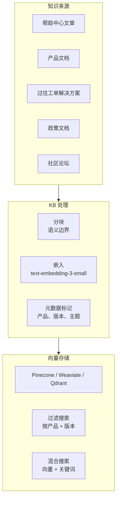

# 架构概览

本页描述了 AI (人工智能) 驱动的客户服务的完整系统架构，涵盖了业务决策框架和技术实施栈。

## 系统架构



## 设计原则

### 1. 分层自动化

并非所有工单都是平等的。系统对每次交互进行分类：



### 2. 基于置信度的路由

每个 AI 响应都会获得一个置信度评分。低于阈值 → 人工审核：

| 置信度 | 操作 | 典型用途 |
|---|---|---|
| 0.90–1.00 | 直接发送 | 明确的 FAQ (常见问题) 匹配，标准流程 |
| 0.70–0.89 | 发送 + 标记审核 | 匹配良好但情况微妙 |
| 0.50–0.69 | 进入人工队列并附带 AI 草稿 | 模棱两可，需要人工判断 |
| < 0.50 | 路由至人工，无草稿 | 无可靠匹配，由人工处理 |

### 3. 上下文保留

从 AI 升级到人工时，完整上下文会进行传输：



### 4. 持续学习闭环



## 组件架构

### AI 处理管道



### 知识库架构



## 集成点

| 系统 | 集成方法 | 数据流 |
|---|---|---|
| 工单系统 (Zendesk, Freshdesk) | Webhooks + REST API | 双向 |
| 实时聊天 (Intercom, Crisp) | WebSocket + REST | 实时 |
| 电子邮件 | IMAP/SMTP 或 API (SendGrid) | 异步 |
| CRM (客户关系管理) (Salesforce, HubSpot) | REST API | 读取客户上下文 |
| 订单系统 | REST API / GraphQL | 读取订单/支付状态 |
| 知识库 | 向量数据库 + REST | 为 RAG (检索增强生成) 读取 |

## 故障模式与缓解措施

| 故障 | 检测 | 恢复 |
|---|---|---|
| AI 幻觉回答 | 置信度评分低 | 路由至人工 |
| AI 提供错误信息 | 客户反馈 / QA (质量保证) | 标记审核，更新 KB (知识库) |
| 知识库过时 | 解决率下降 | 自动新鲜度检查 |
| LLM API 宕机 | 健康检查超时 | 回退到基于规则的系统 + 人工排队 |
| 高延迟 | 响应时间 > SLA (服务水平协议) | 扩展副本，缓存常见查询 |
| 客户感到沮丧 | 情绪分析 | 立即升级至人工 |

## 安全与合规

```mermaid
flowchart TB
    subgraph Data["数据保护"]
        D1[PII (个人身份信息) 检测与脱敏]
        D2[静态 + 传输中加密]
        D3[数据保留政策]
    end

    subgraph Access["访问控制"]
        A1[基于角色的访问控制]
        A2[审计日志]
        A3[API 密钥轮换]
    end

    subgraph Compliance["监管合规"]
        C1[GDPR (通用数据保护条例) - 被遗忘权]
        C2[CCPA (加州消费者隐私法案) - 数据访问]
        C3[行业 - HIPAA/PCI (如果适用)]
    end
```

## 下一步

在了解了架构之后，让我们检查一下 [当前客服现状](./current-landscape)，以了解为什么 AI 驱动的客服正在成为一种必然，而非选择。
