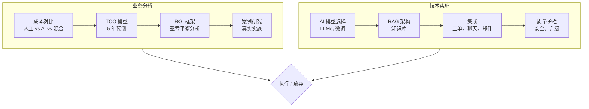
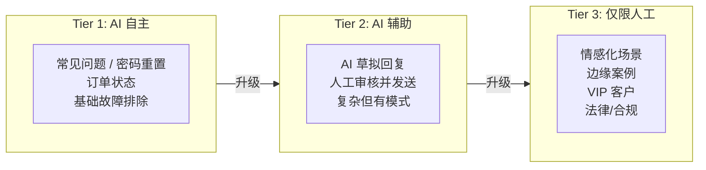

# AI 驱动的客户服务：分析与实施指南

一个用于评估、规划和实施 AI (人工智能) 驱动的客户服务的综合框架 —— 从经济可行性到技术架构。

## 本指南涵盖的内容

本档回答了两个基本问题：

1. **经济上可行吗？** —— 详细的成本模型、ROI (投资回报率) 框架和真实案例研究
2. **如何构建它？** —— 架构模式、集成指南和实施路线图

## 适用对象

| 受众 | 您将发现的内容 |
|---|---|
| **业务领导者** | 成本分析、ROI 模型、风险评估、供应商对比 |
| **产品经理** | 功能范围、集成模式、成功指标 |
| **工程团队** | 架构、RAG (检索增强生成) 模式、API (应用程序接口) 设计、部署指南 |
| **运营人员** | 监控、质量保证、升级设计 |

## 经济概览

AI 客户服务的核心经济学：

| 指标 | 传统客服 | AI 增强型 | 全 AI (Tier 1) |
|---|---|---|---|
| 每张工单成本 | $5–$15 | $0.50–$3 | $0.10–$0.50 |
| 首次响应时间 | 4–24 小时 | < 1 分钟 | < 10 秒 |
| 24/7 覆盖成本 | 3 倍人力 | 基准线 | 基准线 |
| 可扩展性 | 线性 | 指数级 | 指数级 |

:::info 不是替代 —— 而是转型
AI 不仅仅是替代代理。它改变了整个支持模型：更快的响应、一致的质量、无限的可扩展性，并将人类从复杂、高价值的交互中解放出来。
:::

## 混合现实

大多数成功的实施都遵循分层模型：

成熟部署中的典型工单分布：
- **Tier 1 (AI 处理):** 40–60% 的工单
- **Tier 2 (AI 辅助):** 20–30% 的工单
- **Tier 3 (仅限人工):** 10–30% 的工单

## 教程路线图

### 业务分析
1. **[架构概览](./architecture)** —— 系统设计和组件交互
2. **[当前客服现状](./current-landscape)** —— 痛点、成本以及为什么需要改变
3. **[成本对比](./cost-comparison)** —— 正面交锋：人工 vs AI vs 混合模型
4. **[TCO 模型](./tco-model)** —— 包含基础设施、培训、维护在内的 5 年 TCO (总拥有成本)
5. **[ROI 框架](./roi-framework)** —— 盈亏平衡分析、投资回收期、敏感性分析
6. **[案例研究](./case-studies)** —— 真实实施：Zendesk AI, Intercom Fin, Klarna 等

### 技术架构
7. **[AI 模型与选择](./ai-models)** —— LLMs (大语言模型), 微调 vs RAG, 模型对比矩阵
8. **[RAG 架构](./rag-architecture)** —— 知识库设计、检索模式、分块策略
9. **[集成模式](./integration-patterns)** —— 工单系统、实时聊天、电子邮件、全渠道
10. **[人工交接设计](./human-handoff)** —— 升级触发器、上下文传输、队列管理
11. **[质量与安全](./quality-safety)** —— 护栏、幻觉预防、合规性

### 实施
12. **[知识库工程](./knowledge-base)** —— 构建和维护 AI 的大脑
13. **[监控与评估](./monitoring-eval)** —— CSAT (客户满意度), 解决率, 质量指标

### 风险与治理
14. **[风险评估](./risk-assessment)** —— 可能出现的问题、缓解措施、治理框架
15. **[常见问题](./faq)** —— 常见问题和误区

## 前提条件

| 业务分析所需 | 实施所需 |
|---|---|
| 当前客服成本数据 | Python/TypeScript 熟练程度 |
| 工单量指标 | API 集成经验 |
| 客户满意度基准 | 向量数据库熟悉程度 |
| | LLM API 访问权限 (OpenAI, Anthropic 等) |

## 设计理念

1. **经济优先** —— 不要构建无法收回成本的东西
2. **默认混合** —— AI 处理业务量，人工处理复杂性
3. **衡量一切** —— CSAT, 解决率, 每张工单成本, 升级率
4. **快速迭代** —— 从 Tier 1 开始，随着信心的增强而扩展

让我们从 [架构概览](./architecture) 开始。
